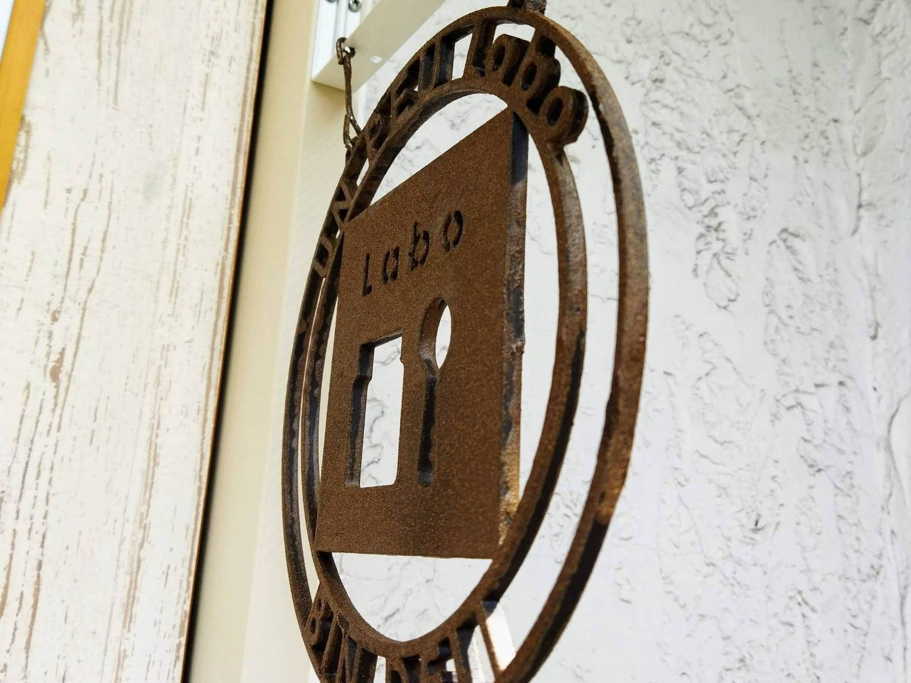

おしゃれな看板を作成させていただきました。  
3Dプリントした看板をサビ塗装してもらい、樹脂とは思えない質感になり、とてもお店の雰囲気に合っています。

名古屋市昭和区の「[UN PEU Labo](https://www.instagram.com/unpeu5/)」さんからのご注文。  
3Dプリントした時計の文字盤を見てのご依頼です。  

デザインイメージをお聞きして、  
・デザイン作成  
・データ上での確認  
・紙に実寸で出力しての確認  
・３Dプリンタ用のデータ作成  
・３Dプリント  
・納品  
・お客様にて、錆塗装  
・取付  

とても素敵な出来上がりになりました。

お客様自身で塗装されましたが、失敗しても、何度でも同じデータで出力できるので、思い切ってチャレンジしていただけたと思います。

樹脂製とは思えない質感になりましたが、とても軽く取り付けも楽々、扱いも楽です。  
イベントの際には、取り外して持っていかれるとのことで、軽いものをご希望でした。  

塗装なしの３Dプリント作品もいいですが、塗装をするといろいろな質感になり楽しいです。  

看板自体も軽いですが、心も軽くなる、ガンバラナイ３Dプリント看板いかがでしょうか？

心がちょっと軽くなる、ガンバラナイ３Dプリント作品は他にもいろいろあります。  

