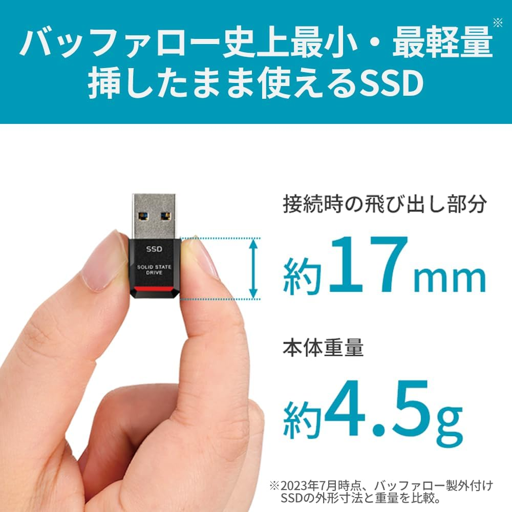

外付けの小さなSSDで起動できるWindows11が簡単にできました。  
このSSDがあれば、どのPCでも自分の環境のWindows11が起動できます。

## 必要なもの

* 作業用WindowsPC
* 外付けのSSD（USBメモリにもインストールできるけど遅すぎて実用的でない）
* Windowsを外付デバイスにインストールするツール(Rufus)

以上です。

## 外付SSD

バッファローのUSBメモリぐらい小さいものを使いました。  

  

[バッファロー SSD 外付け 250GB 極小 コンパクト ポータブル PS5 / PS4 対応 (メーカー動作確認済) USB3.2 Gen2 読込速度 600MB/s ブラック エコパッケージ SSD-PST250U3BA/N](https://amzn.to/42k5yu3)  
(アフィリエイトリンクです)

## Rufus

<iframe title="Rufus - 起動可能なUSBドライブを簡単に作成できます" src="https://hatenablog-parts.com/embed?url=https://rufus.ie/ja/" style="width:100%;height:150px; max-width:600px; margin-left:auto; margin-right:auto;" frameborder="0" scrolling="no" loading="lazy"></iframe>

こちらのツールを使うことで簡単に、外付SSDにWindowsをインストールできます。

### 使い方

ダウンロードしたRufusを起動して、以下のような設定にします。

* **デバイス**  
    初期状態ではSSDは選択できません。   
    下の方の「USB接続のHDDを一覧表示」をチェックすることでSSDのドライブも選択できます。
* **ブートの種類**   
    ここにインストールするWindowsのISOファイルを指定するのですが、右側の「選択」というところからダウンロードすることもできます。  
    ただし、うまく行かないこともあるので、その場合は後述する方法でISOファイルをダウンロードしてしてしてください。
* **イメージオプション**  
    ここを必ず「**Windows to Go**」にしてください。  
    WindowsのISOファイルを指定した後でないと、このオプションは表示されないので忘れがちです。  
    「Windows to Go」にしないと、Windowsをインストールするためのデバイスになってしまい、Windowsが起動するデバイスになりません。

これで「スタート」を押すと更に、いくつかオプションが選択できます。

自分は、すべてのオプションにチェックを入れました。

できたら、再起動して外付デバイスから起動すればWindowsが起動するはずです。  
(外付デバイスから起動しない場合は、電源投入後F2とかF12とかDELキーを押しっぱなしや連打などを試して起動メニュー立ち上げてみてください)

## Windows11のISOイメージダウンロード
RufusでWindowsのイメージをダウンロードしようとするとエラーになることがあります。  
調べたところIPアドレスで弾かれたりすることがあるとかなんとか・・・  
別の日に試したらダウンロードできたので、時間を開けてから試す方法もありますが、マイクロソフトのツールを使ってダウンロードする方法もあります。

<iframe title="Windows 11 をダウンロードする" src="https://hatenablog-parts.com/embed?url=https://www.microsoft.com/ja-jp/software-download/windows11" style="width:100%;height:150px; max-width:600px; margin-left:auto; margin-right:auto;" frameborder="0" scrolling="no" loading="lazy"></iframe>

注意する点は、Rufusでダウンロードできなかったときは、一番下の「ディスクイメージ(ISO)をダウンロードする」でもエラーになるので、その上の「インストールメディアを作成する」をダウンロードしてISOファイルを作成します。

## まとめ

簡単に外付SSDから立ち上がるWindowsができるので、ぜひ試してみてください。

* 普段は別のOSを使っているが、時々Windowsを起動する必要がある。
* 特定の用途用のWindowsを用意しておきたい。
* Windowsが起動しなくなったとき用の、非常用として。

など、いろいろと用途はあるのではないでしょうか？

