がんばらない日常にコーヒーは欠かせませんね。  
ほぼ毎日コーヒーを挽いて入れて香りを楽しんでいるのですが、焙煎もいつかはやってみたいと思いつつ、いろいろ大変そうなので躊躇していました。

1. 焙煎器：ロースターや焙煎するための器具をそろえるのが大変そう
1. ゴミ：焙煎すると豆の皮（チャフというらしい）が舞い散るらしい
1. 匂い：コーヒーの香りが部屋中に染み付くのではないか？

## 電子レンジでコーヒー焙煎

そんなとき電子レンジでコーヒー焙煎ができると聞いて、これならそれほどがんばらずにやれるのでは？と思い試してみました。

1. 焙煎器：電子レンジと電子レンジにかけれる蓋つきの耐熱容器があればいいらしい
1. ゴミ：耐熱容器の中だけに納まりそう？
1. 匂い：電子レンジの中だけで納まりそう？
1. 出来栄え：うまくできるのだろうか？

上記のような不安もありつつ、失敗したらしたでネタになるということで試してみました。

## 用意したもの

* 電子レンジ
* 蓋つき耐熱容器  
    小型の土鍋があったので、土鍋を使いました。
* ざる  
    焙煎後に豆を冷やすために使うので、熱に強いもの。
* 生豆  
    今回購入したのはこれだけ！！  
    [松屋珈琲　コーヒー生豆　ブラジル サントス No.2 17/18 (1kg袋)](https://amzn.to/3L7B9VQ)  
    Amazonのレビューが高くて安いのを選んだ！  

## 焙煎

1. 生豆を土鍋に入れる  
   あまり変な豆はなさそうだったので、ハンドピックせず、100g入れてみました。

2. 蓋をして電子レンジで３０秒（５００W）
3. 取り出して、蓋をしたまま揺する。（加熱ムラを減らすため）
4. 2,3をひたすら繰り返す。  
   時々加熱具合を見るためや、湿気を逃がすために蓋を開けて確認する。  
5. 好みの色になったらざるにあけて冷やす。
6. 完成！！

## 途中の写真

生豆100g  
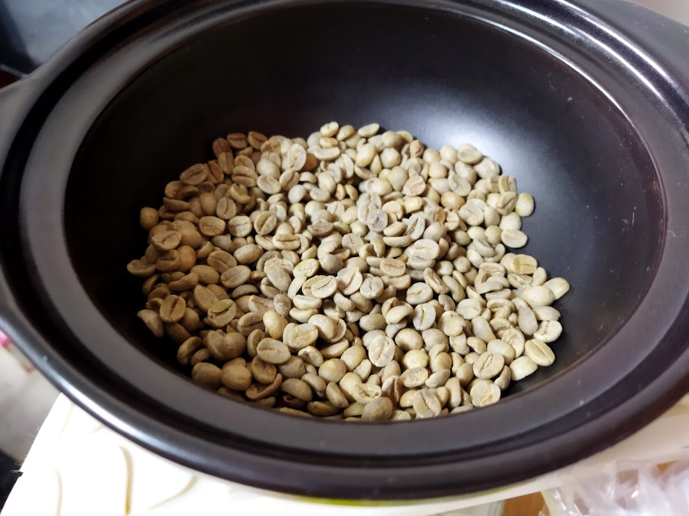

30秒x6 (3分後)  
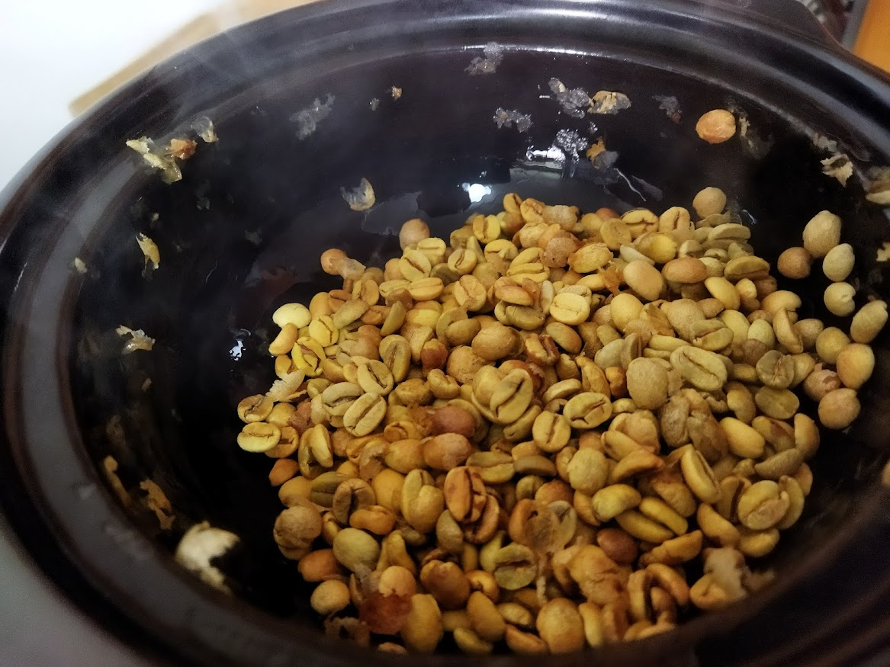

さらに30秒x2 (トータル4分)  
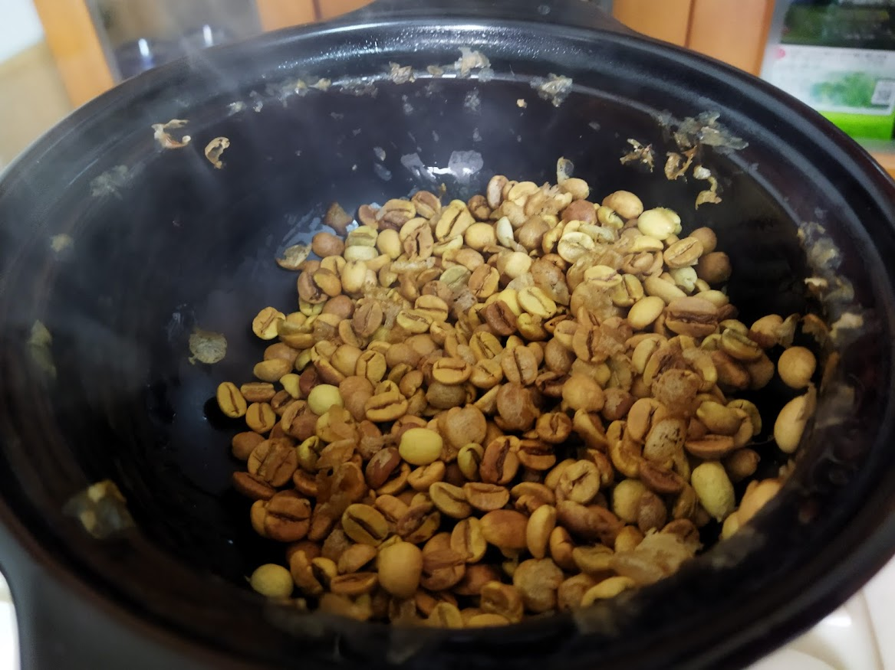

さらに30秒x4 (トータル６分)  
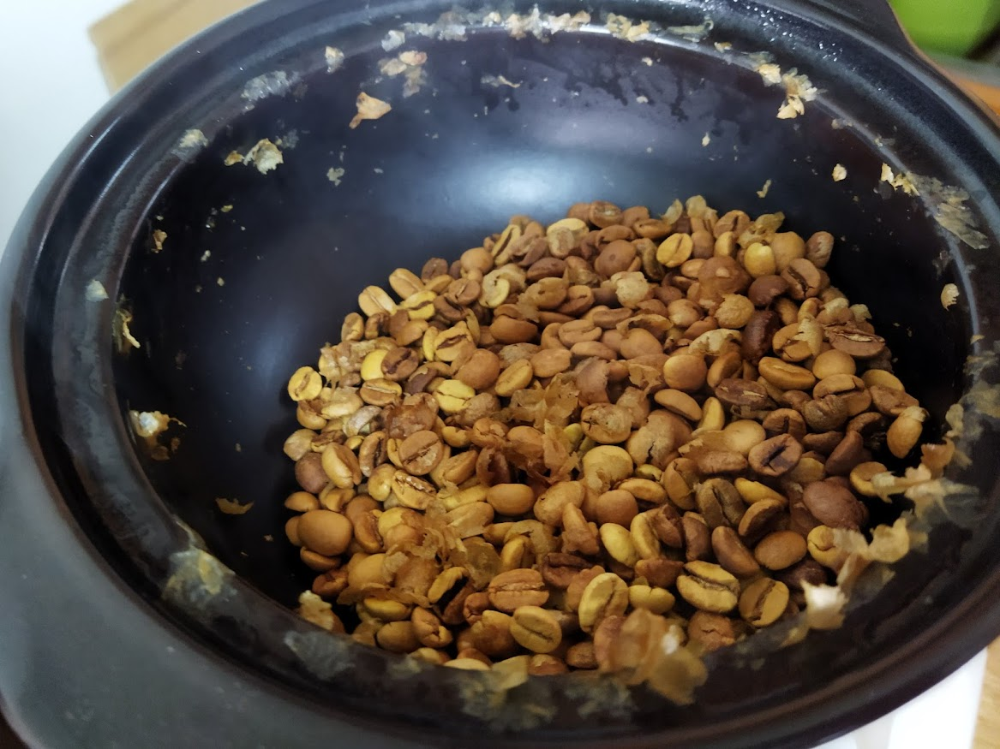

さらに30秒x2 (トータル７分)
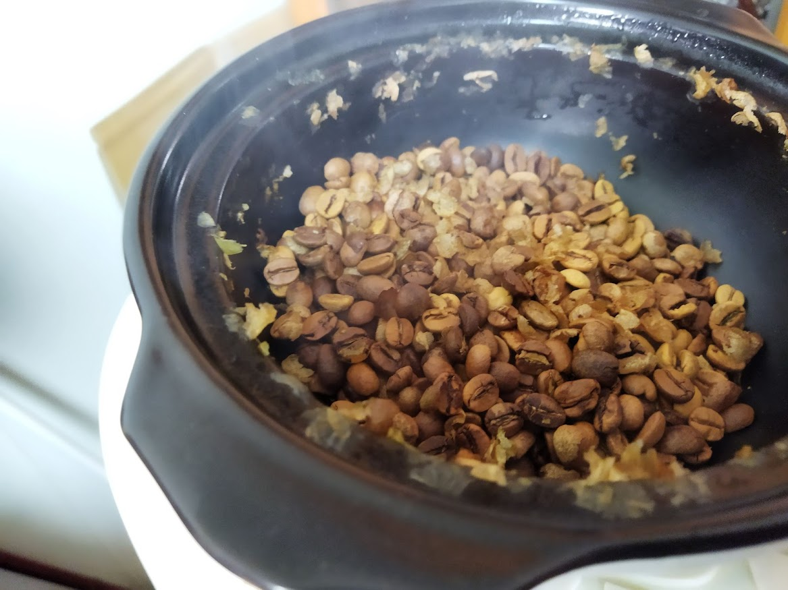

さらに30秒x2 (トータル８分)
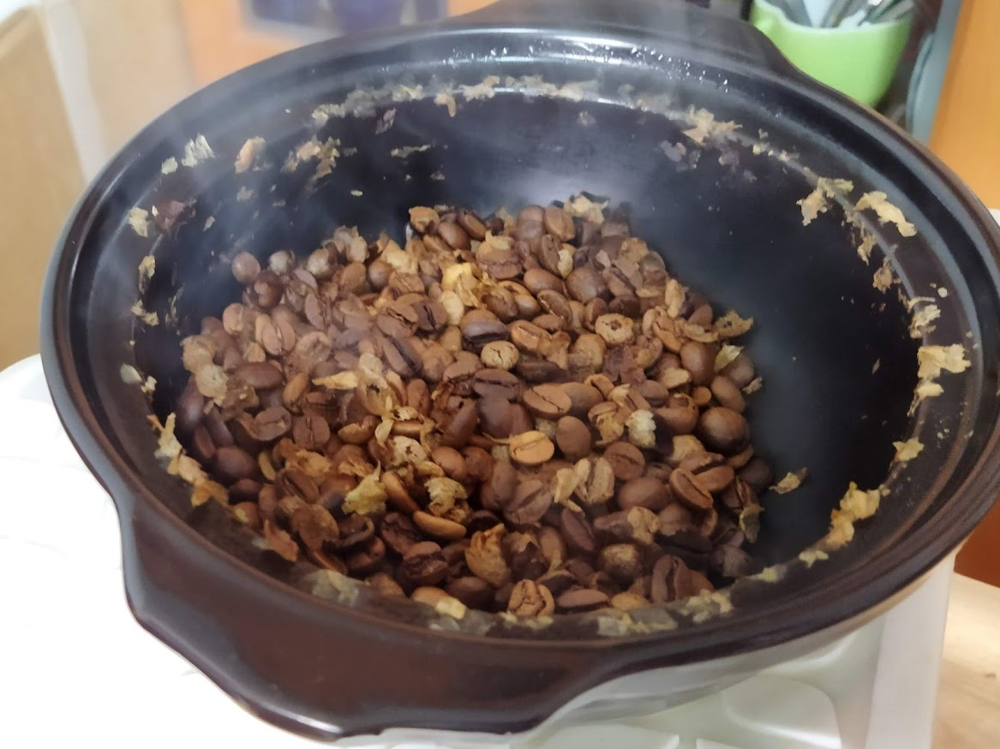

さらに30秒x2 (トータル９分)
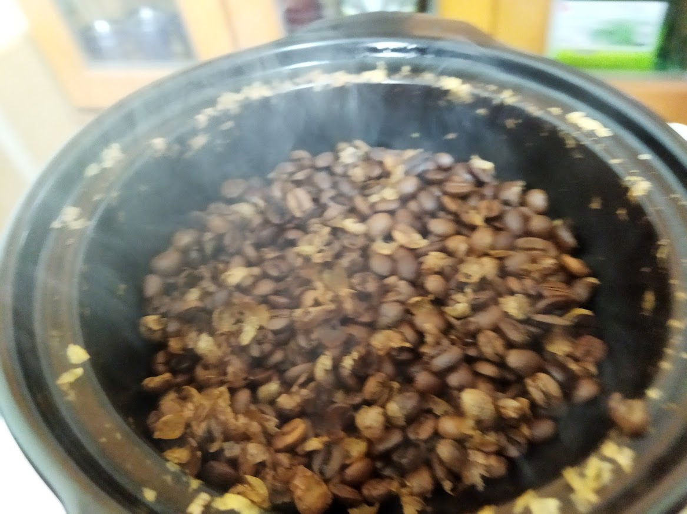

さらに30秒(トータル９分３０秒)

さらに30秒(トータル１０分)
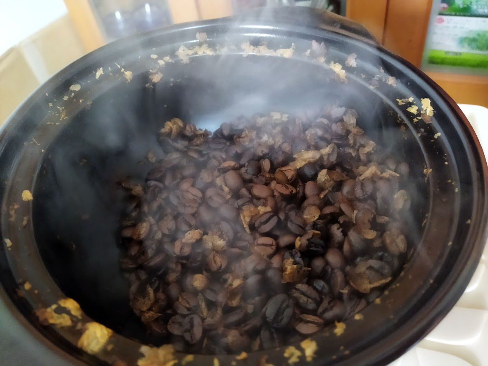

さらに30秒(トータル１０分３０秒)
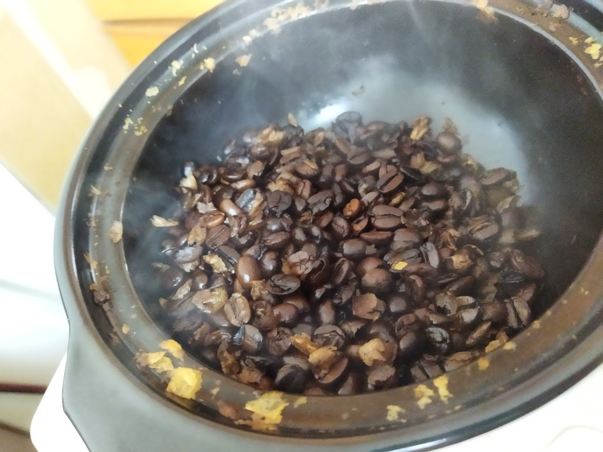

さらに30秒(トータル１１分)
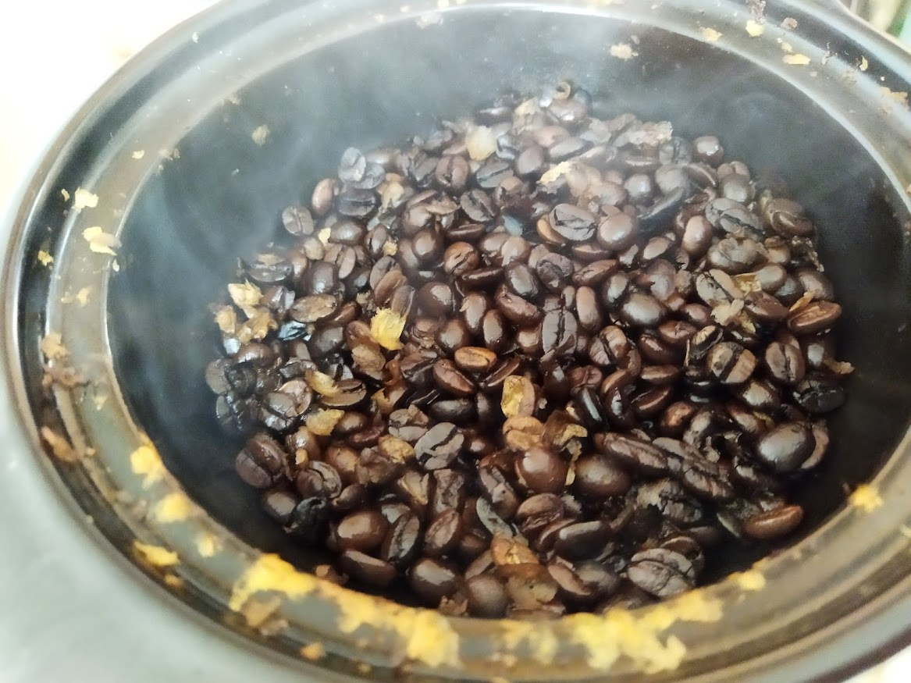

ざるにあけて冷やす  
うちわとか用意してなかったのでひたすら振ったり混ぜたりした。
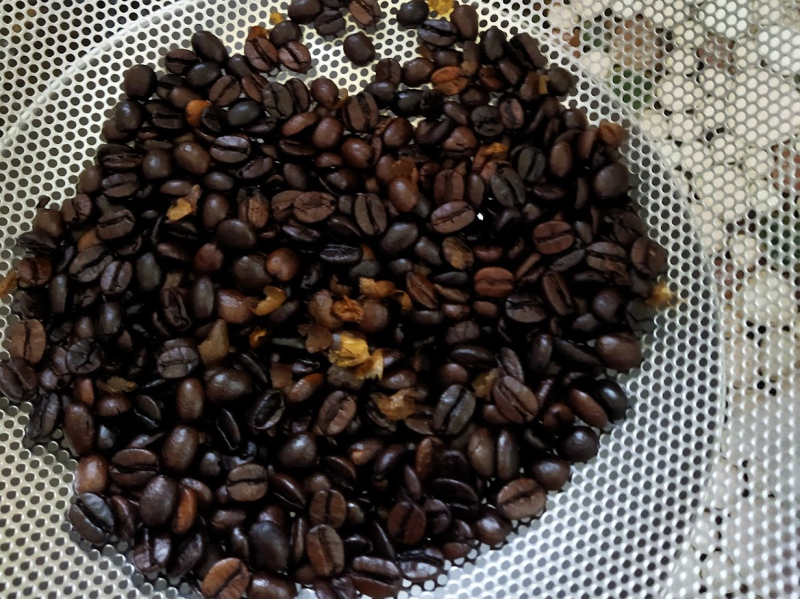

ほとんどチャフ（豆の皮）とか舞い散らずに、ざるから下に落ちました。
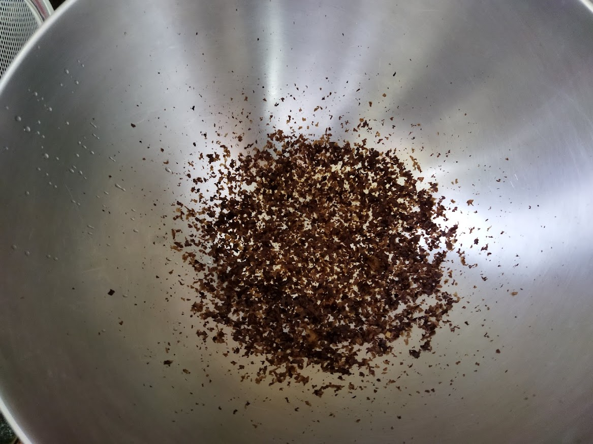

完成！！！

さっそくミルで挽いてみる
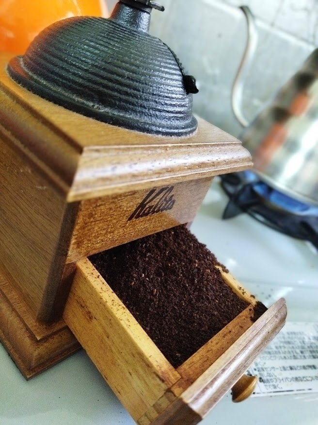

生豆との比較  

## 味・香り

焙煎のはじめは、生豆の生臭い感じ。  
焙煎中は、コーヒーの香りよりも、炒ってる匂いのほうが強かったです。

焙煎後すぐに挽いてみても、炒った匂いが部屋に残っているせいなのか、まだ香りが出てきていないのか、あまりにコーヒーのにおいは感じられませんでした。  
すぐ挽いたコーヒーの味は、深炒りにしたのに苦味はあまりなく、チョコレートのような甘さがかなり強く出ていました。

数時間後と、１日後に淹れてみたら、香りと苦味がどんどん強くなり、チョコレートのような風味は薄くなって深炒りな感じが出てきました。

## 感想

電子レンジ焙煎いいです！！  
そんなにどころか全然がんばらずに焙煎できます。  
気にしてた、カスが飛び散ったり、匂いが充満したりもないし、後片付けもラク。  

うまく行き過ぎて怖いくらい。  
たまたまうまくいっただけかもしれないので、次は失敗するかも？

まあ、失敗しても楽しそう。

みなさんも、がんばらないライフにコーヒーを！！！
