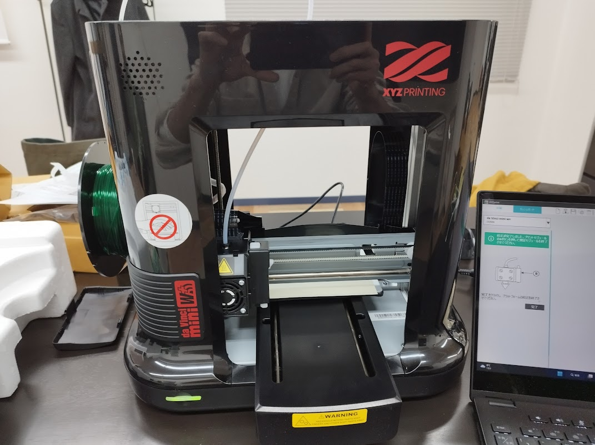
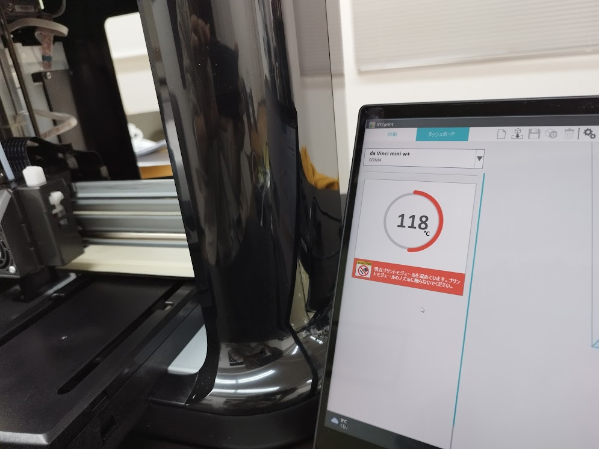
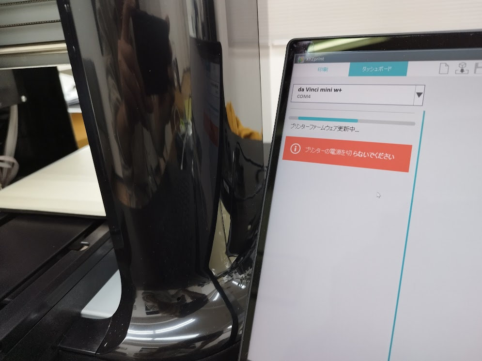
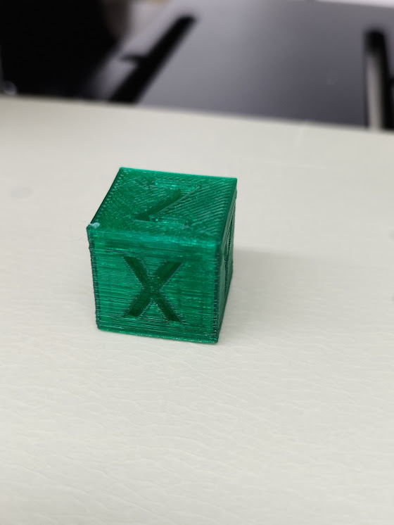

XYZプリンティングの初心者向け3Dプリンター「[ダヴィンチmini w+](https://www.xyzprinting.com/ja-JP/product/da-vinci-mini-w-white)」のセットアップをさせていただく機会がありましたので、セットアップの注意点や触ってみた感想などを残しておきます。

## 「ダヴィンチmini w+」は買いか？

いきなり結論的な話になりますが、

**入門用プリンターとしては買い！**

とにかく難しいことを考えずに３Dプリントを体験したい人にはとても良いプリンターだと感じました。

よりいろいろな素材で、高度なプリントをしたいと考えると２台目が欲しくなりますが、まずは３Dプリントを体験し、もっと作りたいと思うことが重要です。

３Ｄプリンター自体を整備したり、カスタマイズしていくことを目標にする人には、別のプリンターがおすすめです。

### 良い点
* 難しい組み立てもなく、プリント前の調整作業もほとんど必要なく、すぐにプリントできます。
* フィラメントも純正品しか選べないので迷う必要がなく、装着したフィラメントとプリント設定が違う場合エラーが出ます。
* USB接続、wifi接続どちらでも使えます。
* プリント用のアプリケーションや、モデリング用アプリケーションがメーカー純正で用意されている。

### 悪い点
* ベッド(プラットフォーム)を温める機能がない
* 純正のフィラメントしか使えない
* プリント用のスライサーが純正のものしか使えない
* 拡張性が低い

## セットアップ

1. 緩衝材等を取り除く
1. フィラメントをセット
1. プラットフォームシートを張り付ける
1. 配線（コンセント、USBケーブル）

特に間違いやすいというような箇所はありませんが、説明書には細かなことは書かれていません。  
こちらのサイトに細かく写真入りで説明してくれていますので参考にするとよいでしょう。  
[ダヴィンチmini w\+ 3Dプリンタの使い方①開梱・設置編 \| ロジカラブログ](https://logikara.blog/davinci-mini-1/)

## ソフトウェアインストール

PCに必要なソフトをインストールします。

1. XYZprintingアカウントの作成
1. XYZmaker suite(総合ソフト)をインストール
1. XYZmaker 3Dkit(モデリングソフト)をインストール
1. XYZprint(印刷用ソフト)をインストール

ソフトウェアをダウンロードするのに、XYZprintingアカウントを作成する必要があります。  
注意点としてアカウント作成時に**「Facebookでサインインする」を選ばない**ようにしてください。  
後で、インストールしたアプリでもログインが必要になりますが、アプリではFacebookでログインが使えず、パスワードを求められます。  
Facebookでサインインしてしまったら、後からパスワードを追加したり、アカウントを削除する方法がわからなかったので、別のメールアドレスでアカウントをもうひとつ作成しなければなりませんでした。

「XYZmaker 3Dkit」「XYZprint」は、総合ソフトの「XYZmaker suite」からインストールをします。
（XYZmaker suiteでも、XYZprintingアカウントでログインしないとインストールできないので注意）

「XYZmaker 3Dkit」は３Dデータを作成するためのアプリケーションなので、STLデータを他で用意できれば必要ありません。

各ソフトウェアの細かなインストール方法は、こちらのサイトが参考になります。  
[ダヴィンチmini w\+ 3Dプリンタの使い方②テスト印刷編 \| ロジカラブログ](https://logikara.blog/davinci-mini-2/)

## 調整

印刷をする前に、以下の３つの調整が必要です。

1. キャリブレーション（水平調整）
2. Ｚオフセット（ノズルとプラットフォームの距離設定）
3. フィラメントのロード（ノズルが正常か確認）

2の「Ｚオフセット（ノズルとプラットフォームの距離設定）」は省略しましたが、うまく印刷できました。

うまく造形物が定着しない場合などは、再度レベリングやZオフセットの調整をするのがよさそうです。

こちらの動画が参考になりました。

<YouTube youTubeId="7fjfAuf67XI" />

## 写真

PCと接続してレベリング調整終了時(レベルセンサー格納手順を指示されています)

フィラメントロード開始時のノズル温め中画面

ファームウェアをアップデートしてみました

テストプリントしたもの

<iframe class="mx-auto" sandbox="allow-popups allow-scripts allow-modals allow-forms allow-same-origin" style="width:120px;height:240px;" marginwidth="0" marginheight="0" scrolling="no" frameborder="0" src="//rcm-fe.amazon-adsystem.com/e/cm?lt1=_blank&bc1=000000&IS2=1&bg1=FFFFFF&fc1=000000&lc1=0000FF&t=seyaorg-22&language=ja_JP&o=9&p=8&l=as4&m=amazon&f=ifr&ref=as_ss_li_til&asins=B07JM6GNVK&linkId=1e1e96b252d18618ab9f73b48087f040"></iframe>

<iframe class="mx-auto" sandbox="allow-popups allow-scripts allow-modals allow-forms allow-same-origin" style="width:120px;height:240px;" marginwidth="0" marginheight="0" scrolling="no" frameborder="0" src="//rcm-fe.amazon-adsystem.com/e/cm?lt1=_blank&bc1=000000&IS2=1&bg1=FFFFFF&fc1=000000&lc1=0000FF&t=seyaorg-22&language=ja_JP&o=9&p=8&l=as4&m=amazon&f=ifr&ref=as_ss_li_til&asins=B00W75P3AI&linkId=e8afe44408cde0316c31e4a480bffa41"></iframe>

ダビンチnanoも、造形サイズが小さい分本体も小さく値段も安いのでいいかも？
<iframe class="mx-auto" sandbox="allow-popups allow-scripts allow-modals allow-forms allow-same-origin" style="width:120px;height:240px;" marginwidth="0" marginheight="0" scrolling="no" frameborder="0" src="//rcm-fe.amazon-adsystem.com/e/cm?lt1=_blank&bc1=000000&IS2=1&bg1=FFFFFF&fc1=000000&lc1=0000FF&t=seyaorg-22&language=ja_JP&o=9&p=8&l=as4&m=amazon&f=ifr&ref=as_ss_li_til&asins=B07L2SDKYN&linkId=1816bd81eb7ee7eda8caac2819aceb5b"></iframe>

3Dプリンターそのものの構造や、カスタマイズで楽しみたいと思っている方には、KP-3Sもおすすめ。
<iframe class="mx-auto" sandbox="allow-popups allow-scripts allow-modals allow-forms allow-same-origin" style="width:120px;height:240px;" marginwidth="0" marginheight="0" scrolling="no" frameborder="0" src="//rcm-fe.amazon-adsystem.com/e/cm?lt1=_blank&bc1=000000&IS2=1&bg1=FFFFFF&fc1=000000&lc1=0000FF&t=seyaorg-22&language=ja_JP&o=9&p=8&l=as4&m=amazon&f=ifr&ref=as_ss_li_til&asins=B08MT8LQ2X&linkId=acdf9e9fe0f3a9ac439c0a0d2340c10d"></iframe>