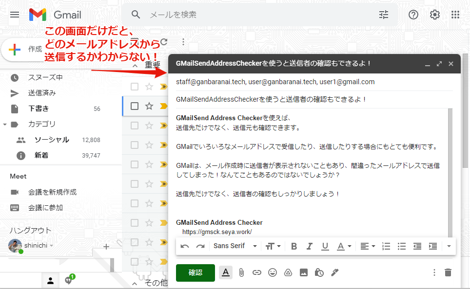
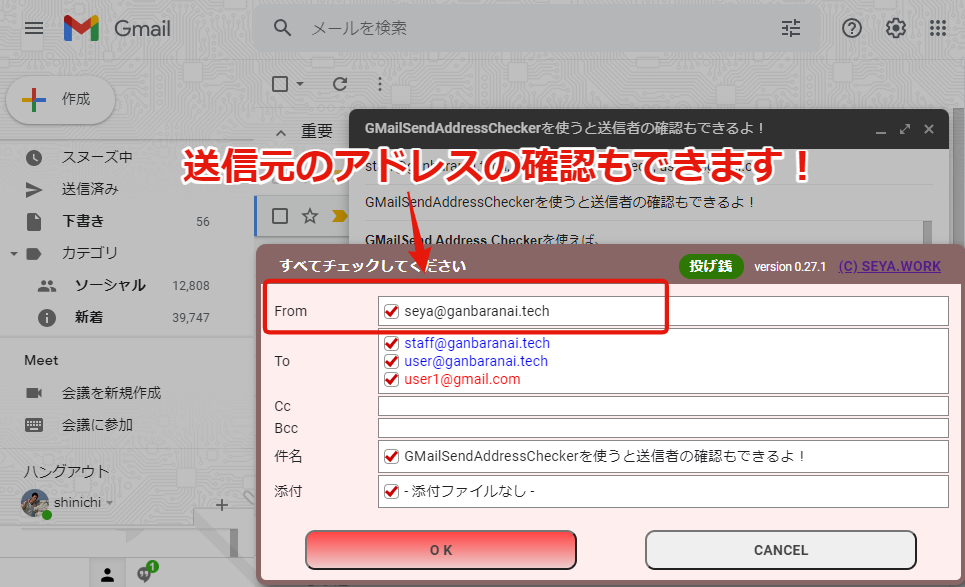

Gmailで複数のメールアドレスを使っていると、メール送信時に別のメールアドレスから送信してしまった！なんてことはありませんか？

## Gmailは便利

Gmailで複数のアドレスのメールを管理すると、とても便利ですよね。  
私も、独自ドメインのメールをGmailで受信したり、仕事用のアドレスも個人のGmailで受信したりしています。  
迷惑メールの振り分けだけでなく、「重要なメール」の振り分け機能もとっても便利です。  
基本「重要なメール」だけ確認すればいいので、メールを確認するのにがんばらなくて済みます。

## どのメールアドレスで送信しようとしてるかわからない
しかし、いろいろなメールアドレスを集約すると、どのメールアドレスで送信しようとしているかわかりにくくなります。

送信先は間違えないように意識するのですが、自分の送信アドレスはあまり気にせずにメール作成することが多いですよね。  
仕事の相手に、個人のメールアドレスで送信してしまうとか、残念な感じになりますよね。

## 送信元のアドレスも確認しましょう！

ガンバラナイ代表の瀬谷が作成した[GMailSend Address Checker](https://gmsck.seya.work/)を使えば、
送信先だけでなく、送信者のアドレスも確認できるので、頑張らずに間違い送信をなくせます。

送信前に、送信者や送信先を確認して、チェックしてから送信することができます。

## Gmailをもっと活用しましょう

[GMailSend Address Checker](https://gmsck.seya.work/)を使えば、複数のアドレス集約も怖くありません。  
どんどんGmailに集約して楽に管理していきましょう。

* [Cloudflareの「Email Routing」とGmailで独自ドメインメールを完全無料で運用する方法 | SERVERSUS](https://www.serversus.work/topics/qkf8sh2jusl8u6sjm5v5/)
* [送信メールアドレスを追加 | Gmailの使い方](https://www.g-workspace.jp/googleworkspace-reference/gmail/another-sendmail/)
* [「優先トレイ」で重要なメールだけをチェックしやすく - 仕事がはかどるGmailテクニック(55) | TECH+](https://news.mynavi.jp/techplus/article/gmail_tech-55/)
* [GMailSend Address Checker - 誤送信防止 -](https://gmsck.seya.work/)

