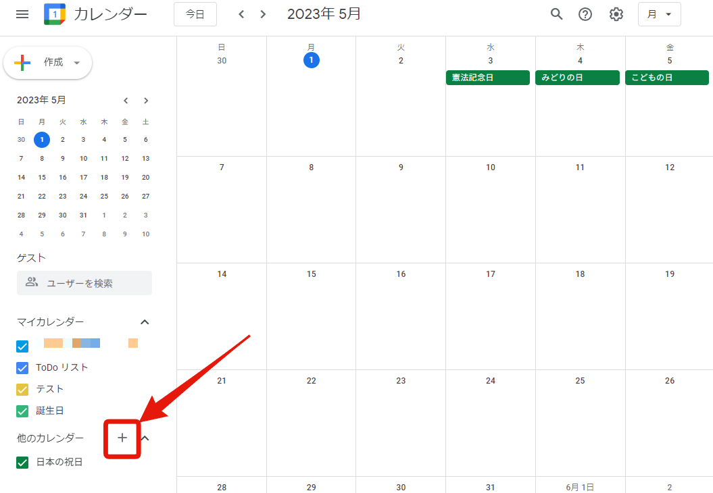
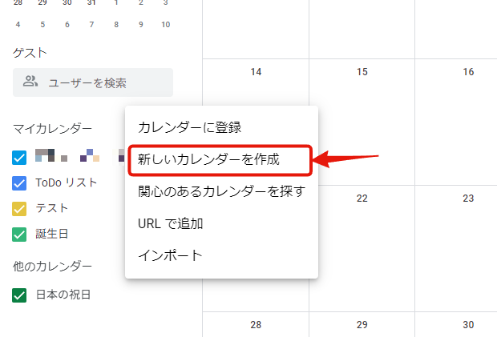
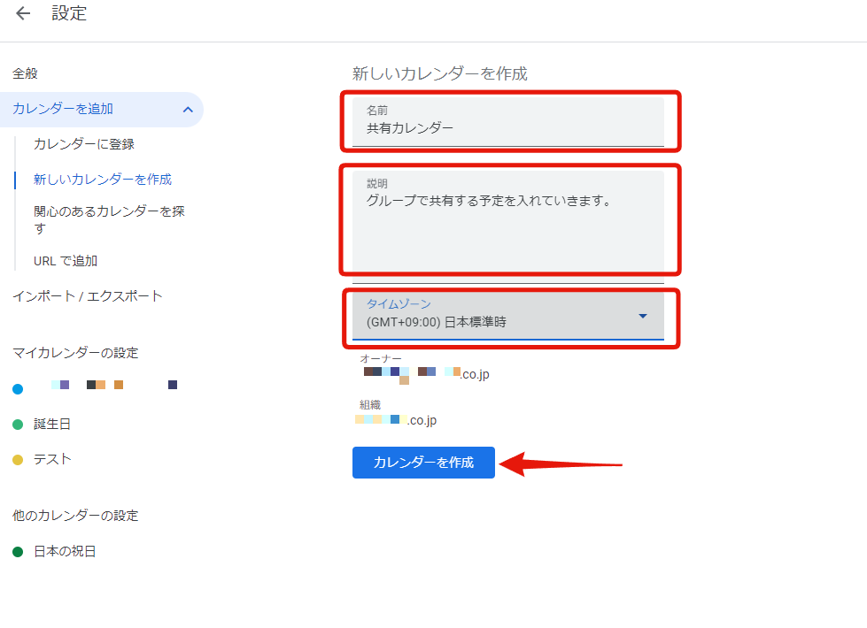
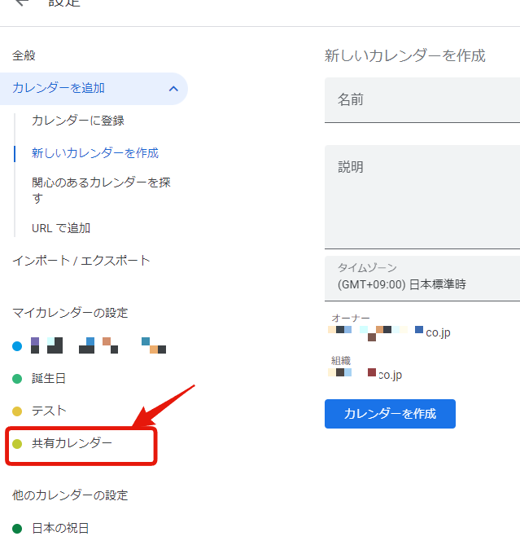
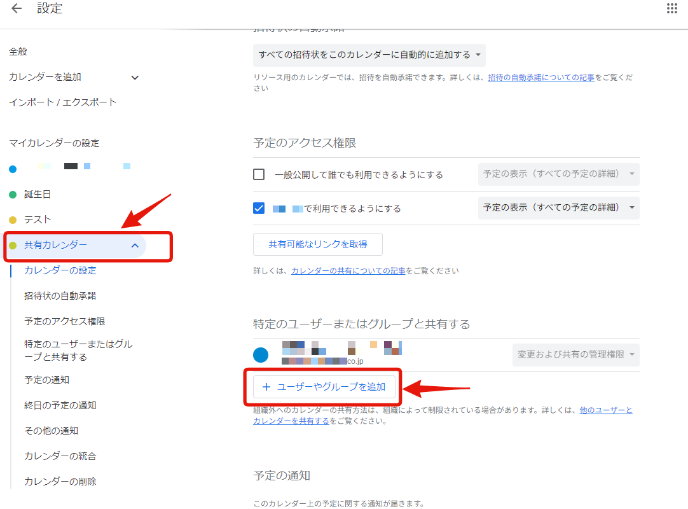
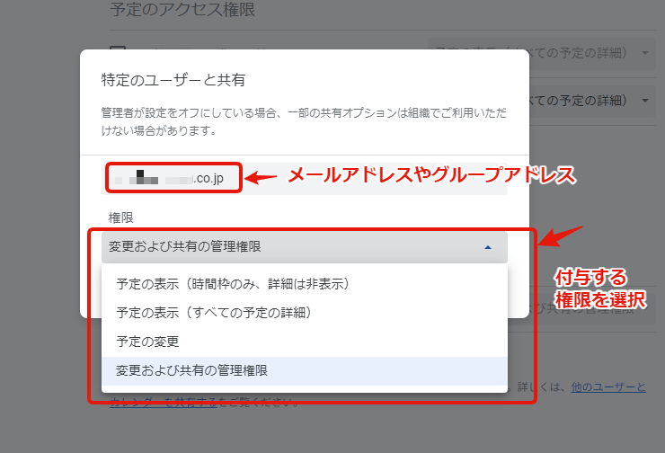
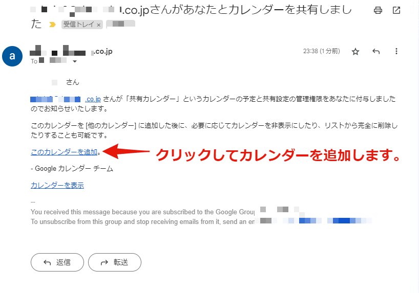

複数人で予定を共有しておくと、いろいろと便利ですが、どのように共有するのがよいか悩みますよね。  
Googleカレンダーを使って楽々簡単にスケジュール共有をしましょう！

Googleカレンダーは、個々のスケジュール管理だけでなく、チームやパートナーとのスケジュール共有にも強力なツールです。  
共有カレンダーを作成することで、複数のユーザーが同じカレンダーを参照し、必要に応じて予定を追加や編集することができます。

## 共有カレンダーの作成方法

以下に、共有カレンダーの作成手順を解説します。

### 1. カレンダーを作成する

Googleカレンダーを開き、左側の「他のカレンダー」セクションを見つけます。  
ここで「+」をクリックし、「新しいカレンダーを作成」を選択します。

* 「他のカレンダー」「＋」をクリック

* 「新しいカレンダーを作成」

### 2. カレンダーの詳細を入力する

次に、新しいカレンダーの名称、説明、タイムゾーンを設定します。  
これらの情報は後からでも変更可能です。

* 名称、説明、タイムゾーンを入力して、「カレンダーを作成」

### 3. カレンダーを保存する

全ての詳細を入力したら、「カレンダーを作成」ボタンをクリックします。  
これで新しいカレンダーが作成され、あなたの「マイカレンダーの設定」リストに表示されます。

* 「マイカレンダーの設定」に作成したカレンダーが追加されています

## カレンダーの共有設定

新しいカレンダーを作成したら、次にそのカレンダーを他のユーザーと共有する設定を行います。

### 1. 共有設定を開く

作成したカレンダーの名前をクリックし、展開されたメニューから「カレンダーの設定」を選択します。

* カレンダー名 ->　「カレンダーの設定」 -> 「ユーザーやグループを追加」

### 2. 共有先を追加する

「特定のユーザーまたはグループと共有する」セクションで、「ユーザーやグループを追加」をクリックします。  
共有したい人のメールアドレスを入力し、その人がカレンダーに対して持つ権限を選択します。  

有料のGoogleWorkspacesを利用している場合は、グループアドレスを入力するとそのグループに属している人全員と共有できます。  
組織内のユーザーだけでなく、組織外のユーザーがグループに入っていても全員と共有できます。

※ただし、組織外のユーザーに予定の参照だけでなく、追加・変更・設定などの権限を付与する場合には、別途管理者による設定が必要となります。
<iframe title="Googleカレンダー活用術：組織外ユーザーに予定の追加・編集を許可する設定 | ガンバラナイ" src="https://hatenablog-parts.com/embed?url=https://ganbaranai.tech/blog/googlecalender-externalsharing-setting/" style="width:100%;height:150px; max-width:600px; margin-left:auto; margin-right:auto;" frameborder="0" scrolling="no" loading="lazy"></iframe>

### 3. 変更を保存する

全ての設定が完了したら、「送信」ボタンをクリックします。これでカレンダーの共有設定が完了です。

共有設定したユーザーに招待メールが送信されますので、メールの案内に従ってカレンダーを追加すると招待されたユーザーも共有カレンダーの参照や変更などが出来るようになります。

* 招待メール

## 共有カレンダーの利用

共有カレンダーは、チームやパートナーと予定を共有するための強力なツールです。  
特に、プロジェクトの期限や会議のスケジュールなど、複数の人が参照する必要のある情報を一元管理するのに便利です。

共有カレンダーに新しい予定を追加した場合、その予定は共有している全てのユーザーに表示されます。  
また、他のユーザーが予定を追加や編集した場合、その変更はリアルタイムであなたのカレンダーに反映されます。

---

以上が、Googleカレンダーで共有カレンダーを作成し、他のユーザーと共有する方法についての解説です。  
この機能を活用して、効率的なスケジュール管理を実現しましょう。  
次回の記事もお楽しみに！

