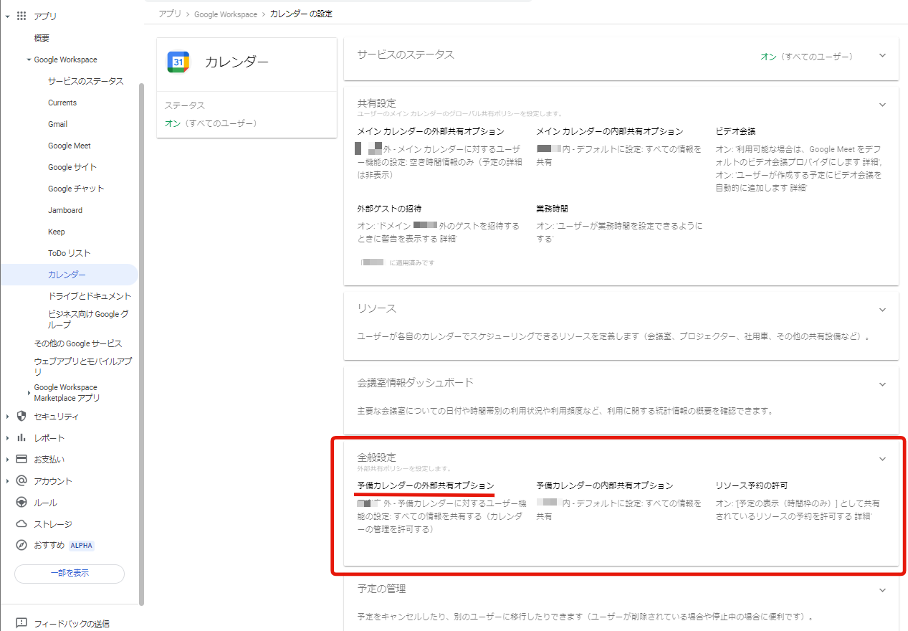
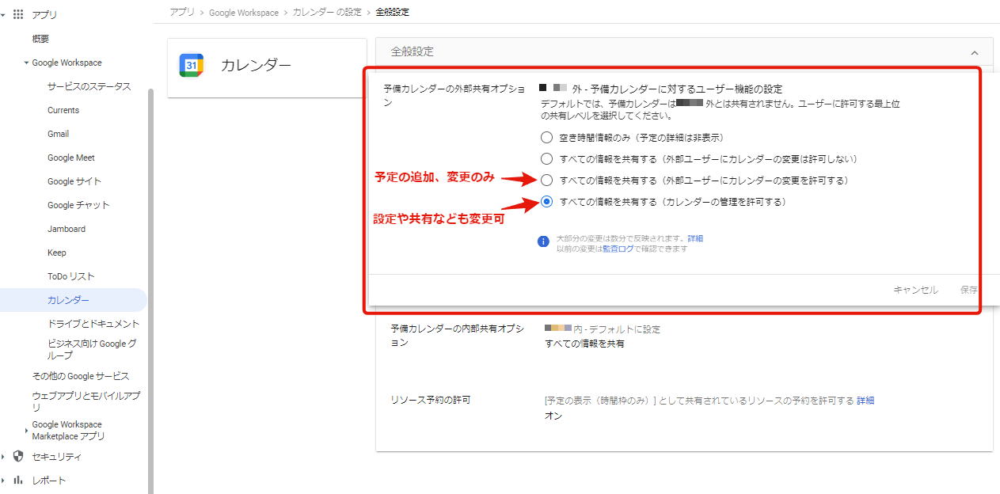

Googleカレンダーは、スケジュール管理を効率化するための強力なツールです。特に、チームや組織全体で利用するとき、その価値は一段と増します。

しかし、組織外のユーザーとカレンダーを共有し、予定の追加や編集を許可するには、管理コンソールで設定を行っておく必要があります。  
設定をしておかないと、組織外のユーザーにはスケジュールを見る権限しか付与できません。

## 設定手順

Google Workspacesの管理コンソールで設定を行います。  
この設定は組織の管理者権限を持つユーザーしか行うことができません。

### カレンダーの設定画面

アプリ > Google Workspaces > カレンダーの設定　画面を開きます。

### 予備カレンダーの外部共有オプションを変更

「全般設定」の「予備カレンダーの外部共有オプション」を変更します。

* すべての情報を共有する（外部ユーザーにカレンダーの変更を許可する）
* すべての情報を共有する（カレンダーの管理を許可する）

これらの選択肢のいずれかを選ぶことで、組織外のユーザーに予定の追加や変更の権限を付与できるようになります。
後者は、さらに設定や共有設定の権限も組織外のユーザーに付与できるようになります。

## 共有カレンダーの作成

設定を行った後、新しいカレンダーを作成し、そのカレンダーを組織外のユーザーと共有することができます。
さらに、予定の追加・編集を行える権限を付与することも可能です。

具体的なカレンダーの作成方法や共有方法については、今後の記事で詳しく解説する予定です。

## 参考サイト
以下サイトを参考にしました。
<iframe title="社外ユーザーとのカレンダー共有可否を設定 | Google 管理コンソールの使い方" src="https://hatenablog-parts.com/embed?url=https://www.g-workspace.jp/googleworkspace-reference/admin/calendar-sharing/" style="width:100%;height:150px; max-width:600px; margin-left:auto; margin-right:auto;" frameborder="0" scrolling="no" loading="lazy"></iframe>

----

今回の記事では、Googleカレンダーで組織外のユーザーとのカレンダー共有を許可し、予定の追加や編集を可能にする設定方法について解説しました。Googleカレンダーを活用して、スケジューリングの効率化を図りましょう。