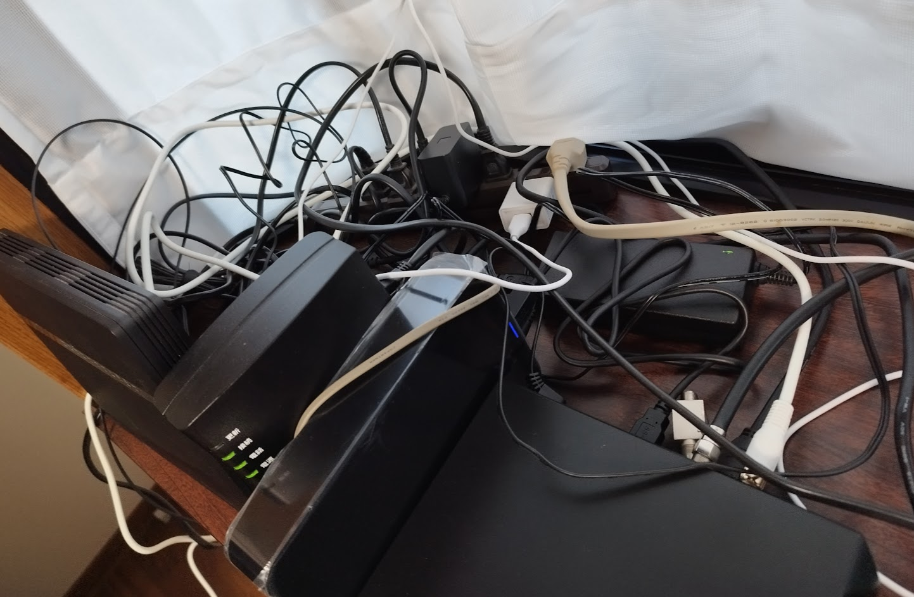
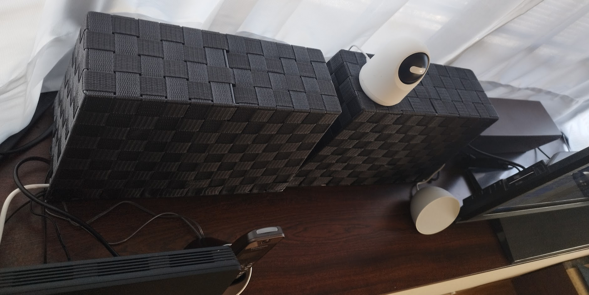
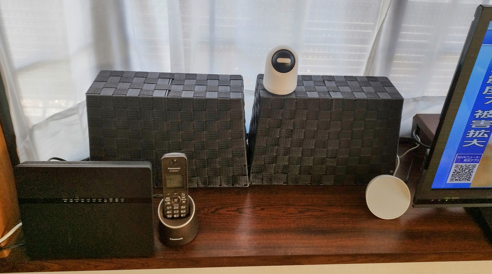
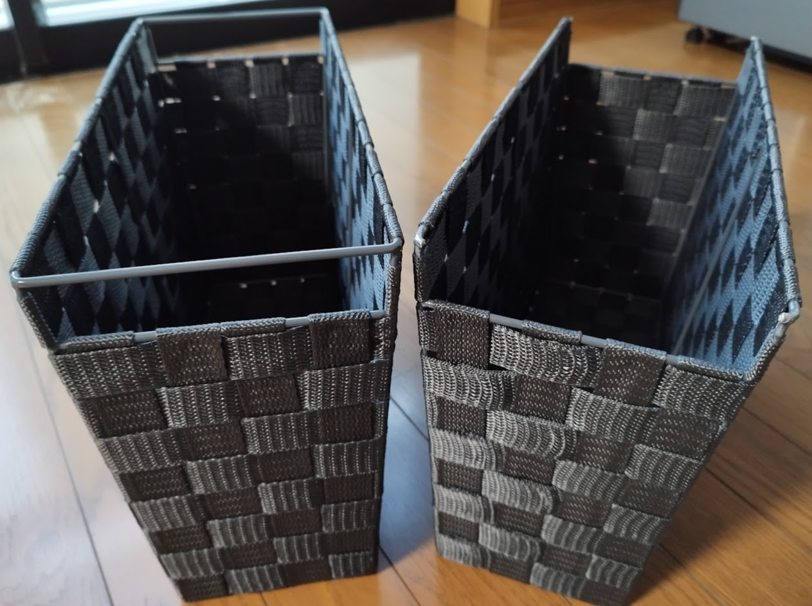
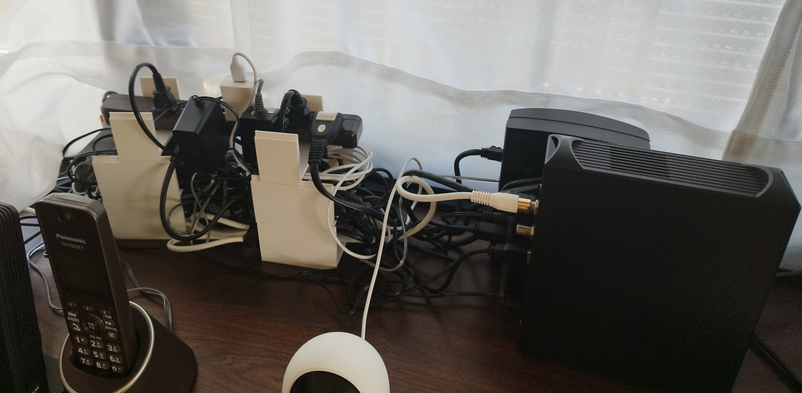

ネット、電話、TVなどのごちゃごちゃ配線を、ダイソーのPP収納マガジンラックと、3Dプリントしたパーツですっきり隠してみました！

## BEFORE

インターネットルーター、ONU、録画用HDD、CATVセットトップボックス、配線、テーブルタップなどで、配線がぐちゃぐちゃ。

## AFTER

配線だけでなく、ONU、HDD、セットトップボックスも隠して、すっきり！！

## 使ったもの

### ダイソー 抗菌ＰＰ収納マガジンラック
<iframe title="抗菌ＰＰ収納マガジンラック" src="https://hatenablog-parts.com/embed?url=https://jp.daisonet.com/collections/living0205/products/4550480256153" style="width:100%;height:150px; max-width:600px; margin-left:auto; margin-right:auto;" frameborder="0" scrolling="no" loading="lazy"></iframe>

取っ手になる部分を切り取って、上からかぶせた時にケーブルが通るように加工しています。  
なかなか固いフレームで、大きめのニッパーで、根気よく少しづつ削るようなイメージでカットしました。  

### ELPA スリム回転タップ
  
[Amazon.co.jp: エルパ (ELPA) スリムタップ 雷ガード 延長コード 7個口 2ｍ 回転 耐雷 WBS-SL702SB(WD)](https://amzn.to/3NMw8WH)  
(アフィリエイトリンクです)

各穴の向きを変えれるので便利です。

### 自作 3Dプリントパーツ

配線や、テーブルタップを上方向に積むためのガイド兼げたになるパーツを、簡単に設計してプリントしました。

下の写真の白いパーツです。

上に重ねてスタックできるパーツを積んでいます。  
間に、配線や大型のACアダプターなどを入れています。  

このように縦に積んだ配線の上に、ダイソーのＰＰ収納マガジンラックをかぶせています。  
ONU、HDD、セットトップボックスも立てて、マガジンラックをかぶせました。

出窓に置いても違和感のないケーブル隠しができたと思います。

## 3DプリントパーツSTL
[block.stl](block.stl)