モバイルSuica以外もfreeeの明細に取り込みたい！ってことで、NFC対応スマホ(Androidでしか試していない)と、Googleスプレッドシート(GAS)でやってみました。

一度設定すれば、スマホに交通系カードをタッチしてアプリで読み込んでエクスポートするだけで、freee会計に同期されます！！

金額だけでなく、鉄道会社、利用区間も明細に入るので、便利です。

モバイルSuicaにすれば、連携アプリがあるのですが、各交通系カードのポイント還元が使えなくなったりします。  
自分の使っているmanacaは、名古屋市営地下鉄や市バスの利用だと10%~30%もの還元を受けることができるので、モバイルSuicaに乗り換えるのは。。。

## 必要なもの

1. freee会計のアカウント（アプリを設定するのに管理者が権限が必要だと思います）  
　　個人事業向けのスタータープランでOK
1. NFC対応スマホ（交通系カードの読み取り用。Androidでしか試していません）
1. GoogleアカウントGoogleドライブ、Googleスプレッドシートを利用します）
1. 交通系カード

## 設定手順

最初の手順はちょっと多いですが、一度設定してしまえば、次からは  
1. スマホで交通系カードを読み取り  
2. 履歴データをエクスポート  

だけで、freeeに明細が同期されるようになります。

### freeeで交通系カード用の口座作成

freee会計のホーム画面から、「決済サービス・電子マネーを登録」をクリックします。  

スクロールした最後の「利用している電子マネーが見つからない場合」をクリックします。  
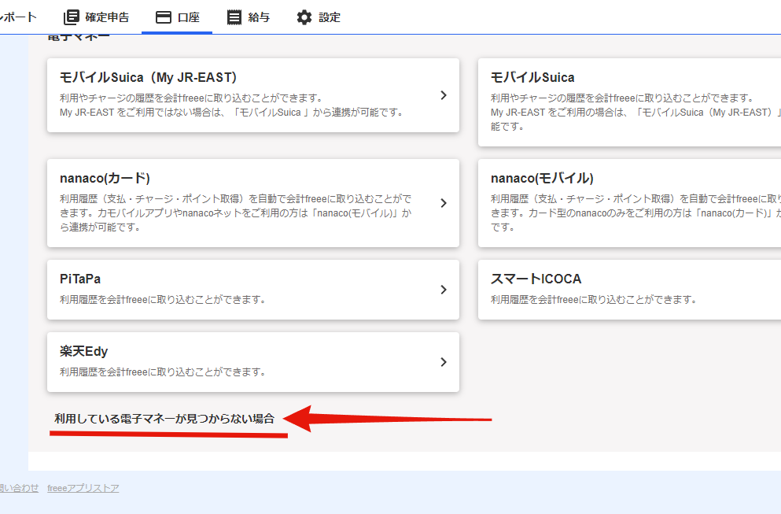

「口座を登録」をクリックします。  
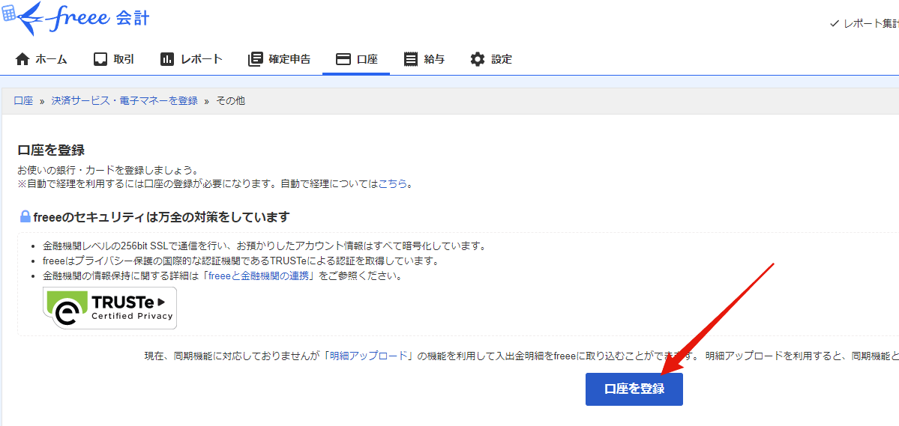

「その他」という名前の口座ができているので、名前を変更します。  
ホーム画面の「その他」をクリックします。  

「口座設定」をクリックします。  
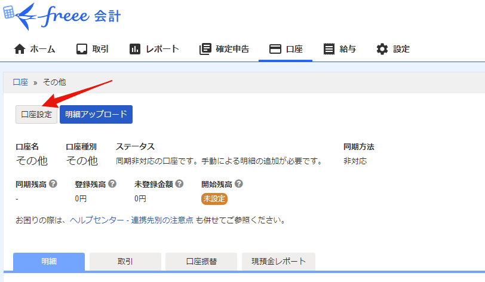

口座名を入力します。  
※あとでスマホアプリの設定にこの名前を使うので覚えておいてください。  
(自分は、manacaにしました)
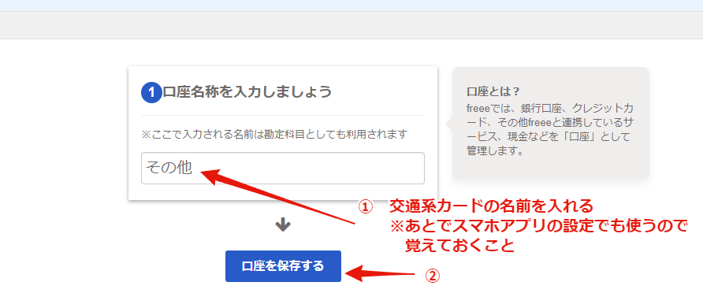

これでfreee会計の口座の準備は完了です。  
次は、交通系カード内の履歴を読み取るためのスマホアプリの準備をします。

### スマホの交通系カード読み取り用アプリの準備

読み取りアプリは以下のアプリを利用させていただきました。

[電子マネーICカード残高確認 \- iPhone/Androidアプリはこちら](https://cardreader.digital-equality.com/)

Android版でしか確認していませんが、履歴のCSVデータの形式が同じで、GoogleドライブへのエクスポートができればiOS版でもうまくいくはずです。

#### カードの新規追加

アプリをインストールして、まずは利用するカードを登録します。

アプリを立ち上げると、簡単な説明チュートリアルがあり、その後以下の画面になるので、「＋」ボタンをタップします。  
  

交通系カードを選び、指示に従って登録するカードをスマホに密着させます。  
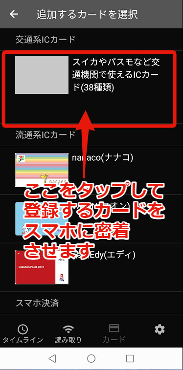

追加したすぐはSuicaのカードの絵になっているので、カードの名前と、カードの画像を変更します。  
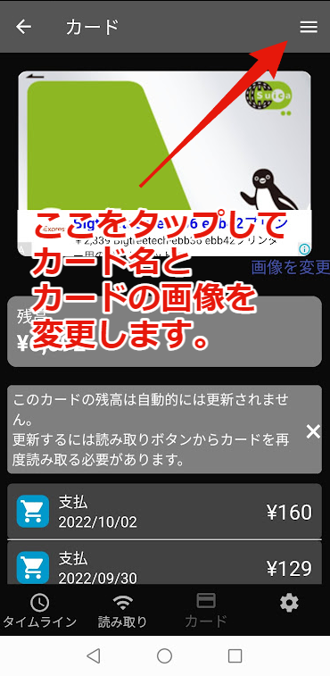  

**!!!! 重要 !!!!**  
**カード名は、freeeで作った口座名と同じ名前にする必要があります。**  
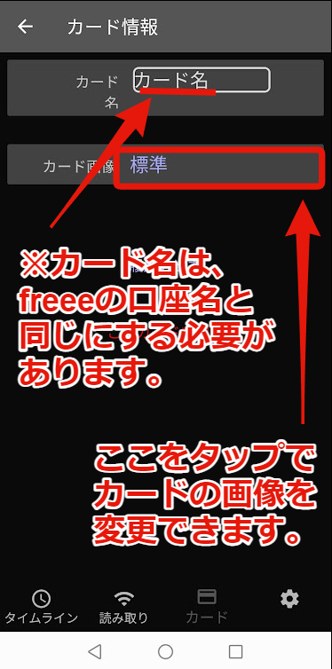

### スプレッドシート設定手順

#### スプレッドシートを適当なフォルダにコピー

[https://docs.google.com/spreadsheets/d/14Vv-ole-d23TnrgHNSRpn4iubhJF5ABWlEGNu-jR-M4/edit?usp=sharing](https://docs.google.com/spreadsheets/d/14Vv-ole-d23TnrgHNSRpn4iubhJF5ABWlEGNu-jR-M4/edit?usp=sharing)  
このスプレッドシート開いて、自分のGoogleドライブにコピーします。  
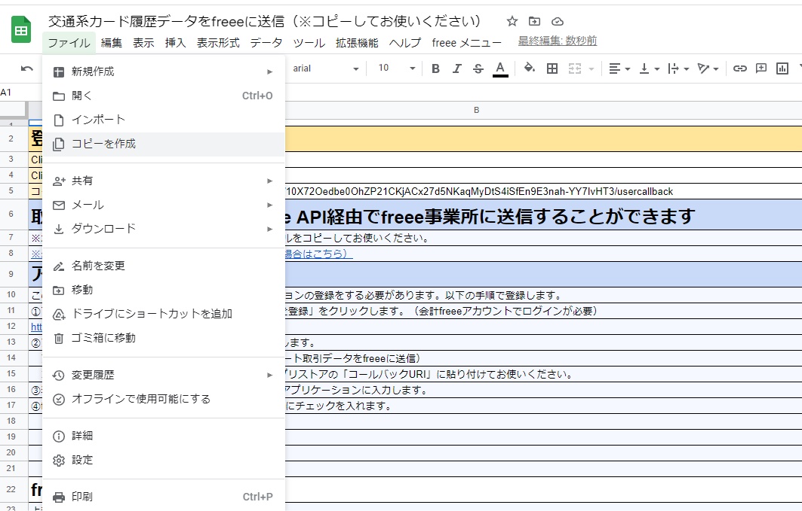

#### freeeにスプレッドシートをアプリとして登録する

コピーしたスプレッドシートとfreeeを連携させるために、アプリとして登録をします。

下記、URLで、freeeにログイン後、「新規追加」ボタンをクリックします。  
https://app.secure.freee.co.jp/developers/applications  

新しいアプリの作成画面で、  
　1.アプリ名（なんでもOK。　例：交通系カード履歴をfreeeに送信）  
　2.概要（念でもOK。　例：交通系カードの履歴データをfreeeの口座明細として送信します）  
　3.「作成」ボタンをクリック  
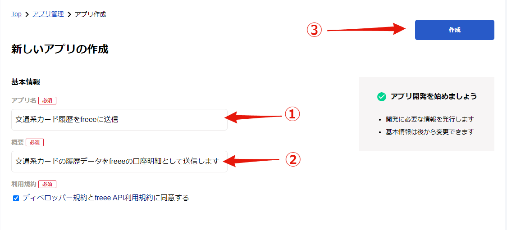

スプレッドシートから、「コールバックURL」をコピーし、フリーのアプリ詳細ページでペーストします。  
↓スプレッドシートの画面  
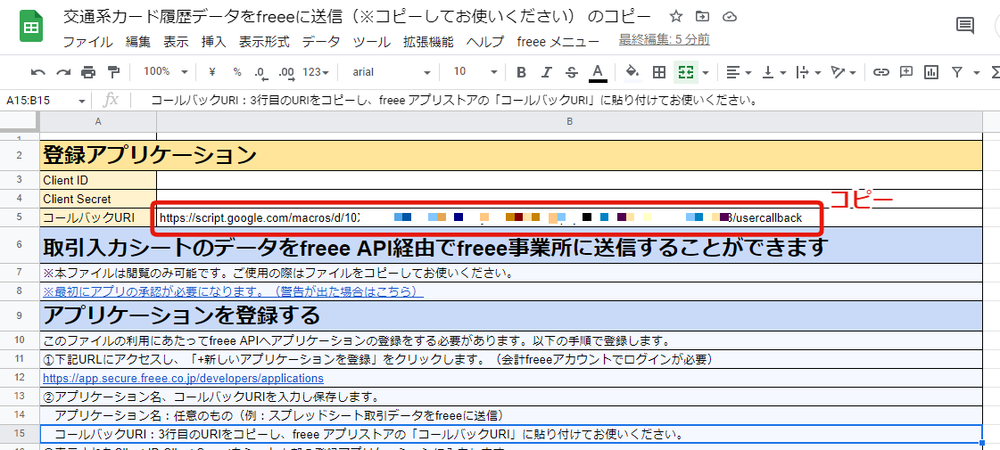

↓freeeアプリ詳細画面  
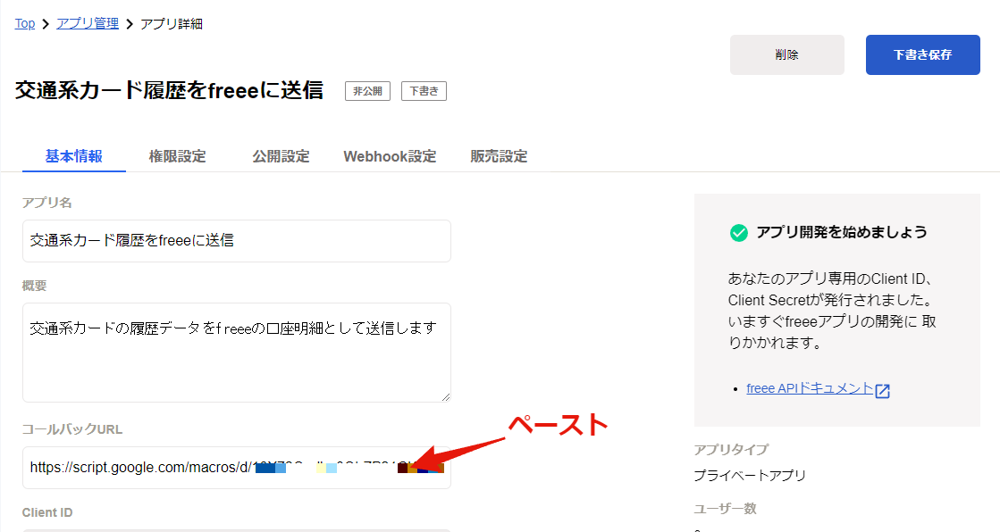

アプリ詳細上ページの、「Client ID」「Client Secret」の値をそれぞれコピーし、スプレッドシートにペーストします。

↓freeeアプリ詳細画面  
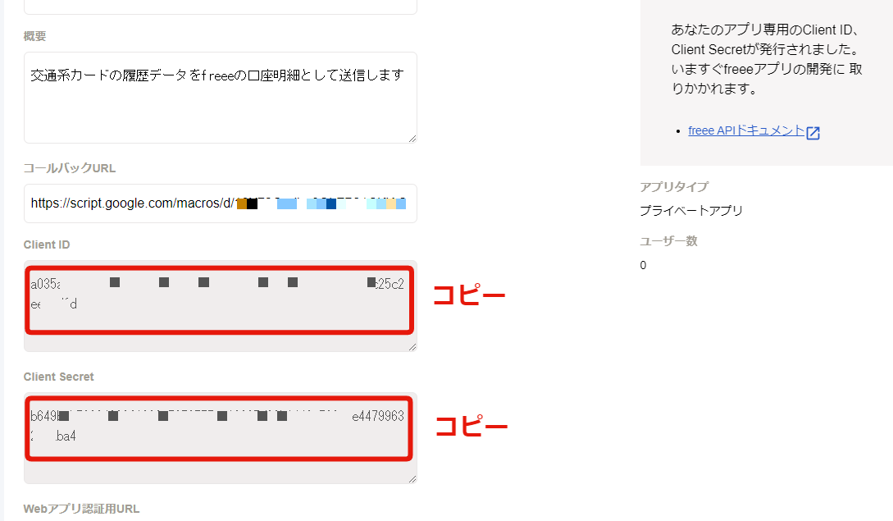

↓スプレッドシート画面
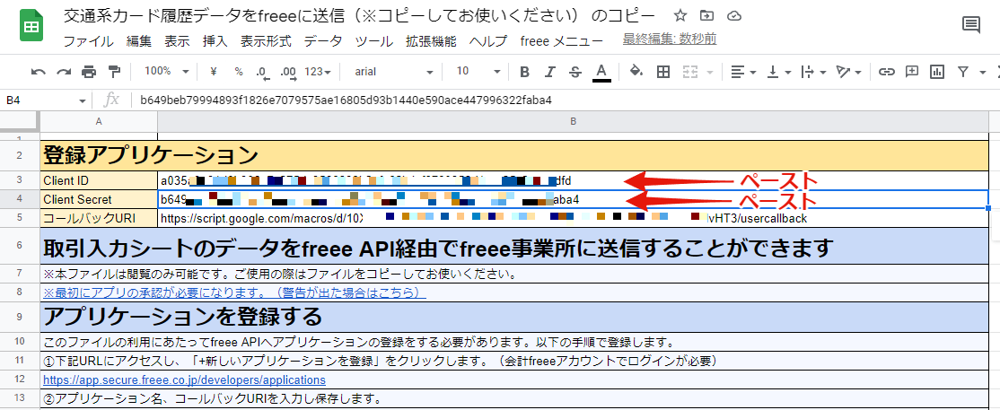

次は、アプリにどのようなデータへのアクセスを許可するかを設定します。  
このアプリでは、以下の権限が必要です。  
　・[会計] 事業所　　参照  
　・[会計] 明細　　　参照　更新  
　・[会計] 口座　　　参照	  

freeeアプリ詳細画面で「権限設定」をクリックして、上記の権限をチェックします。  
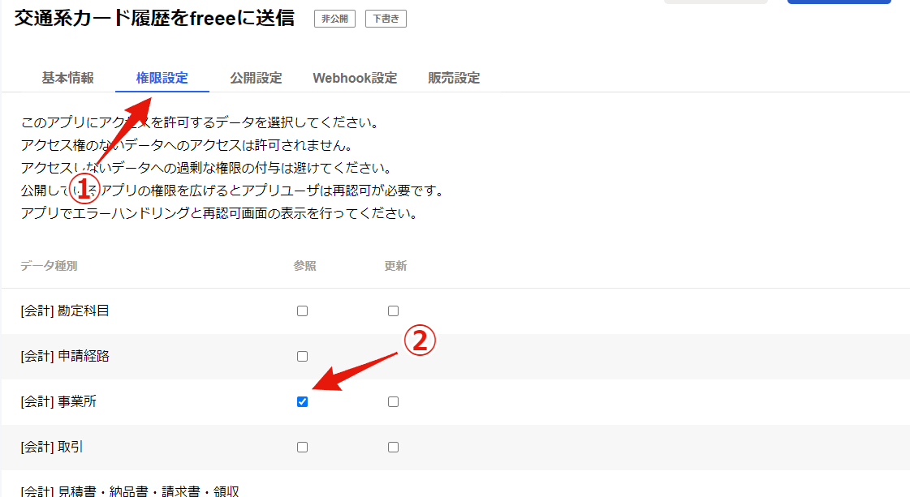

　　：

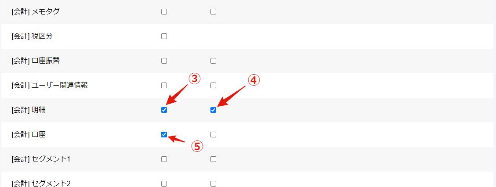

最後に「下書き保存」をクリックします。  
（下書き保存のままでいいのか？という不安がありますが、これで大丈夫なようです）
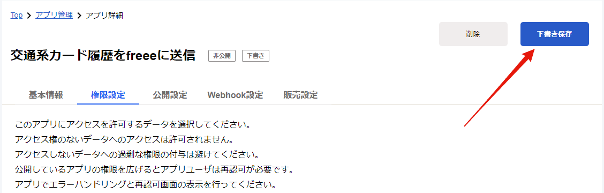

#### freeeから必要な情報を取得

freeeから口座の一覧を取得する必要があります。

スプレッドシートに「freeeメニュー」が追加されているので、そこから以下の操作を行います。  
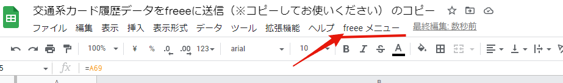

1.freeeと連携  
　ユーザーアカウントでfreeeとスプレッドシートの連携の認証を行います。  
2.事業所を選択
　取引の送信先となる事業所の選択を行います。  
3.口座リストを取得  
　事業所に登録されている口座一覧を取得します。（カード履歴のカード名と同じ名前の口座に明細を追加します）  
　※時間がかかる場合があります  

1から3までを順番に行います。

##### 初回実行時のGoogle認証
1を実行したときに「承認が必要」と表示された場合は、「続行」を押して認証を行ってください。  
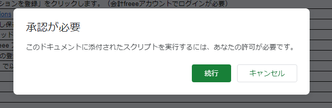

自分のGoogleアカウントを選択します。  
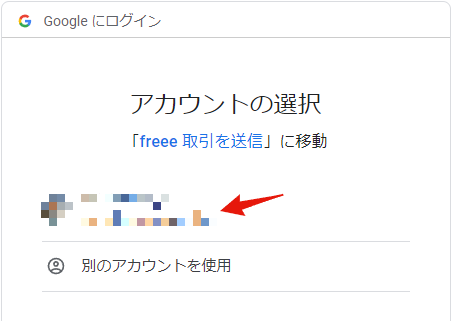

「詳細」をクリック  
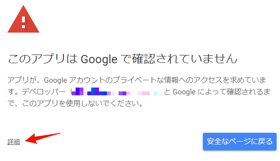

「freee 取引を送信(安全でないページ)に移動」をクリック  
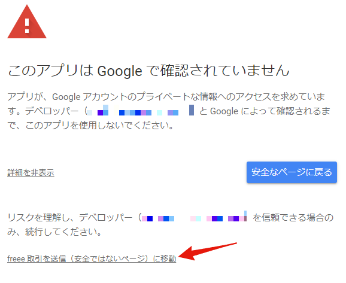

「許可」をクリックして、スプレッドシートのfreeeメニューの１～３までを再度実行してください。
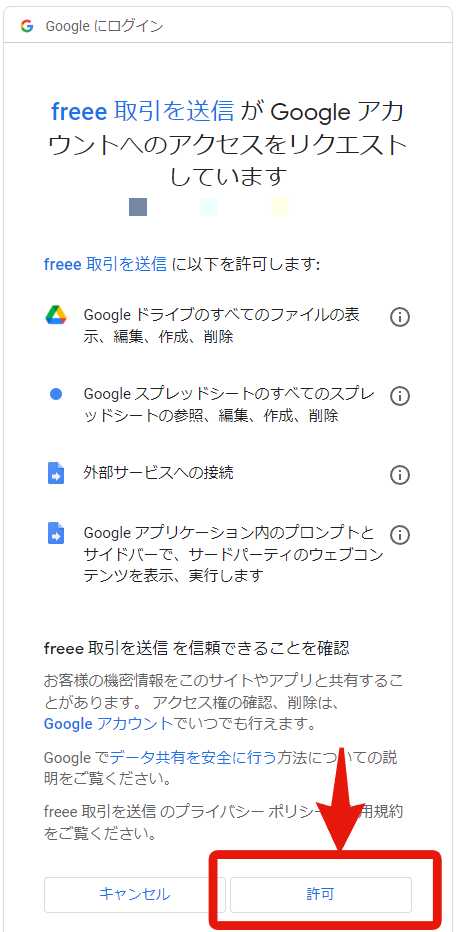

##### 1.freeeとの連携
「1.freeeと連携」を実行すると以下の画面になるので、「認証する」をクリックします。
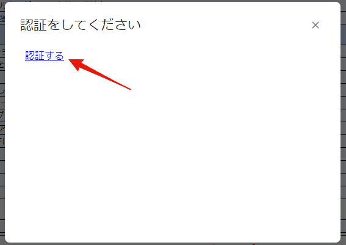

「認証する」をクリックすると、以下が画面が表示されるので「許可する」をクリック

##### 2.事業所を選択
「2.事業所を選択」を実行すると、以下のウィンドウが表示されるので、  
事業所を選択して、決定ボタンを押します。  
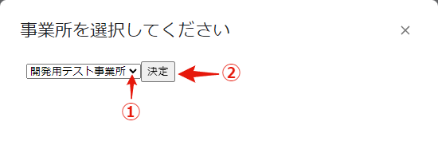

##### 3.口座リストを取得 
「3.口座リストを取得 」を実行すると、freeeから口座の一覧が取得されます。  
特にウィンドウ等の表示はありません。

### カード読み取りとエクスポート

#### カード読み取り

スマホアプリでカードを読み取ります。  
Androidだと、スマホにICカードを密着させたときに起動するアプリを設定することができます。  
(iOSはよくわかりません)

インストールした「電子マネーICカード残高確認」アプリで交通系カードの履歴を読み込みます。  
新規でカード追加したときにすでに読み込まれているので、読み取り作業は省略しても構いません。

#### 履歴データをエクスポート

履歴データをGoogleドライブの、スプレッドシートをコピーしたフォルダにエクスポートします。

交通系カードを読み取ったあとは以下のような画面になっているので、右上のメニューをタップします。  
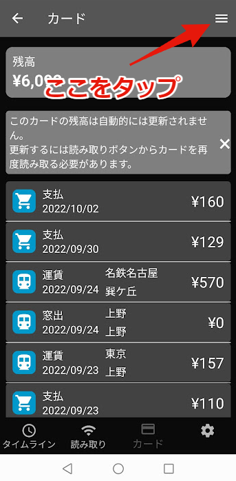

「履歴の出力」をタップ
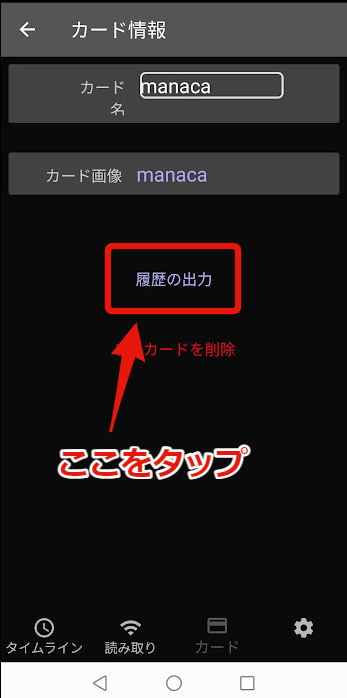

「その他処理用(CSV形式/UTF-8)」をタップ
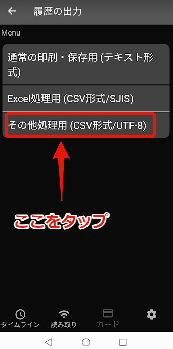

「ドライブ」をタップ  
(２回目以降は保存した場所がアイコン表示されるのでそこを押すだけでOK)

スプレッドシートをコピーしたフォルダを選択して、保存  
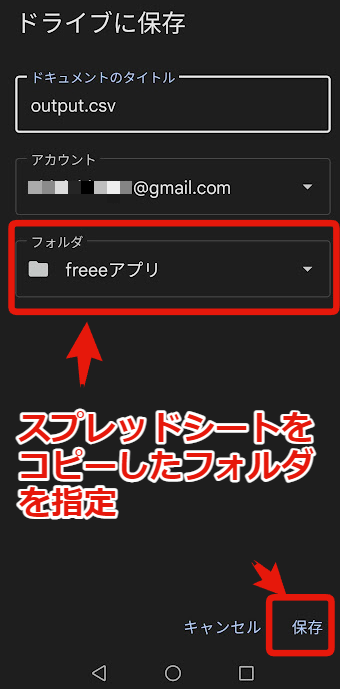

グーグルドライブでスプレッドシートと同じフォルダに、「output.csv」が出来ていることを確認します。
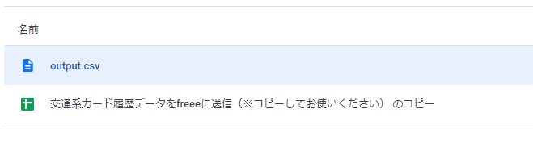

### 口座明細の同期テストと、自動実行設定

エクスポートしたoutput.csvを、freeeの口座明細と同期するテスト行います。  
うまく同期出来たら、自動実行するようにします。

#### 同期テスト
スプレッドシートの「freeeメニュー」の、  
「4.交通系カード履歴を送信」を選択します。

「交通系カード履歴」シートに履歴が追加され、freeeに送信できたデータはimportDataの項目に送信日時が入ります。

freee会計を開いて、交通系カードの明細に履歴が追加されていることを確認します。
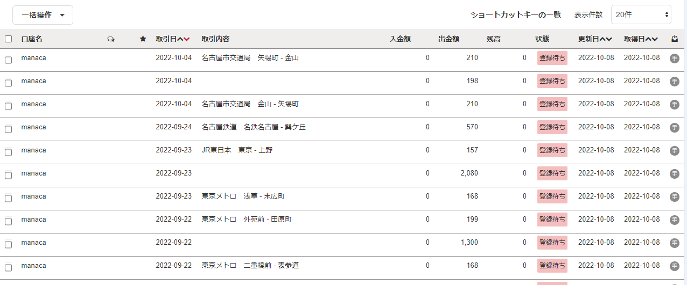  
↑こんな感じで鉄道会社と区間運賃などが明細に追加されます。

運賃以外の支払いのところは何も概要がないです。

#### 自動実行設定

きちんと明細がfreeeに送信されることを確認したら、スプレッドシートの操作を自動実行するようにします。

この設定を行うことで、スマホアプリでカードを読み取ってエクスポートしておけば、自動でfreeeと同期するようになり、スプレッドシートを開く必要がなくなります。

スレッドシートのメニューで、  
「拡張機能」-「Apps Script」を選択します。

時計のアイコンを押して、「＋トリガーを追加」をクリックします。  
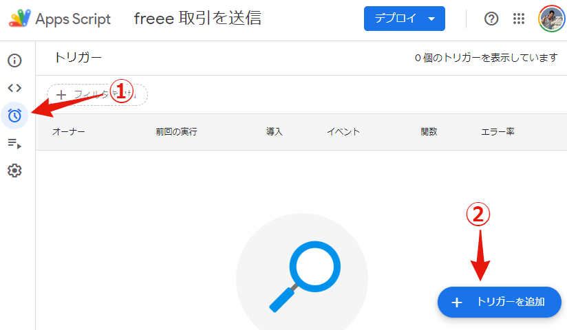

以下の順に設定していきます。
1. 実行する関数を選択 : 「freeeMenuTraincardPost」
2. イベントソースを選択 : 「時間主導型」
3. 時間ベースのトリガーのタイプを選択 : 「時間ベースのタイマー」
4. 時間の間隔を選択 : 「1時間おき」
5. 保存
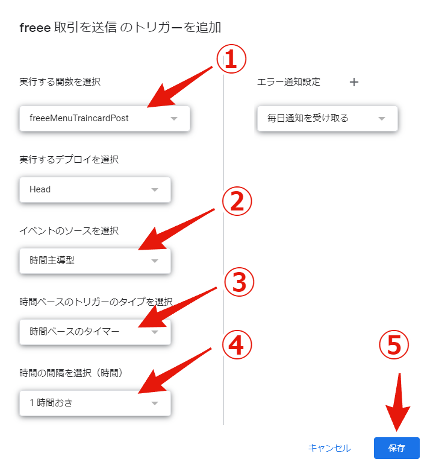

これで、スマホアプリから履歴をエクスポートしておけば１時間後ぐらいには、freeeに同期されるようになります。

## 確認はしていないけどできるのでは？

1. 複数カードの管理
    freee会計の口座名と、スマホアプリに登録するカード名を紐づけているので、複数のカードを読み取って複数の口座で管理できるような気がします。
1. 交通系以外の電子マネーカード
    利用させてもらったスマホアプリ「電子マネーICカード残高確認」は、交通系カード以外のカードの管理もできるので、エクスポートするフォーマットが同じであれば、交通系以外のカードもfreeeと同期出来るかも？
  