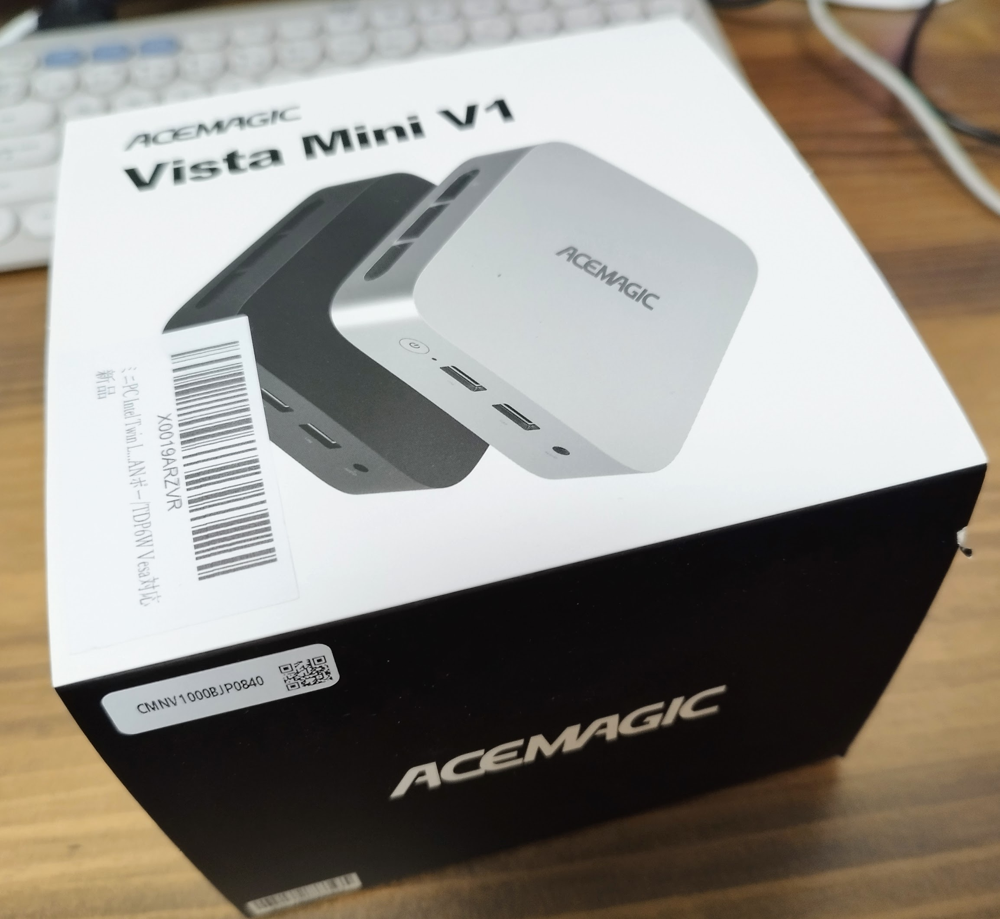
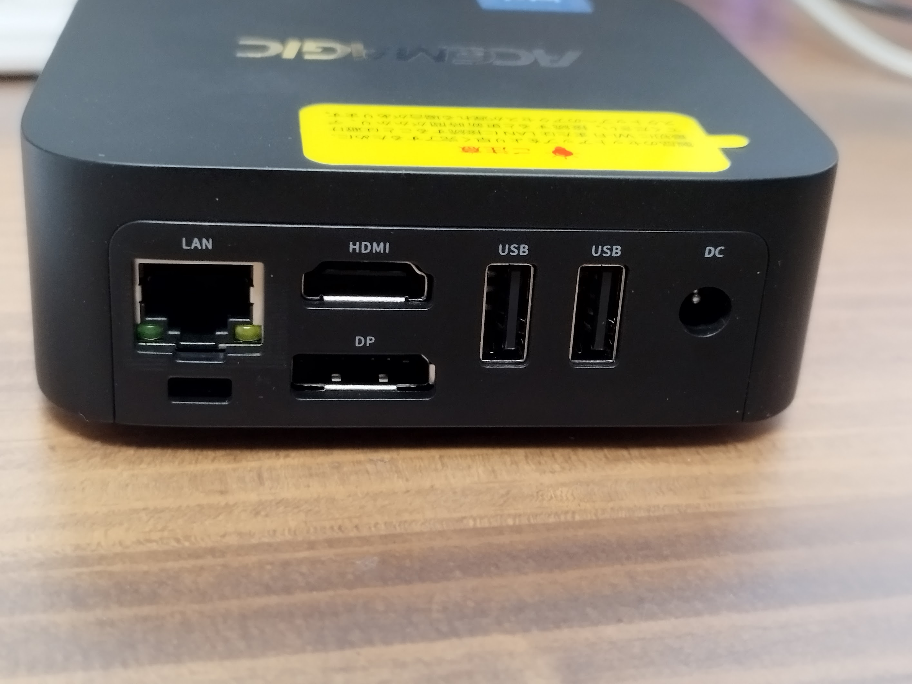
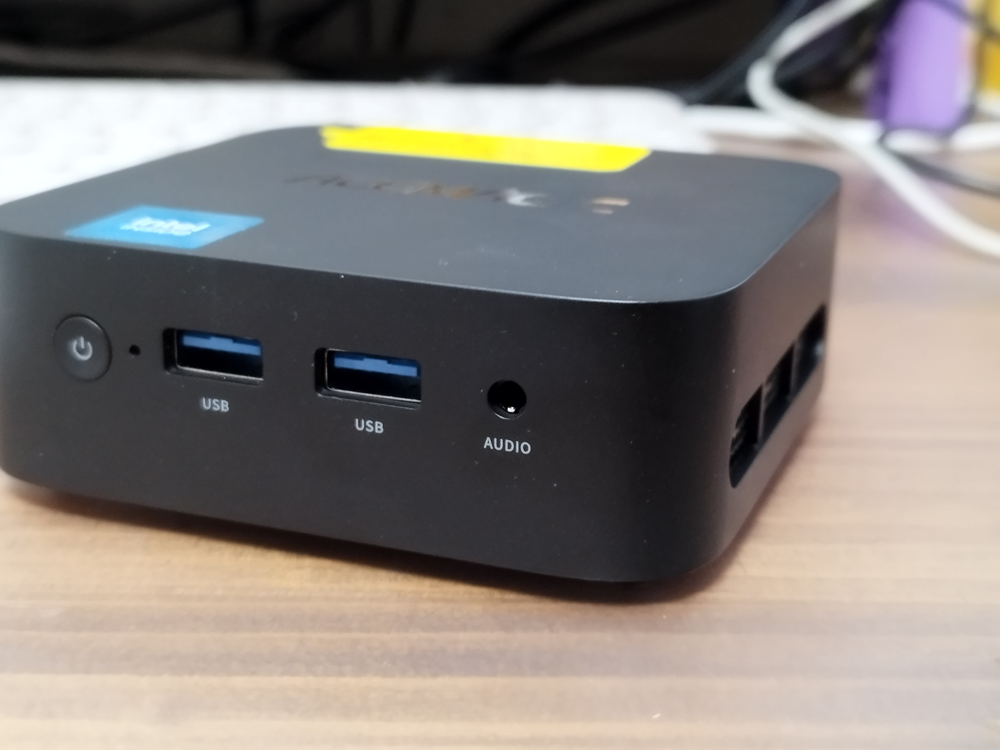
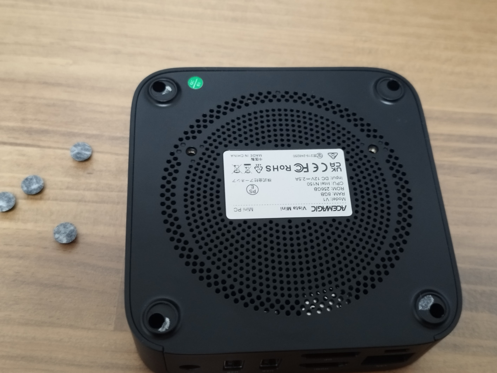
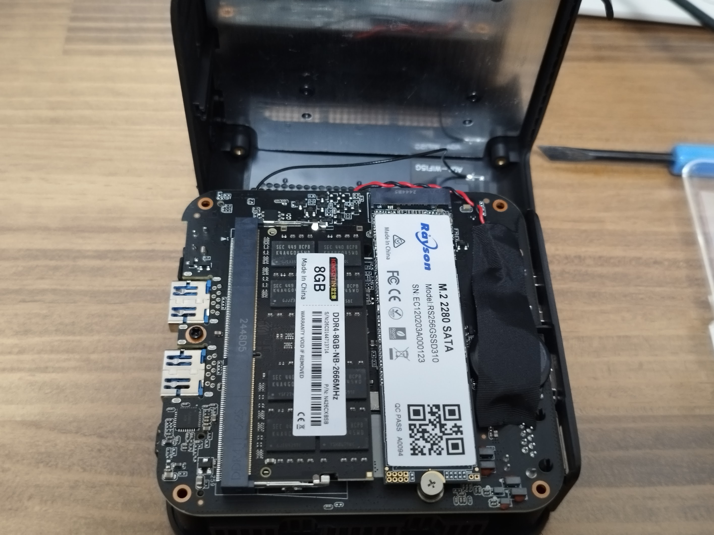
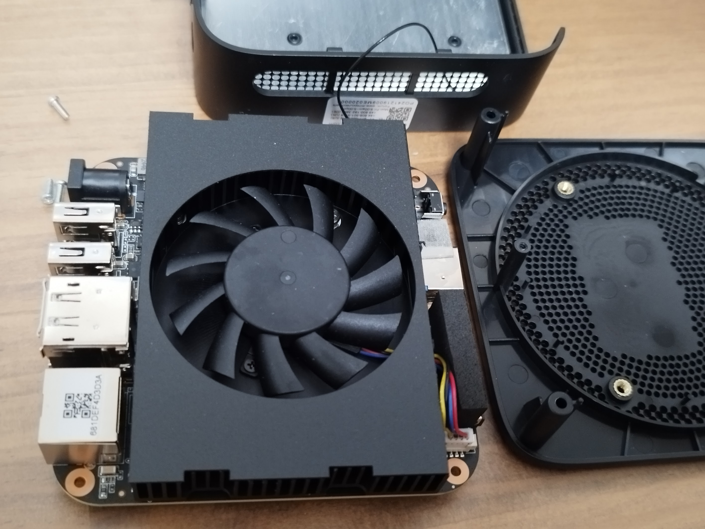

# ACEMAGIC Vista Mini V1
小型で安いミニPCが必要だったので、アマゾンで19,900円だったこれを購入してみました。

[【ミニpc N150 2025年初登場】ACEMAGIC ミニ PC Intel Twin Lake MiniPC Vista Mini V1 8GB 256GB 静音設計 パワフル＆省電力 ミニパソコン Windows11 Pro 7nm/3.6GHz/4コア4スレッド 小型pc省スペース 4K@60Hz 高速放熱＆静音性WiFi5G/BT4.2/RJ45LANポー/TDP6W Vesa対応](https://amzn.to/4k77oXc)  
(アフィリエイトリンクです)  

- CPU : N150
- RAM : 8GB
- SSD : 256GB
- OS : Windows 11 Pro

## 外箱

## 内容物

- ACアダプター
- VESAブラケットとネジ
- 本体
- マニュアル

## 外観（接続ポート)

## Windows起動

静か！！
ファンの音とか全くしない。（回ってないのか？）

## Windowsのライセンス

やっぱり、ボリュームライセンスでした。

HomeAssistant OSを入れるために購入したので問題ないですが、Windowsで利用する場合は要注意ですね。

アマゾンのレビューに、サポートに連絡したらOEMライセンスもらえたという情報もあったので、連絡してみるのもありかも？

ライセンスの確認方法は以下ページを参考にしました。
<iframe title="格安PCのWindows がボリュームライセンスという闇 #AdventCalendar2023 - Qiita" src="https://hatenablog-parts.com/embed?url=https://qiita.com/oishi-d/items/f8115f923376afed5a71" style="width:100%;height:150px; max-width:600px; margin-left:auto; margin-right:auto;" frameborder="0" scrolling="no" loading="lazy"></iframe>

## 分解

起動確認できたので、分解してみます！

底面のゴム足を外し、４隅のネジを外すとあけられます。  
(※WiFiのアンテナにつながる線があるので切断しないように)

メモリもSSDも交換可能な仕様でした。  
16GB仕様の製品も販売されているようなので、16GBには問題なく換装できそうです。  
32GBはいけるかな？

# 感想
安くて、小さくて、静かで思った以上に良かったです。

メモリもSSDも換装可能なのが意外でした。  
安いミニPCはメモリは基板に直付けが多いので、この点はポイント高いです。

この後は、HomeAssistant OSをインストールして使っていく予定です。  

