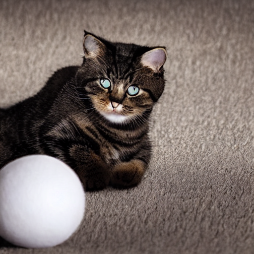
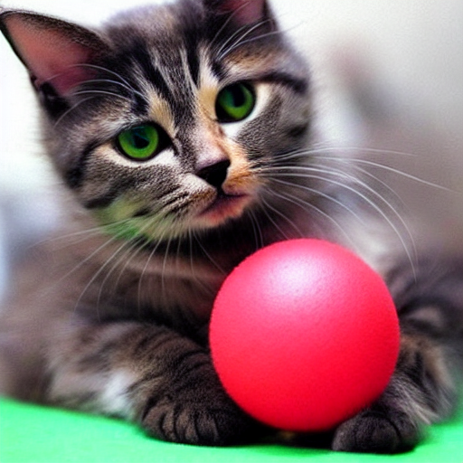
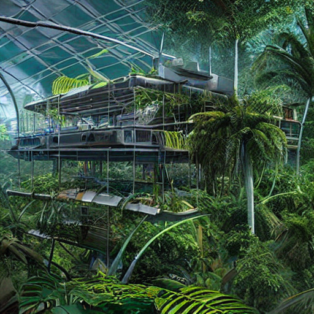
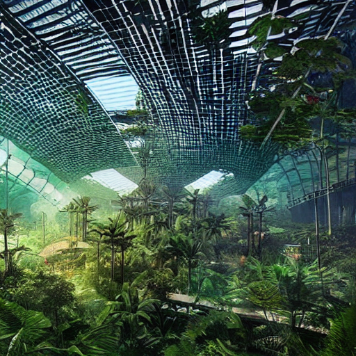
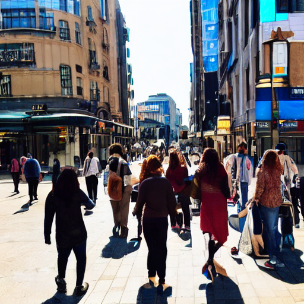
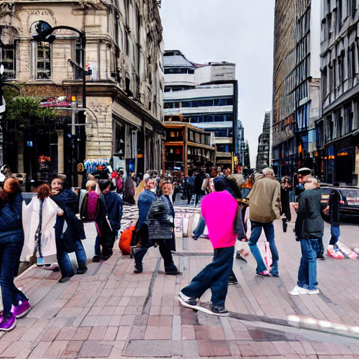
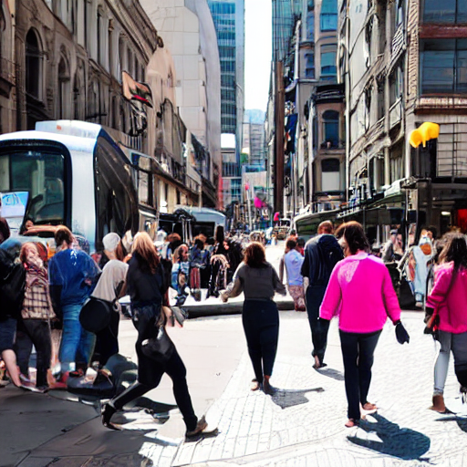

巷で話題になっている画像生成AIを簡単に試してみました。

## 画像生成AIとは

テキスト（英語）で生成してほしい画像の詳細を伝えると、AIがいい感じに作画してくれるという夢のようなシステムです。  
最近は、簡単にある程度の品質の画像を生成してくれるようになったということで、少し試してみました。


## Stabele Diffusion

画像生成AIもいろいろなシステムがあるのですが、つい最近オープンソースとして公開された「Stabele Diffusion」を試してみました。

デモサイトもあって、誰でも無料で簡単に画像生成を試すことができます。  
[Stable Diffusion - a Hugging Face Space by stabilityai](https://huggingface.co/spaces/stabilityai/stable-diffusion)

英語で生成してほしい画像の詳細を入れるだけで、４つの画像を生成してくれます。  
ただし、多くのユーザーが利用すると、順番に生成するため待ち時間かそれなりに発生してしまうようです。  
順番待ちがなければ、４つの画像が数秒で生成されます。

## 自分だけのStabele Diffusion

高性能なPCを持っている場合は、自分のPCにStabele Diffusionをインストールして自分だけで利用することも可能です。  
ただし、いろいろな環境を整える必要があり、PCの性能以外にもハードルが高い部分が結構あります。

もっと、簡単に試すには、Googleが提供している「Colaboratory」というPython実行環境を利用して、「Stabele Diffusion」を自分専用に動作させることができます。  
クラウド環境での実行なので、自分のPCのスペックが低くても大丈夫です。

[画像生成AI「Stable Diffusion」を低スペックPCでも無料かつ待ち時間なしで使う方法まとめ - GIGAZINE](https://gigazine.net/news/20220824-stable-diffusion-google-colaboratory/)  
こちらの記事の通りにやれば簡単に「Stabele Diffusion」をインストールできます。

さすがに無料のクラウド環境なので、画像１枚生成するのに３０秒ほどかかり、デモサイトより時間はかかりますが、他の人の順番待ちをしなくてもいいのが良いですね。

上記サイトの方法だと、１つのキーワードにつき１枚の画像しか生成してくれないので、自分はちょっと工夫して数枚の画像を生成してくれるようにしてみました。

``` python
num_images = 3
prompt = ["cute cat paly with ball"] * num_images

images = pipe(prompt)["sample"]

for i, img in enumerate(images):
  img.save(f"cat{i}.png")
```

`num_images`の値が生成する枚数です。   
`cute cat paly with ball`が、どのような画像を生成するか？という部分ですので、ここに生成したい内容を英語で指定します。

## 生成例

英文の与え方で大きく結果が変わるようで、コツなどもあるようですが簡単に試した結果を以下に貼っておきます。

#### cute cat paly with ball
  
  
  

#### A high tech solarpunk utopia in the Amazon rainforest
  
  
  

#### A small cabin on top of a snowy mountain , artstation
  
  
  

#### People walking through the scramble crossing in the city
  
  
  
