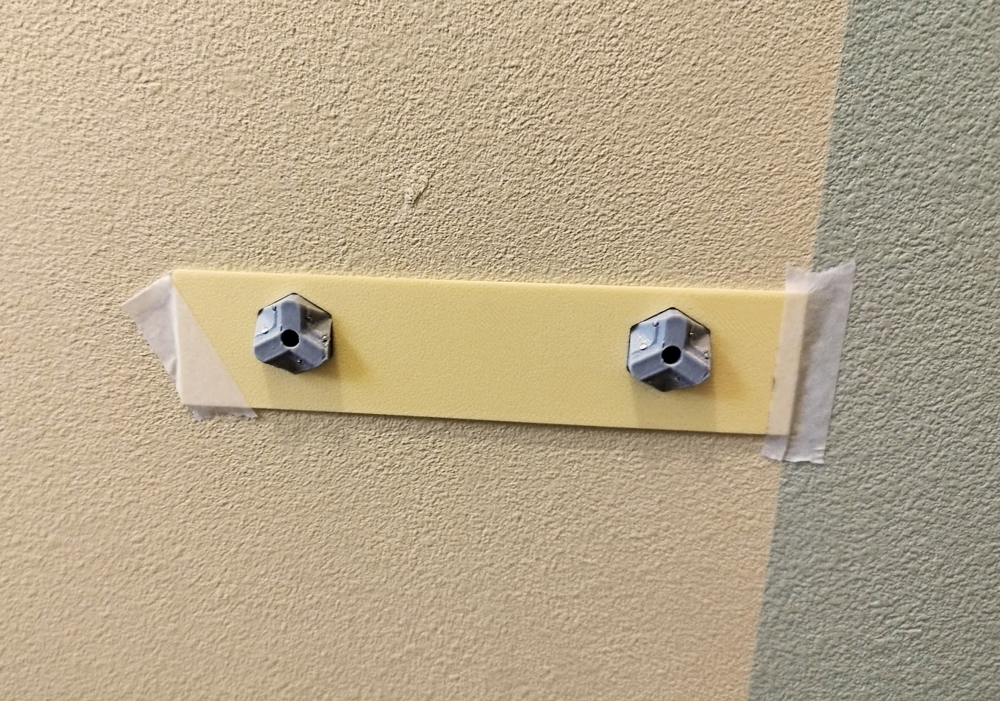

# はじめに

賃貸住宅や壁に穴を開けたくない環境では、ネジや釘を使うことが難しい場面が多々あります。特に、トイレのようなスペースでは、壁にしっかりと固定できる収納やホルダーが欲しい一方で、壁にダメージを与えたくないというジレンマがあります。

そんな課題を解決できるアイテムを見つけたので、シンプルなトイレットペーパーホルダーを３Dプリンターで自作してみました。

# 便利アイテムの紹介

トイレットペーパーホルダーの固定に使用する **「石膏ボード壁掛けアンカー 虫ピン式（STLデータ）」** について説明します。

## アイテムの概要
- **商品名**：「石膏ボード壁掛けアンカー 虫ピン式（STLデータ）」
- **販売サイト**：[BOOTHの商品ページ](https://booth.pm/ja/items/4322834)
- **用途**：壁に穴を開けずにナットやボルトを固定できるアイテム
- **特徴**：
  - 石膏ボードに虫ピンを使って固定できる
  - M3 / M4 の六角ナット・ボルトに対応
  - 3Dプリンタで自作可能

# トイレットペーパーホルダーのデザイン

今回は以下のポイントにこだわってデザインしました。

- **最小限のデザイン**：装飾を省き、シンプルで機能的な形状にこだわりました。
- **跳ね上げ式構造**：ペーパー交換が簡単にできるように、アームを跳ね上げ式に設計。
- **一体型3Dプリント設計**：跳ね上げ部分を含め、一度のプリントで作成可能なデザインにしました。

# 製作手順

## 3Dプリント準備
- **必要なパーツ**：
  - 便利アイテム（アンカー）×2
  - ホルダー本体 ×1

## 使用フィラメント
- **便利アイテム（アンカー）**：割れにくく耐久性のあるPETGフィラメント。
- **ホルダー本体**：光沢がなくパステル感のあるPolyterra PLAフィラメント。

# 取り付け手順

1. **取付位置ガイドの仮固定**
   - ホルダー本体と一緒にプリントした、取付位置ガイドプレートを壁にマスキングテープなどで仮固定します。

   

2. **水平微調整**
   - きちんと水平になるように微調整します。
   - スマホに水準器アプリをインストールして使用しました。

3. **便利アイテムの取り付け**
   - ガイドに便利アイテムの形の穴があいているので、そこに便利アイテムをはめて取り付けます。
   - 便利アイテムにM4のナットを入れるのを忘れないように！
   - 取り付けは、虫ピン6本を便利アイテムの空いている小さな穴に差し込み、奥まで押し込みます。
   - 使用した虫ピン：[こちら](https://amzn.to/4aHnyCF)
   - 虫ピンを奥まで押し込むために使用したアイテム：[こちら](https://amzn.to/4jyFu6y)  
   
   

4. **取り付けガイドプレートを外す**

   

5. **ホルダー本体をビス止め**
   - 使用したビス：M4 x 8mm
   - 長すぎると壁を傷つけたり、きちんと固定されません。  
   
   

# 使用感と改善点

実際に取り付けてみると、**非常にがっちりと固定され、ぐらつきもなく安定** していました。取り付けガイドを用意したことで、**水平も正確に調整でき、希望した位置に設置** することができました。

ただし、究極にシンプルなデザインにしたため、**ペーパーを抑える部分があった方が良いかもしれない** と感じました。

別カラー

# 3Dデータ

トイレットペーパーホルダ本体と、取り付けガイドのみです。

[toilet_paper_holder.3mf](toilet_paper_holder.3mf)
