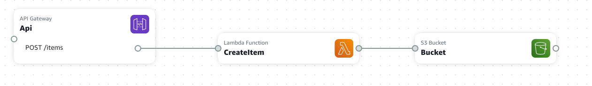

AWS Application Composerを試してみました。  
いくつか躓いた箇所があったのでまとめておきます。

## AWS Application Composerとは

<iframe title="サーバーレスアプリケーションを視覚的に構成する – AWS Application Composer – Amazon Web Services" src="https://hatenablog-parts.com/embed?url=https://aws.amazon.com/jp/application-composer/" style="width:100%;height:150px; max-width:600px; margin-left:auto; margin-right:auto;" frameborder="0" scrolling="no" loading="lazy"></iframe>

API Gateway,Lambda,S3,DynamoDBなどを使った、サーバーレスアプリの構成を、ビジュアルで分かりやすく簡単に作成するツールです。

## 使ってみた

<iframe title="AWS Application Composerを使ってサーバーレスアプリを作ってみた - Qiita" src="https://hatenablog-parts.com/embed?url=https://qiita.com/afukui/items/a41b1a688c5d7fd592b2" style="width:100%;height:150px; max-width:600px; margin-left:auto; margin-right:auto;" frameborder="0" scrolling="no" loading="lazy"></iframe>

この辺りを参考に、サーバーレスアプリの設計図っぽいものをドラッグアンドドロップで作っていきます。

自分は簡単に、「API Gatewayに画像データをPOSTするとLambdaでS3にどんどん保存していく」みたいな単純なものを作ってみました。



これだけで、これらのサービスを構築するのに必要な設定やファイルのひな形が作成されます。  
簡単です！！

あとは、ひな形ができているLambdaのコードを書いたりしていきます。

ここまでは、Application Composerで簡単に出来ましたが、この後のビルドとデプロイはコマンドを打っていきます。

```
sam build
```
```
sam deploy -g
```
この２つのコマンドを実行するだけなのですが、AWSに慣れていないせいかいくつかハマりました。

## ハマりポイント

### AWS CLIのインストール

AWS SAM CLIだけでなく、AWS CLIもインストールする必要がある。

### sam deployするのにいろいろ権限が必要

`sam deploy`するための権限を持ったユーザーをIAMで作成し、そのユーザーのアクセスキーなどを`aws configure`で設定する必要があります。

必要な権限は、
* AWSCloudFormationFullAccess
* IAMFullAccess
* CloudWatchFullAccess

あと、使うサービスに必要な権限。今回の場合は、
* AmazonAPIGatewayAdministrator
* AWSLambda_FullAccess
* AmazonS3FullAccess

### API Gateway —> Lamda間が、Proxy設定になる

Application Composerを使わずにAPI Gatewayを使ったときは、POSTした内容がそのままLamdaの関数にわたっていました。  
Application Composerを使うと、Proxy設定になるようで、POSTしたデータ以外にもいろいろLamda関数にわたります。その中の`body`要素がPOSTしたデータでした。

この設定はGUIでは変更できないようです。  
(template.yamlファイルを修正すれば変更できそうです)

## 良かったこと

1. GUIでわかりやすくサービスをつなげられる。  
    後で見てもわかりやすく、人に伝えるのにも良い。
2. ローカル上のファイルの変更を検知して差分ビルド&デプロイしてくれる。  
   `$ sam sync --watch --stack-name sam-app`  
   とコマンドを打っておくと、ローカルのファイル変更を検出して勝手にやってくれる。  
   lamdaのプログラム変更とかすごく楽！
3. ひとまとまりのサービス全体をリポジトリで管理できそう！

## 追加設定

### S3を公開設定にする

template.yamlを以下のように変更、追加して、S3のファイルを外部公開できるようになりました。

```yaml
  Bucket:
    Type: AWS::S3::Bucket
    Properties:
      BucketName: !Sub ${AWS::StackName}-bucket-${AWS::AccountId}
      WebsiteConfiguration:
        IndexDocument: index.html
  BucketPolicy:
    Type: AWS::S3::BucketPolicy
    Properties:
      Bucket: !Ref Bucket
      PolicyDocument:
        Version: 2012-10-17
        Statement:
          Sid: PublicReadGetObject
          Action:
            - s3:GetObject
          Effect: Allow
          Principal: '*'
          Resource: !Join
            - ''
            - - 'arn:aws:s3:::'
              - !Ref Bucket
              - /*
```
