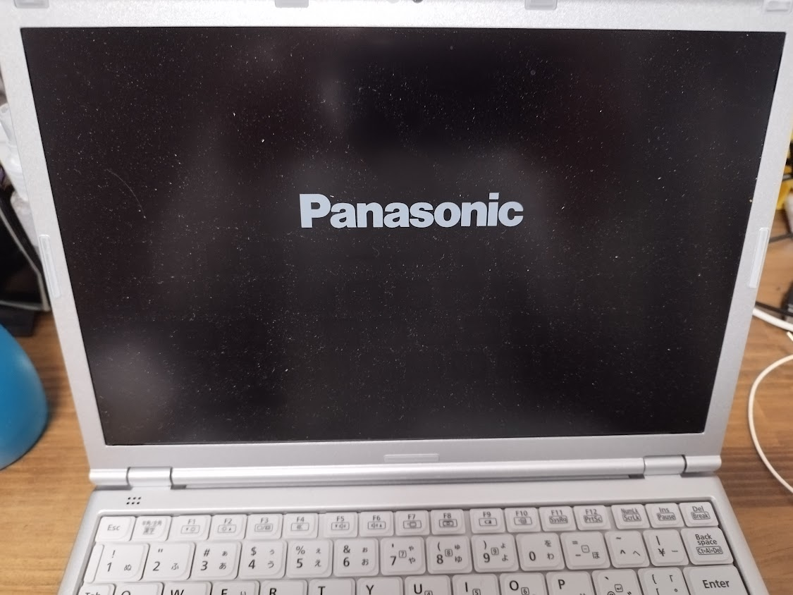
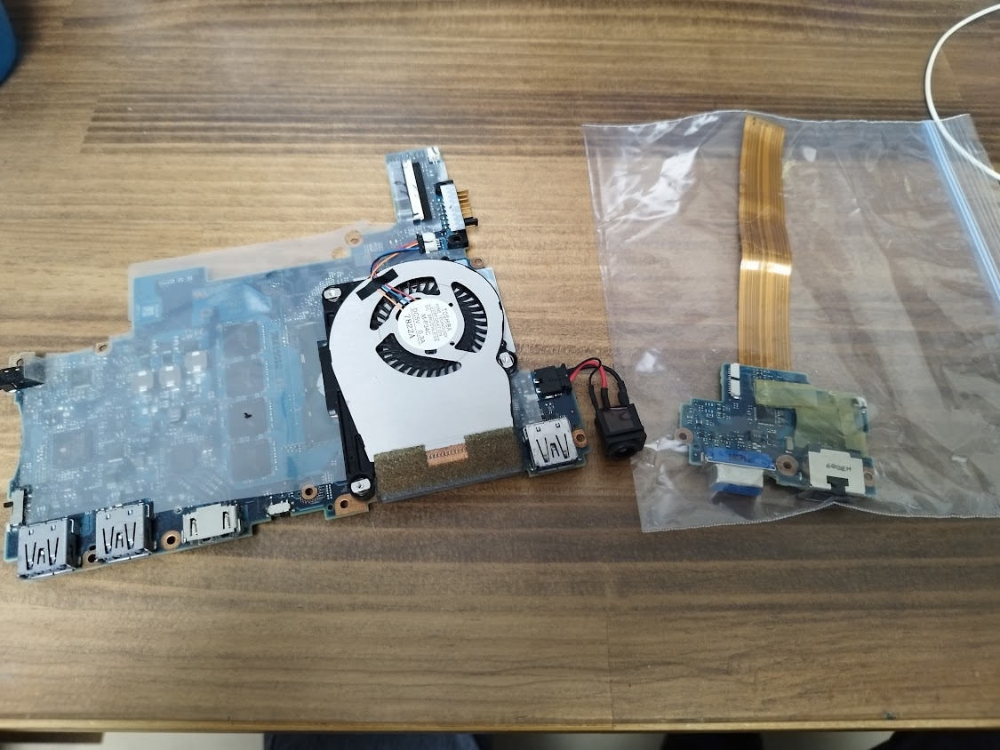
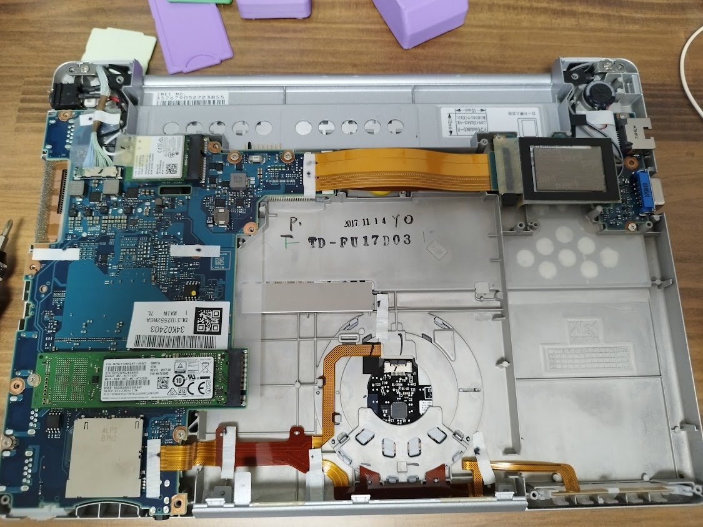
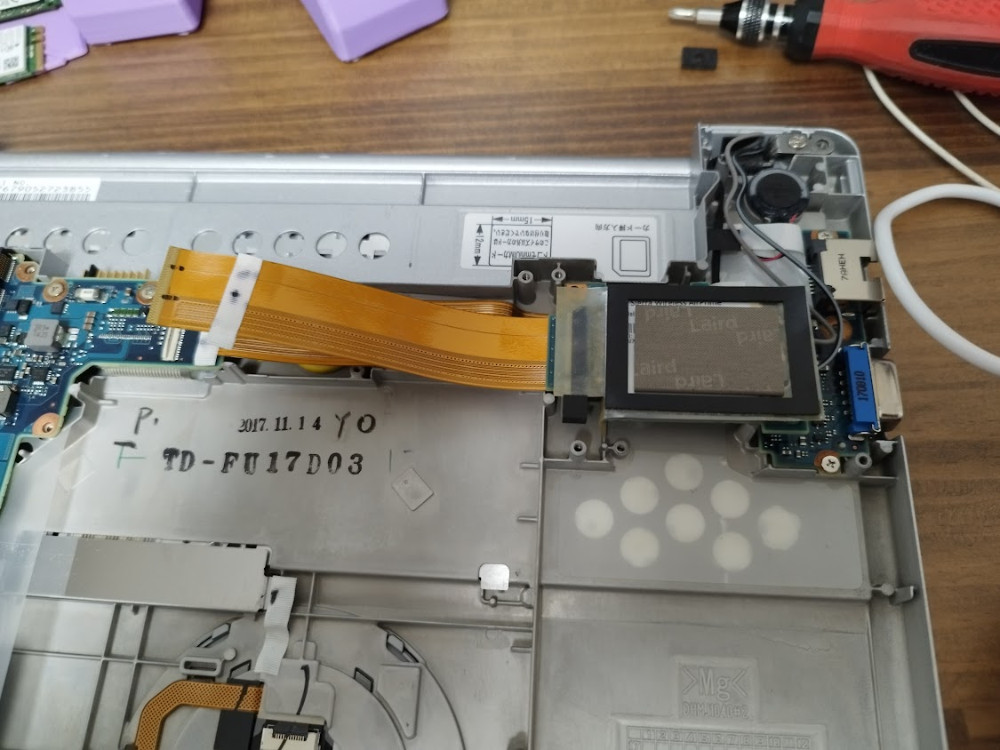
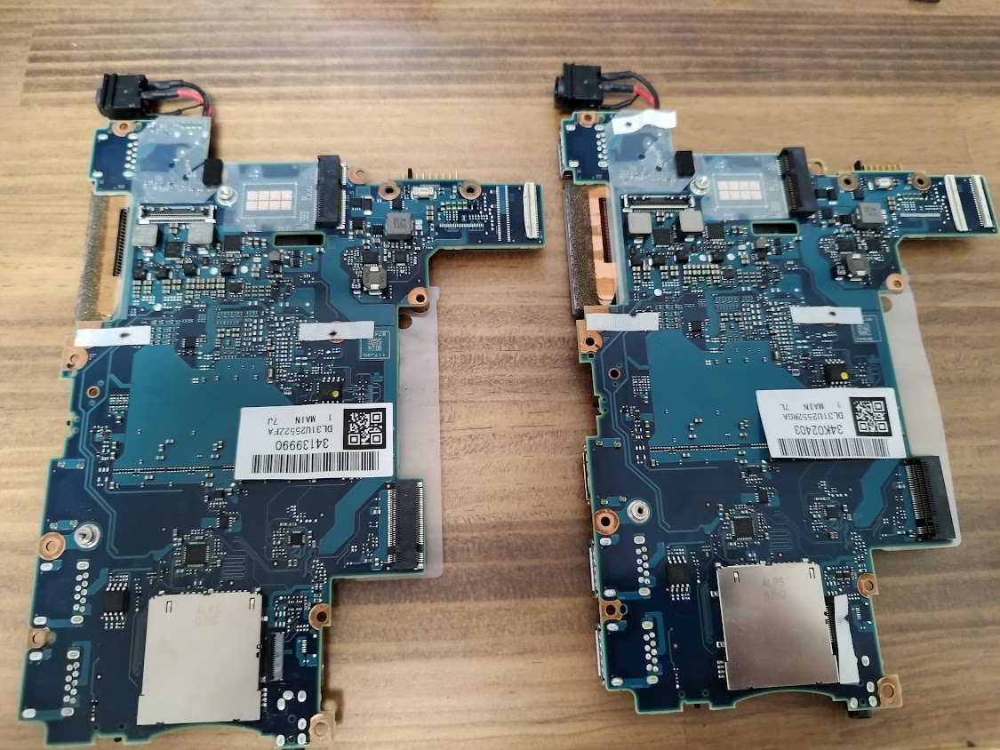
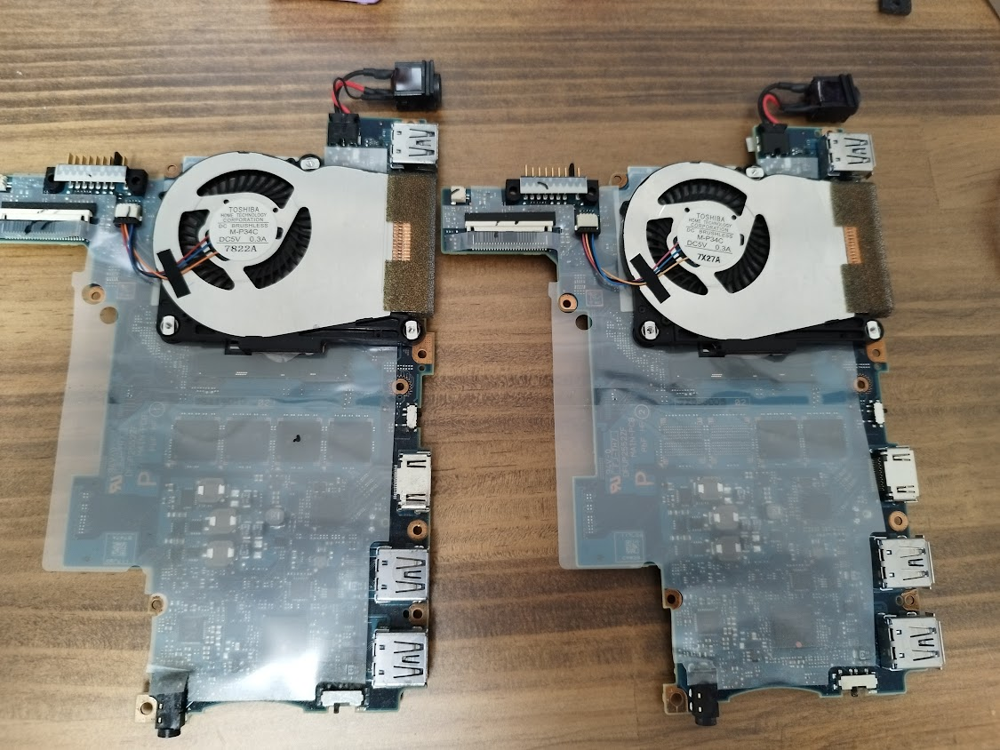

最近は軽くて安い、中古のレッツノートを買って、ChromeOSやUbuntuを入れて使っています。  
１万円台で8GBのメモリ、SSDのノートPCが買えるなんていい時代ですね。  

最初に買ったレッツノートが電源起動時のPanasonicロゴから進まなくなってしまい使えず、しまっていたのですが、ヤフオクでマザーボードだけを2,000円でゲットしたので交換してみます。

## 分解

こちらのサイトを参考に分解していきます。

<iframe title="分解工房・Panasonic Let'snote CF-SZ5,CF-SZ6(SSD初期搭載モデル)/メインボード交換修理方法" src="https://hatenablog-parts.com/embed?url=https://bunkaikoubou.jp/letsnote/cf-sz5/sz5s_1mb.html" style="width:100%;height:150px; max-width:600px; margin-left:auto; margin-right:auto;" frameborder="0" scrolling="no" loading="lazy"></iframe>

サイトが分かりやすいので、サクサク分解できました。  

なんと、分解したレッツノートはLTEモデルでした。  
アンテナが液晶パネルのほうにあるようで配線が外せなかったので、フラットケーブルだけ抜いてメインボードにつながらないようにしました。  

左：新しく取り付ける基板、右：分解して取り出した基板  

新しく取り付ける基板は8GBメモリ、取り外した基板は4GBメモリなのが分かります。  

## 組み立て

分解したときのサイトを参考に、逆順に戻していきます。

## 結果

症状変わらず、起動時のPanasonicロゴが表示されるだけで、そのあとはキーを押しても何をしても変わりませんでした・・・・

CMOS電池が切れてるのかな？  
CMOS電池をネットで探したけど、ヤフオクで3,000円もするのしか見つけられなかった。

また分解してCMOS電池のサイズやコネクタを調べようと思います。

