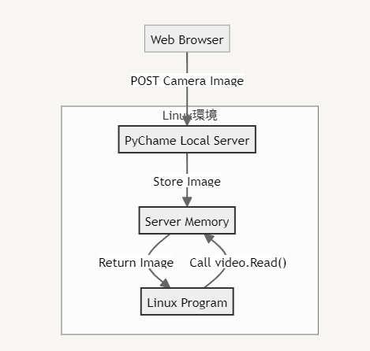

ChromeOSのLinux環境はカメラデバイスに対応していないらしいので、OpenCVなどでカメラ画像を使ったプログラムが書けません。

しかし、うまい仕組みでカメラ画像をLinux環境のプログラムで使うためのpythonライブラリ発見しました。
<iframe title="LucasOliveiraaa/Pychame: A simple way to use the Chromebook integred camera within OpenCV" src="https://hatenablog-parts.com/embed?url=https://github.com/LucasOliveiraaa/Pychame" style="width:100%;height:150px; max-width:600px; margin-left:auto; margin-right:auto;" frameborder="0" scrolling="no" loading="lazy"></iframe>

https://github.com/LucasOliveiraaa/Pychame

以下、実際に動かしてみたわけではなく自分なりに調べて解釈した内容です。


## PyChameを使ったカメラ画像を表示するサンプルプログラム
``` python
    from pychame.video import Video
    import cv2

    video = Video()

    while True:
        frame, success = video.Read()

        if not success:
            continue

        cv2.imshow("Camera Frame", frame)


        if cv2.waitKey(1) & 0xFF == ord('q'):
            break

    video.Release()
    cv2.destroyAllWindows()
```
たったこれだけです。

PyChameのvideoクラスのReadを呼び出して、カメラ画像を取得し、それをOpenCVで表示しているだけです。

## PyChameの仕組み

### videoクラスはカメラデバイスにアクセスしていない
videoクラスは、ローカルサーバーを立ち上げて、どこかからカメラ画像のデータをPOSTで送ってもらいます。

その送ってもらった画像データを整えて、video.Read()で返しているだけです。

### ChromeOS側のブラウザからカメラ画像を送信

どこからカメラ画像を送るかというと、PyChameにあるindex.htmlをブラウザで開くことで、videoクラスで立ち上げたサーバーに、定期的にカメラ画像POSTしています。

### データの流れ



## 実際の仕様手順

1. ChromeOSのLinux環境で、PyChameを使ったプログラムを実行
2. ChromeOS側のブラウザで以下URLを開く  
   https://0.0.0.0:5000  
   (PyChameの用意したindex.htmlが開きます)
3. 「Sending Camera Data」ボタンを押して、カメラを許可
4. カメラ映像が、Linux環境のプログラムに送られます


このような仕組みで、ChromeOSのLinux環境ではカメラデバイスが使えないという問題を解決しています。

カメラデバイス以外に、Linux環境からではアクセスできない（しづらい）もののアクセスにもこの手法は使えそうですね。

もう一度言いますが、実際に動かしてみたわけではないので、使えないかもしれません・・・・
