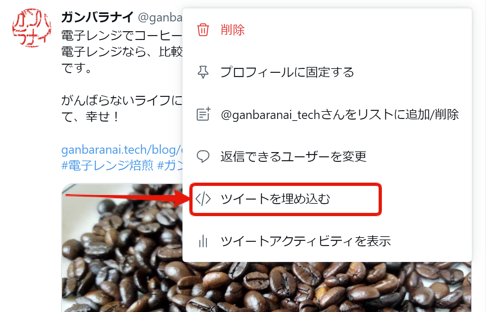
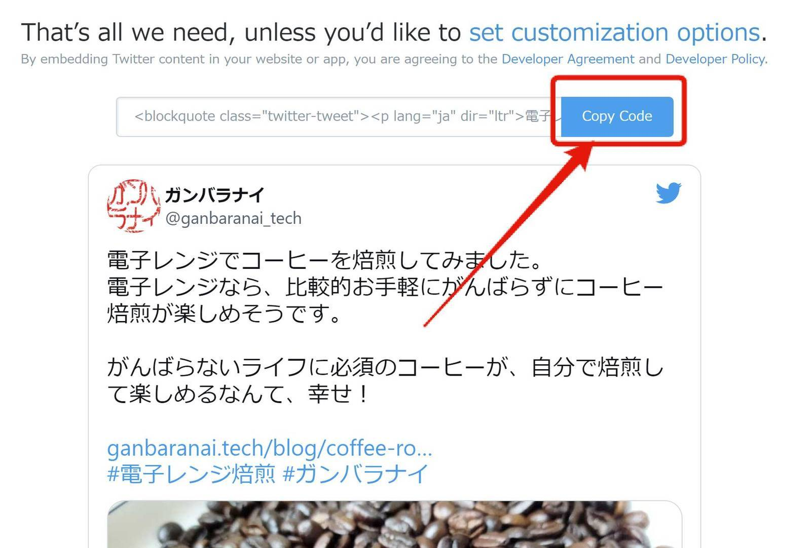

import { Link } from "gatsby"


> <Link to="/tech-blog/gatsby-starter-blog-15-mdx/">GatsbyでHP作成 その15：MDX対応</Link>  　
>
>※現在は、上記記事でMDX化して別の方法で埋め込んでいます。


Blogに、Twitterの投稿を埋め込めるといいなと思いやってみました。

## プラグイン導入

```shell
$ yarn add gatsby-plugin-twitter
```

```jsx{5}:title=gatsby-config.js
module.exports = {
  ...
  plugins: [
    ...
    `gatsby-plugin-twitter`,
    ...
```

## ツイートの埋め込みコードを取得

埋め込みたいツイートの右上のメニューをクリックします。  


「ツイートを埋め込む」をクリック。


「Copy Code」をクリックしてコードをコピー。


## Markdownファイルにコードをコピー

```html:title=index.md
<blockquote class="twitter-tweet"><p lang="ja" dir="ltr">電子レンジでコーヒーを焙煎してみました。<br>電子レンジなら、比較的お手軽にがんばらずにコーヒー焙煎が楽しめそうです。<br><br>がんばらないライフに必須のコーヒーが、自分で焙煎して楽しめるなんて、幸せ！<a href="https://t.co/4KZNzfrnbD">https://t.co/4KZNzfrnbD</a><a href="https://twitter.com/hashtag/%E9%9B%BB%E5%AD%90%E3%83%AC%E3%83%B3%E3%82%B8%E7%84%99%E7%85%8E?src=hash&amp;ref_src=twsrc%5Etfw">#電子レンジ焙煎</a> <a href="https://twitter.com/hashtag/%E3%82%AC%E3%83%B3%E3%83%90%E3%83%A9%E3%83%8A%E3%82%A4?src=hash&amp;ref_src=twsrc%5Etfw">#ガンバラナイ</a></p>&mdash; ガンバラナイ (@ganbaranai_tech) <a href="https://twitter.com/ganbaranai_tech/status/1506644515247255562?ref_src=twsrc%5Etfw">March 23, 2022</a></blockquote> 
```

※最後にscriptタグが入りますが、それは削除します。

## 結果
```
<blockquote class="twitter-tweet"><p lang="ja" dir="ltr">電子レンジでコーヒーを焙煎してみました。<br>電子レンジなら、比較的お手軽にがんばらずにコーヒー焙煎が楽しめそうです。<br><br>がんばらないライフに必須のコーヒーが、自分で焙煎して楽しめるなんて、幸せ！<a href="https://t.co/4KZNzfrnbD">https://t.co/4KZNzfrnbD</a><a href="https://twitter.com/hashtag/%E9%9B%BB%E5%AD%90%E3%83%AC%E3%83%B3%E3%82%B8%E7%84%99%E7%85%8E?src=hash&amp;ref_src=twsrc%5Etfw">#電子レンジ焙煎</a> <a href="https://twitter.com/hashtag/%E3%82%AC%E3%83%B3%E3%83%90%E3%83%A9%E3%83%8A%E3%82%A4?src=hash&amp;ref_src=twsrc%5Etfw">#ガンバラナイ</a></p>&mdash; ガンバラナイ (@ganbaranai_tech) <a href="https://twitter.com/ganbaranai_tech/status/1506644515247255562?ref_src=twsrc%5Etfw">March 23, 2022</a></blockquote> 
```
※リロードしないと正常に表示されませんでした。


## 動画もOK

動画を含んだツイートも埋め込めました。
```
<blockquote class="twitter-tweet"><p lang="ja" dir="ltr">看板プリント中の動画 <a href="https://t.co/Ci98oGnTZd">pic.twitter.com/Ci98oGnTZd</a></p>&mdash; ガンバラナイ (@ganbaranai_tech) <a href="https://twitter.com/ganbaranai_tech/status/1507258965344006150?ref_src=twsrc%5Etfw">March 25, 2022</a></blockquote>
```
コメントのツイートを埋め込んだつもりが、元のコメントも表示されてしましました。

## コメントツイートのみを埋め込む


コメントツイートのみになりました！
```
<blockquote class="twitter-tweet" data-conversation="none"><p lang="ja" dir="ltr">看板プリント中の動画 <a href="https://t.co/Ci98oGnTZd">pic.twitter.com/Ci98oGnTZd</a></p>&mdash; ガンバラナイ (@ganbaranai_tech) <a href="https://twitter.com/ganbaranai_tech/status/1507258965344006150?ref_src=twsrc%5Etfw">March 25, 2022</a></blockquote>
```

