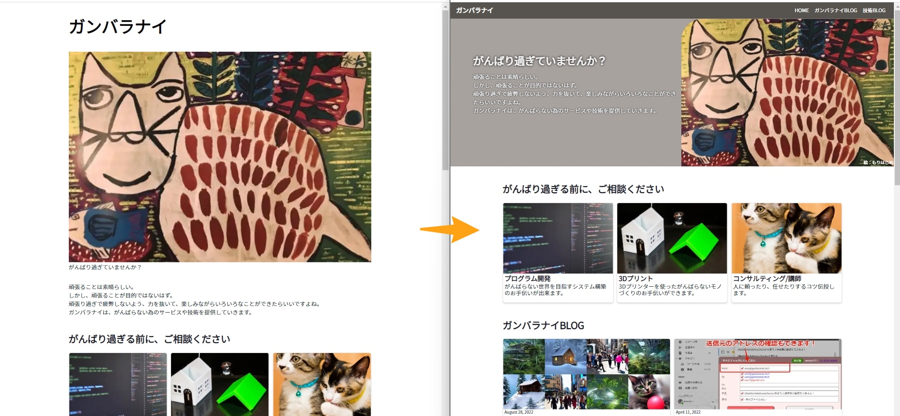
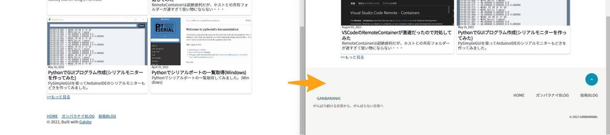

Tailwind CSSを導入して、見た目を整えてみました。

## Tailwind CSSをインストール

[Install Tailwind CSS with Gatsby - Tailwind CSS](https://tailwindcss.com/docs/guides/gatsby)  
公式サイトに従ってインストール。

```
$ yarn add tailwindcss postcss autoprefixer gatsby-plugin-postcss
$ npx tailwindcss init -p
```

```js{4}:title=gatsby-config.js
module.exports = {
    // ...
  plugins: [
    'gatsby-plugin-postcss',
    // ...
  ],
}
```

```js{3-7}:title=tailwind.config.js
/** @type {import('tailwindcss').Config} */
module.exports = {
  content: [
    "./src/pages/**/*.{js,jsx,ts,tsx}",
    "./src/components/**/*.{js,jsx,ts,tsx}",
    "./src/templates/**/*.{js,jsx,ts,tsx}",
  ],
  theme: {
    extend: {},
  },
  plugins: [],
}
```

```css{1-3}:title=style.css
@tailwind base;
@tailwind components;
@tailwind utilities;
　　：
```

## VS Code拡張機能を追加

[Tailwind CSS IntelliSense - Visual Studio Marketplace](https://marketplace.visualstudio.com/items?itemName=bradlc.vscode-tailwindcss)

これを導入すると、Tailwind CSSのクラスの候補が出たり、クラスにマウスカーソルをあてると、実際に割り当てられているCSSが表示されるのでとても便利になります。


## デザイン変更

Tailwind CSS を導入したので、ヘッダー、フッターをコンポーネントで作成し、トップページの一部も変えてみました。

### ヘッダーと、トップページの先頭変更


ヘッダーはコンパクトにして、各ブログへのリンクを追加しました。  
スマホ表示の場合は、ハンバーガーメニューで展開するようにしました。  

トップページの最初の部分は、お気に入りのもりはじめ氏の画像を右側に表示し、メッセージを左側に来るようにしました。  
レスポンシブ対応で、ウィンドウの幅が狭くなるとメッセージと画像が重なって表示されます。  
画像と重なった際に、メッセージが少しでも読みやすくなるようにシャドーを入れています。  
あと、もりはじめ氏のインスタへのリンクを追加しました！  

### フッター変更


フッターは、各ブログへのリンクと、ページの先頭へスクロールするボタンを追加しました。  

### ソースコード

``` js:title=components/HeaderNavi.js
import React, { useState } from 'react'
import { Link } from "gatsby"

const HeaderNavi = ({menuItems}) => {

  const [isNavOpen, setIsNavOpen] = useState(false);

  return (
    <header id="pageTop" class="w-full mx-auto flex justify-between items-center bg-stone-600 border-b-2 border-stone-500">
        <Link to="/"><h1  class="my-1 mx-4 text-lg text-white">ガンバラナイ</h1></Link>
        <nav class="flex items-center mx-4">
          
          <div class={
              (isNavOpen ? `visible left-0 mt-0` : `invisible mt-[-600px]`) +
              `
                list-none flex flex-col text-center mx-0 mb-0 z-50
                fixed top-0 left-0 w-full h-52 bg-stone-600
                duration-500 md:transition-none md:mt-[-600px]
              `}>
            <ul>
              {menuItems.map(([title, url]) => (
                <li class="m-0">
                  <Link to={url} 
                    className=" text-white block px-6 py-3 text-lg duration-500 hover:bg-stone-500"
                    activeClassName=" text-white block px-6 py-3 text-lg duration-500 hover:bg-stone-500"
                  >
                    {title}
                  </Link>
                </li>
              ))}
            </ul>
            <button onClick={() => setIsNavOpen(false)} 
              class="z-50 absolute top-0 right-0 p-4 duration-500" >
              <svg xmlns="http://www.w3.org/2000/svg" fill="none" viewBox="0 0 24 24" stroke-width="1.5" class="stroke-white w-6 h-6">
                <path stroke-linecap="round" stroke-linejoin="round" d="M6 18L18 6M6 6l12 12" />
              </svg>
            </button>
          </div>

          <ul class={
            `
              list-none text-center m-0
              flex-row static hidden md:flex
            `}>
            {menuItems.map(([title, url]) => (
              <li class="m-0">
                <Link to={url} 
                  className="text-white block px-2 py-3 text-sm duration-500 hover:bg-stone-500"
                  activeClassName="text-white block px-2 py-3 text-sm duration-500 hover:bg-stone-500"
                >
                  {title}
                </Link>
              </li>
            ))}
          </ul>
          <button onClick={() => setIsNavOpen(!isNavOpen)} class="md:hidden">
            <svg xmlns="http://www.w3.org/2000/svg" fill="none" viewBox="0 0 24 24" stroke-width="1.5" class="stroke-white w-6 h-6">
              <path stroke-linecap="round" stroke-linejoin="round" d="M3.75 6.75h16.5M3.75 12h16.5m-16.5 5.25h16.5" />
            </svg>
          </button>
        </nav>
    </header>
  )
}

export default HeaderNavi
```

``` js:title=components/FooterNavi.js
import React from 'react'
import { Link as ScrollLink } from "react-scroll"
import { Link } from "gatsby"

const FooterNavi = ({menuItems}) => {

  return (
    <footer class="bg-stone-100">
      <div
        class="relative max-w-screen-xl px-4 py-8 mx-auto sm:px-6 lg:px-8 lg:pt-8"
      >
        <button class="absolute top-0 right-4 sm:right-6 lg:right-8">
          <ScrollLink
            class="inline-block p-2 text-white transition bg-cyan-600 rounded-full shadow sm:p-3 lg:p-4 hover:bg-cyan-500"
            to="pageTop"
            smooth={true}
            duration={500}
          >
            <span class="sr-only">Back to top</span>

            <svg
              xmlns="http://www.w3.org/2000/svg"
              class="w-5 h-5"
              viewBox="0 0 20 20"
              fill="currentColor"
            >
              <path
                fill-rule="evenodd"
                d="M14.707 12.707a1 1 0 01-1.414 0L10 9.414l-3.293 3.293a1 1 0 01-1.414-1.414l4-4a1 1 0 011.414 0l4 4a1 1 0 010 1.414z"
                clip-rule="evenodd"
              />
            </svg>
          </ScrollLink>
        </button>

        <div class="lg:flex lg:items-end lg:justify-between">
          <div>
            <div class="flex justify-center lg:justify-start">
              <Link to="/"><div class="my-1 mx-4 text-base text-cyan-800">GANBARANAI</div></Link>
            </div>

            <p
              class="max-w-md mx-auto my-1 leading-relaxed text-sm text-center text-stone-500 lg:text-left"
            >
              がんばり続ける日常から、がんばらない日常へ
            </p>
          </div>

          <nav class="mt-10 lg:mt-12" aria-labelledby="footer-navigation">
            <h2 class="sr-only" id="footer-navigation">Footer navigation</h2>

            <ul
              class="flex flex-wrap justify-center gap-6 lg:justify-end md:gap-8 lg:gap-12"
            >
              {menuItems.map(([title, url]) => (
                <li>
                  <Link to={url} 
                    className="text-stone-700 transition hover:text-stone-700/75 text-base"
                    activeClassName="text-stone-700 transition hover:text-stone-700/75"
                  >
                    {title}
                  </Link>
                </li>
              ))}
            </ul>
          </nav>
        </div>

        <p class="mt-6 text-xs text-center border-stone-500 lg:text-right">
          &copy; 2022 GANBARANAI.
        </p>
      </div>
    </footer>

  )
}

export default FooterNavi
```

``` js:title=components/layout.js
import * as React from "react"

import HeaderNavi from "../components/HeaderNavi"
import FooterNavi from "../components/FooterNavi"


const menu_items = [
  ['HOME', '/'],
  ['ガンバラナイBLOG', '/blog'],
  ['技術BLOG', '/tech-blog']
]

const Layout = ({ location, title, children }) => {
  const rootPath = `${__PATH_PREFIX__}/`
  const isRootPath = location.pathname === rootPath

  return (
    <div className="h-full" data-is-root-path={isRootPath}>
      <HeaderNavi menuItems={menu_items}/>
      <main className="">{children}</main>
      <FooterNavi menuItems={menu_items}/>
    </div>
  )
}

export default Layout
```

``` js:title=pages/index.js
import * as React from "react"
import { graphql, Link } from "gatsby"
import { StaticImage } from "gatsby-plugin-image"


// import Bio from "../components/bio"
import Layout from "../components/layout"
import Seo from "../components/seo"
import PostGrid from "../components/post-grid"
import TopCard from "../components/top-card"

const BlogIndex = ({ data, location }) => {
  const siteTitle = data.site.siteMetadata?.title || `Title`
  const all_posts = data.allMdx.group

  const about_posts = all_posts.find(group => group.fieldValue==="about").edges.map(edge => edge.node)

  const blogs = [
    {
      label: "ガンバラナイBLOG",
      posts: all_posts.find(group => group.fieldValue==="ガンバラナイ").edges.map(edge => edge.node),
      link: "/blog/"
    },
    {
      label: "技術BLOG",
      posts: all_posts.find(group => group.fieldValue==="Tech").edges.map(edge => edge.node),
      link: "/tech-blog/"
    }
  ]

  if (all_posts.length === 0) {
    return (
      <Layout location={location} title={siteTitle}>
        <Seo topFlag={true} />
        <div class="mx-auto max-full py-1 px-1 sm:px-6 lg:px-8">
          <StaticImage 
            src="../images/mori.jpg" 
            alt="はーつん"
            layout="fullWidth"
            loading="eager"
            />
          <p>
            No blog posts found. Add markdown posts to "content/blog" (or the
            directory you specified for the "gatsby-source-filesystem" plugin in
            gatsby-config.js).
          </p>
        </div>
      </Layout>
    )
  }

  return (
    <Layout location={location} title={siteTitle}>
      <Seo topFlag={true} />
      <aside
        class="overflow-hidden relative sm:items-center bg-stone-400"
      >
        <div class="flex justify-end relative">
          <StaticImage 
            src="../images/mori.jpg" 
            alt="はーつん"
            loading="eager"
            class=" max-w-2xl sm:rounded-tl-[30px] md:rounded-tl-[60px]"
          />
          <a href="https://www.instagram.com/haatsun_do/" class="absolute bottom-0.5 right-0.5 text-xs text-white">絵：もりはじめ</a>
        </div>
        <div class=" absolute top-0 left-0 p-8 md:p-12 lg:px-16 lg:py-24">
          <div class="max-w-xl mx-auto text-center sm:text-left" >
            <h2 class="text-2xl font-bold text-stone-100 my-1 mx-0 md:text-3xl drop-shadow-[0_0px_3px_rgba(0,0,0,1)]">
            がんばり過ぎていませんか？
            </h2>

            <p class="block text-sm text-gray-100 md:text-base md:mt-4 md:block drop-shadow-[0_0px_1.5px_rgba(0,0,0,1)]">
              頑張ることは素晴らしい。<br/>
              しかし、頑張ることが目的ではないはず。<br/>
              頑張り過ぎで疲弊しないよう、力を抜いて、楽しみながらいろいろなことができたらいいですよね。<br/>
              ガンバラナイは、がんばらない為のサービスや技術を提供していきます。
            </p>
          </div>
        </div>

      </aside>

      <div class="container mx-auto px-1 sm:px-6 lg:px-8">
        <h3>がんばり過ぎる前に、ご相談ください</h3>
        <TopCard posts={about_posts}></TopCard>

        {blogs.map((blog => {
          return(
            <div key={blog.label}>
              <h3><Link to={blog.link}>{blog.label}</Link></h3>
              <PostGrid posts={blog.posts}></PostGrid>
              <p><Link to={blog.link}>&gt;&gt;もっと見る</Link></p>
            </div>
            )
        }))}
        </div>
    </Layout>
  )
}

export default BlogIndex

export const pageQuery = graphql`
  query {
    site {
      siteMetadata {
        title
      }
    }
    allMdx(sort: { fields: [frontmatter___date], order: DESC }) {
      group(field: frontmatter___blog, limit: 4) {
        fieldValue
        edges {
          node {
            excerpt
            fields {
              slug
            }
            frontmatter {
              date(formatString: "MMMM DD, YYYY")
              title
              description
              blog
              image {
                childImageSharp {
                  gatsbyImageData(
                    layout: CONSTRAINED
                    transformOptions: {
                      fit: COVER
                      cropFocus: ATTENTION
                    }
                    aspectRatio: 2
                    width: 800
                  )
                }
              }
            }
          }
        }  
      }
    }
  }
`
```


## 参考

* [Tailwind CSS - Rapidly build modern websites without ever leaving your HTML.](https://tailwindcss.com/)
* [Free Open Source Tailwind CSS Components | HyperUI](https://www.hyperui.dev/)
