# バックアップは大事

HomeAssistantはいろいろなデバイスの設定と、それに合わせたダッシュボードの設定、そして今後は自動化で連携など、ちょっと設定がおかしくなると広範囲に影響が出そうです。

ということで、とにかくバックアップ。

標準機能のバックアップと、世代別バックアップもできるGoogleDriveBackupアドインも導入してみます。

# 標準機能のバックアップ

[設定] - [システム] - [バックアップ]  
http://homeassistant.local:8123/config/backup/overview

スクリーンショットは撮り忘れましたが、「バックアップの設定」で「自動バックアップ」を設定しました。

その際に、暗号化キーが表示されるので確実に保存しておきましょう！！！

暗号化キーがないと、バックアップを復元できないらしいです！

## 暗号化キーの確認方法  
[設定] - [システム] - [バックアップ] - [設定と履歴] - [暗号化キーを表示]  
http://homeassistant.local:8123/config/backup/settings

「緊急キットをダウンロード」で、ダウンロードできますが、プレーンテキストなのでセキュリティ上あまりよろしくありません。  
私は普段使っているパスワード管理ツールに保管しました。

## バックアップのダウンロード

自動バックアップで、バックアップするようにはなりましたが、HomeAssistantが動作しているマシンにバックアップしているので、HomeAssistantが起動しなくなったりしたらバックアップファイルも使えません。

そこで、別のPCにもバックアップを保存しておきます。

1. 保存するバックアップを選択
    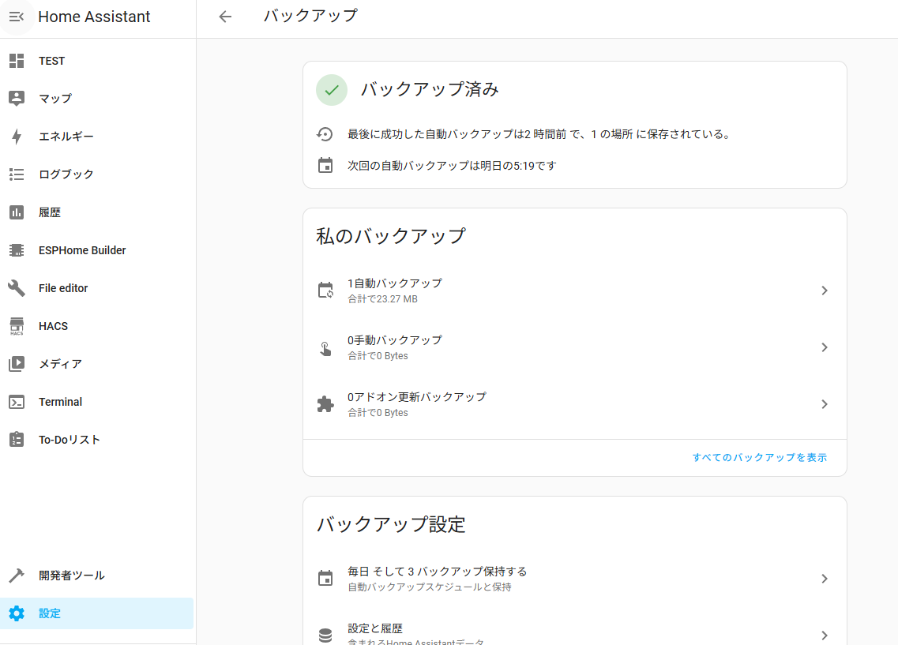

2. バックアップファイルをダウンロード
    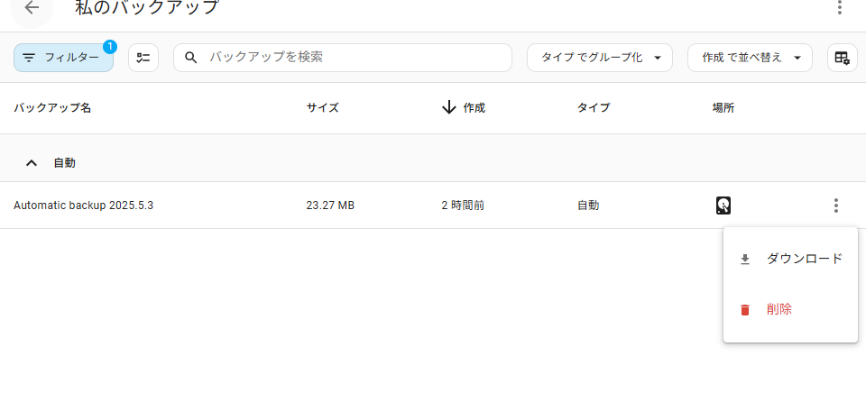  
      
    「安全ではないダウンロードがブロックされました」  
    と表示されたので、「保存」をクリック  
    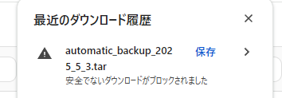

# Googleドライブにバックアップ

アドインを使って、Googleドライブにもバックアップが作成されるようにします。

1. リポジトリの追加
    - Home AssistantのUIで「設定」→「アドオン」→「アドオンストア」に移動します。
    - 右下の「アドオンストア」ボタンをクリックし、右上の三点リーダー（…）をクリックして「リポジトリ」を選択します。
    - 以下のURLを追加します:   
    https://github.com/sabeechen/hassio-google-drive-backup
    - 「追加」をクリックし、ポップアップを閉じます。  
    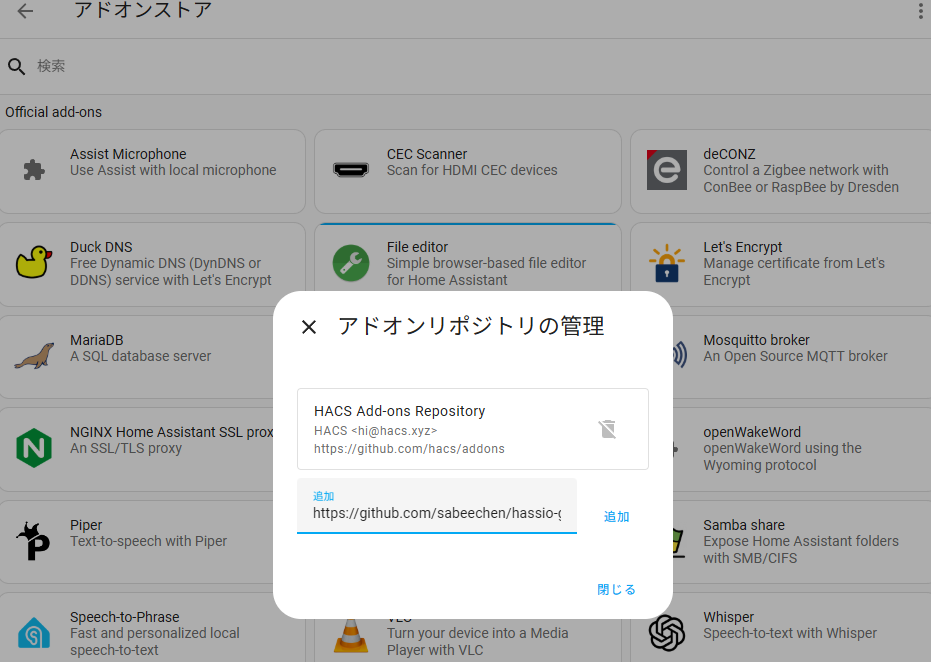

2. アドオンのインストール
    - アドオンストアに戻り、下にスクロールすると「Home Assistant Google Drive Backup」が表示されるので、それをクリックしてインストールします。
    - インストール後、「サイドバーに表示」を有効にしておくと便利です。  
    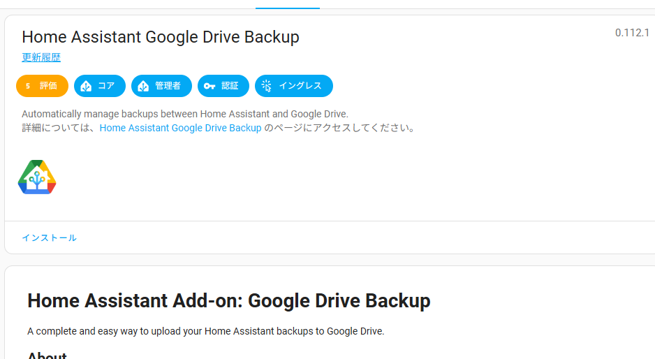

3. アドオンの起動とGoogleドライブ連携
    - アドオンを起動し、「Web UIを開く」をクリックします。
    - ウェブUIで「Authenticate with Google」をクリックし、画面の指示に従ってGoogleアカウントにログインし、Home AssistantがGoogleドライブにアクセスすることを許可します。  
        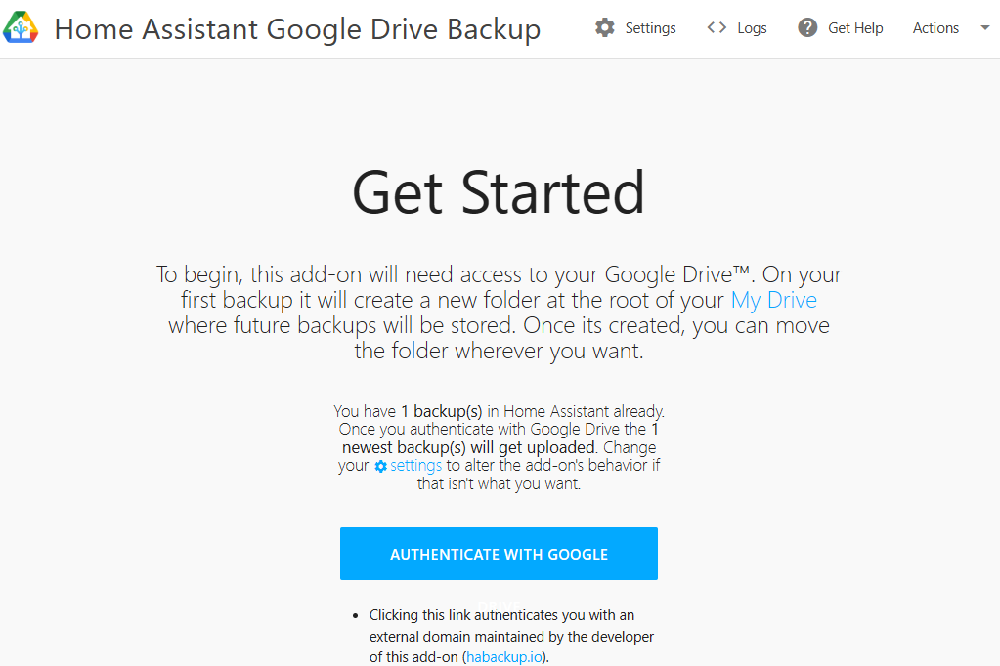

        この画面が開いたら「COPY」ボタンを押し、HomeAssistantのタブに戻る。　　
        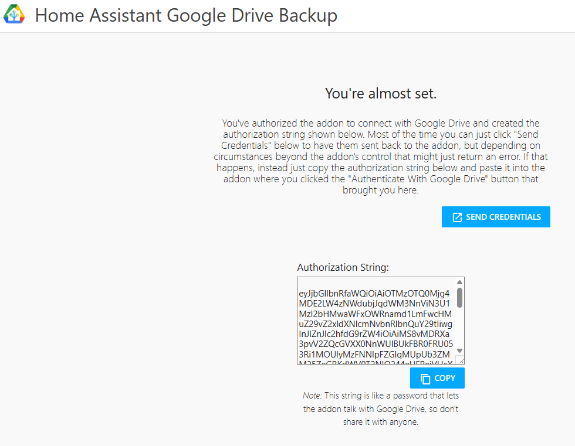  

        テキストエリアにペーストして、「SAVE」
        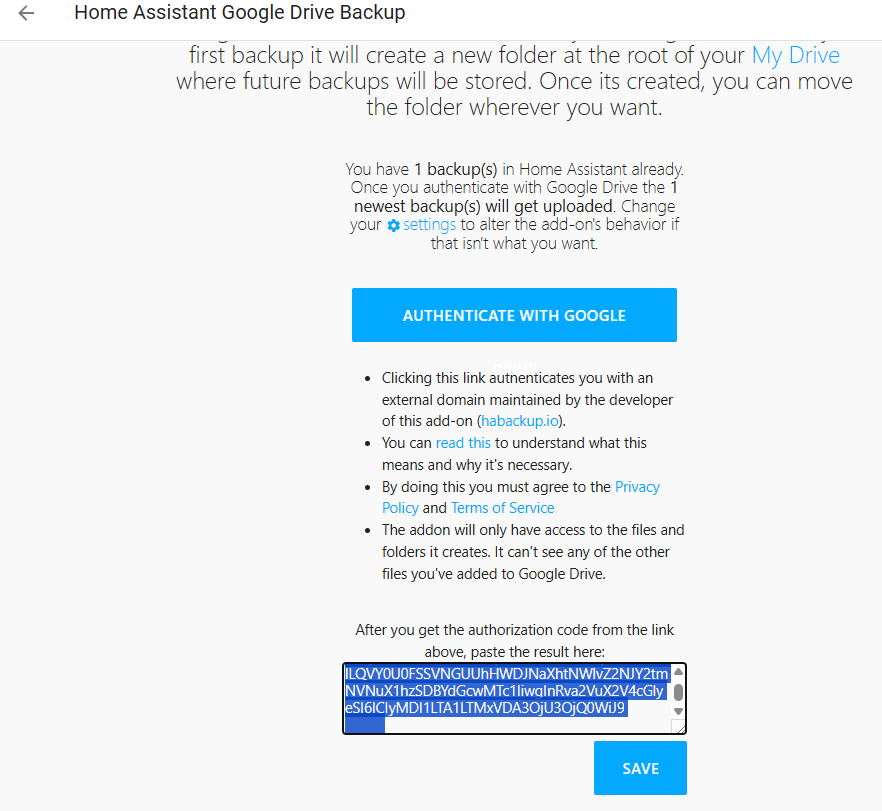

    - 認証が完了すると、通常は自動的にHome Assistantに戻り、設定が保存されます。  
        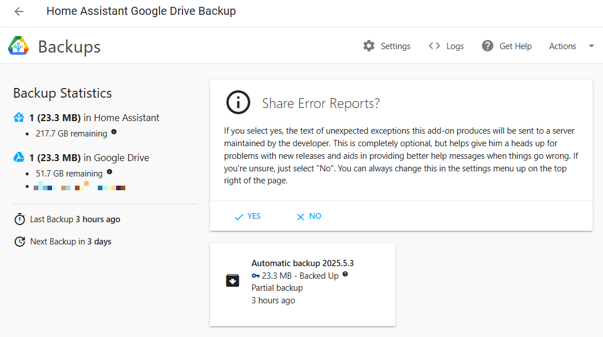

4. バックアップ設定の確認
    - アドオンのWeb UIで、バックアップのスケジュール、保持するバックアップの数、Googleドライブ内の保存フォルダなどを設定できます。

## 世代別バックアップ

Google Drive Backupアドオンでは、世代別バックアップの設定ができます。

以下のように設定してみます。
- 毎日バックアップを実行を実行
- 毎日のバックアップは２日分残す
- 毎週月曜のバックアップは2週分残す
- 毎月1日のバックアップは2週分残す
- 毎年1/1のバックアップを1年分残す

最大8個のバックアップを保存するので、「Backups in Google Drive」を8にする。  
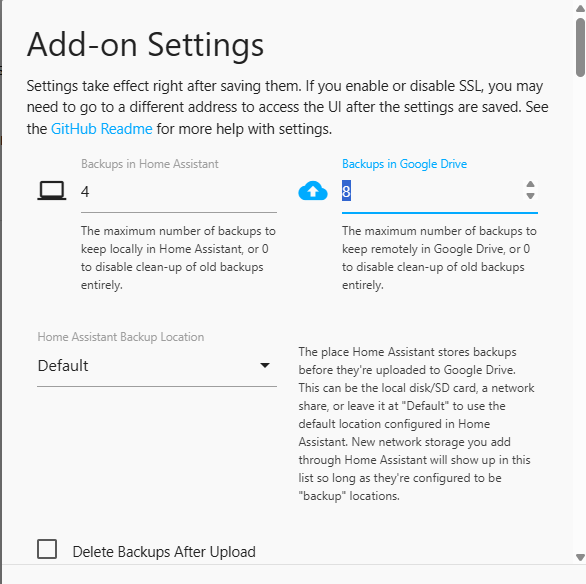

「Keep Genarational Backups」にチェックを入れる  
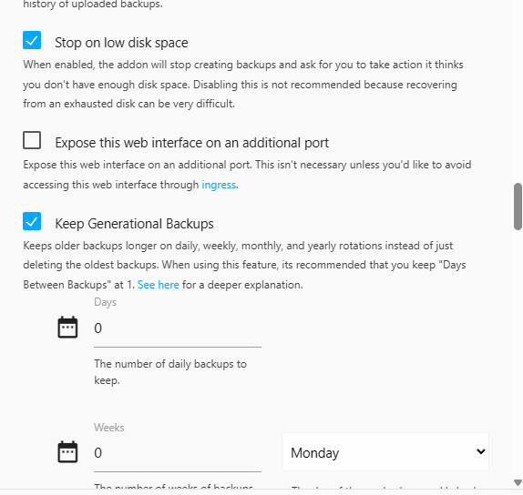

それぞれ保存する数を設定  
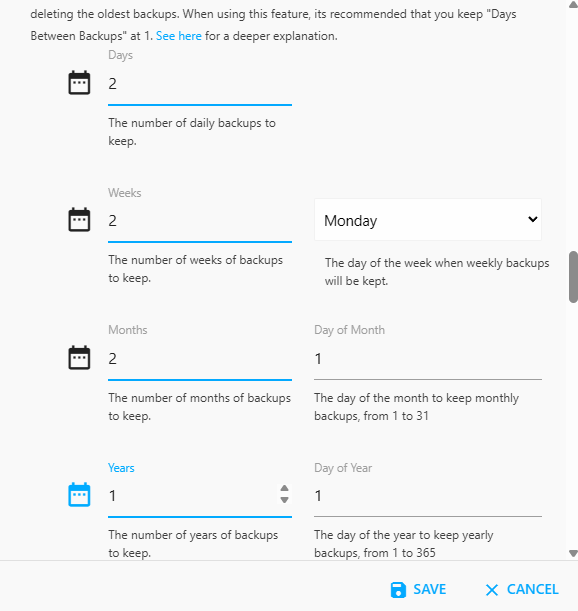

