# Bluetoothの電波が弱い、届かない場所にも、デバイスを置きたい！

Xiaomiの温湿度計をHomeAssistantに接続したのですが、電波が弱い場所があります。  
<iframe title="【HomeAssistant】温湿度計 Xiaomi LYWSD03MMC | ガンバラナイ" src="https://hatenablog-parts.com/embed?url=https://ganbaranai.tech/tech-blog/ha-xiaomi-lywsd03mmc/" style="width:100%;height:150px; max-width:600px; margin-left:auto; margin-right:auto;" frameborder="0" scrolling="no" loading="lazy"></iframe>

このような場合は「Bluetoothプロキシ」を導入するのが良い！とGeminiさんが教えてくれました。

# Bluetoothプロキシとは？

Home AssistantのBluetoothプロキシ機能は、ESPHomeデバイス（ESP32など）をBluetoothの信号中継器として利用するものです。これにより、BluetoothデバイスとHome Assistant本体の間の距離を気にすることなく、広範囲にBluetoothデバイスを配置できます。

- **仕組み:**  
ESPHomeをフラッシュしたESP32ボードを、Bluetoothデバイスの近くに設置します。  
このESP32がBluetooth信号を受信し、Wi-Fi経由でHome Assistantにデータを送ります。
- **メリット:**  
    - 広範囲をカバーできる。
    - 複数のプロキシを設置することで、家全体をカバーできる。
    - 安価に実現できる。

# Bluetoothプロキシの導入
ESP32を搭載したマイコンが必要となりますが、今回は**M5Stack nanoC6**を使ってみます。  
親指の先ぐらいのサイズのマイコンです。

<iframe title="M5Stack NanoC6 — スイッチサイエンス" src="https://hatenablog-parts.com/embed?url=https://www.switch-science.com/products/9570" style="width:100%;height:150px; max-width:600px; margin-left:auto; margin-right:auto;" frameborder="0" scrolling="no" loading="lazy"></iframe>

## ESPHomeアドオンのインストール

Bluetoothプロキシのインストールには、まずESPHomeアドオンをインストールする必要があります。

HomeAssistantの[設定]-[アドオン]-[アドオンストア]で、「ESPHome Device Builder」をインストールします。

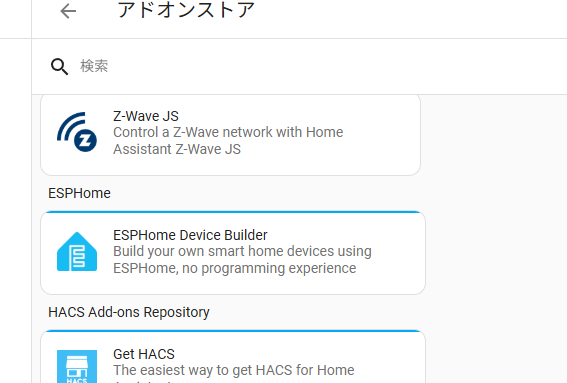

インストール出来たら「開始」させます。  
(サイドバーに表示をONにしておいたほうが良いでしょう)  
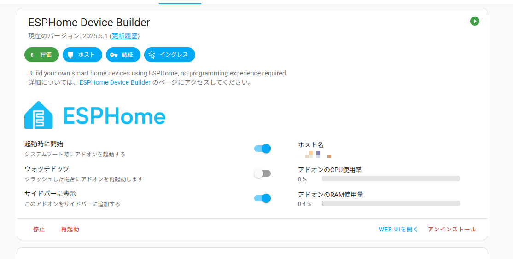

## Bluetoothプロキシのインストール

1. ESPHomeから新しいデバイスの作成  
    - [ESPHome Builder] - [+ NEW DEVICE]
    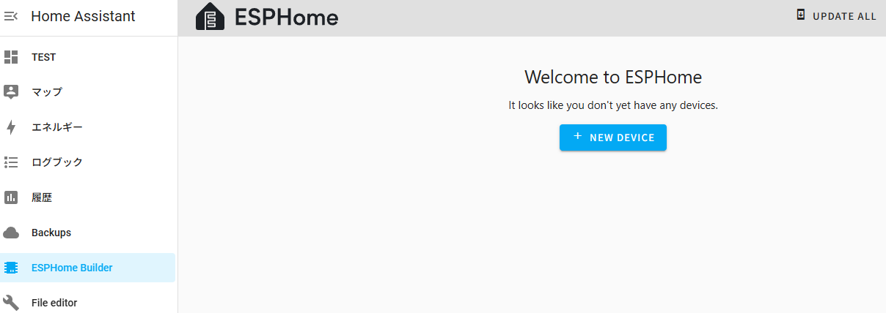

    - 「CONTINUE」  
    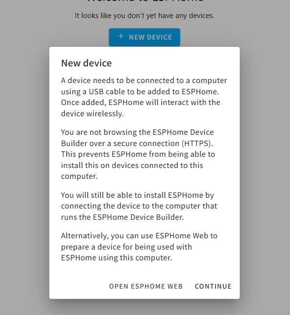

    - 新しいデバイスの名前と、WiFiのSSID,パスワード設定  
    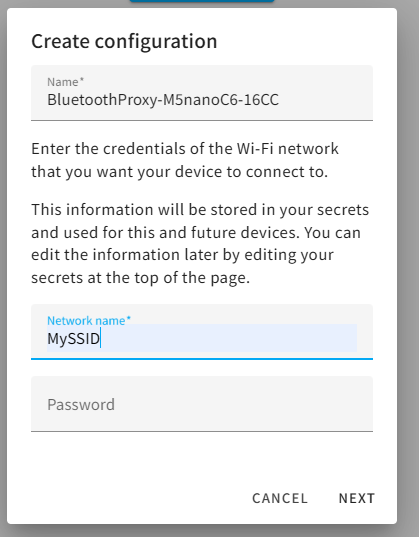

    - マイコンデバイスタイプ選択  
    M5Stack NanoC6は、ESP32-C6を搭載しているので、「ESP32-C6」を選択  
    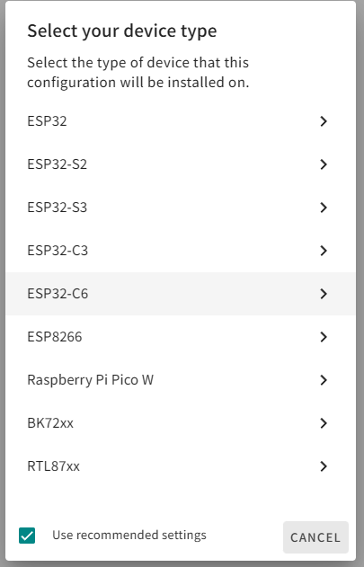

    - デバイスの設定完了  
    ちょっと設定変更するので、一旦SKIP
    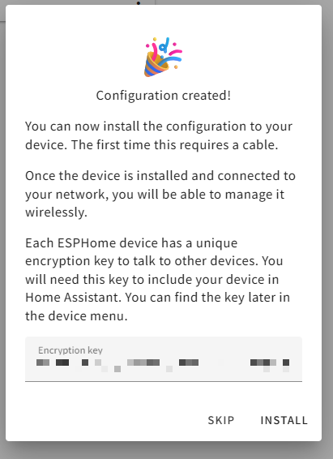

2. YAMLファイル修正  
    - ESPHomeで新たに追加されたデバイスの「EDIT」をクリック  
    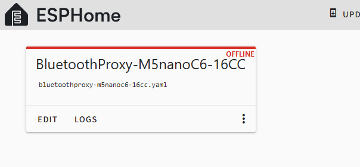
    
    - esp32: framework: type:の箇所を「esp-idf」
    - 一番下に以下コード追加  
        ```
        esp32_ble_tracker:
            scan_parameters:
                interval: 1100ms
                window: 1100ms
                active: true

        bluetooth_proxy:
            active: true
        ```  
    - 「SAVE」して「INSTALL」  
        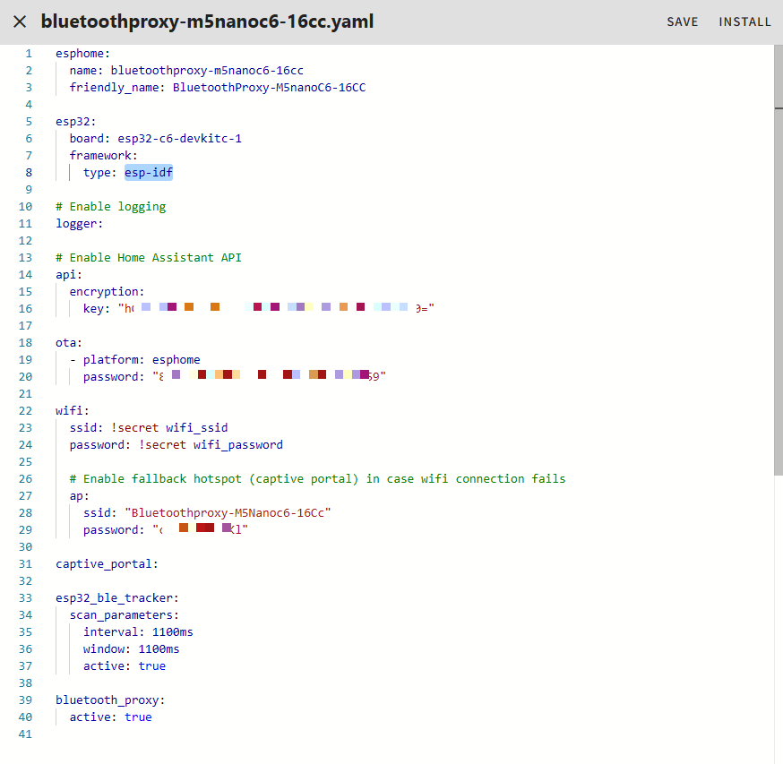

3. ファームウェア書き込み  
    - HomeAssistantOSが動いているPCにM5Stack nanoC6をUSB接続  
    ※M5STack nanoC6のボタンを押しながらUSB接続する

    - 「Plug into the computer running ESPHome Device Builder」をクリック  
    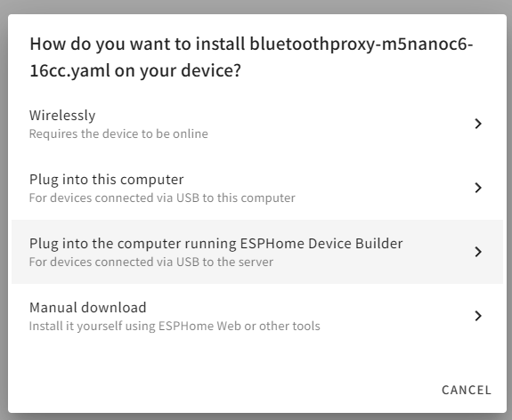

    - M5Stack nanoC6を接続したシリアルポートが表示されるのでクリック  
    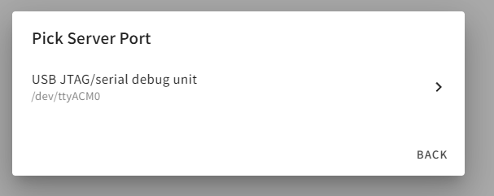

    - しばらくビルドや書き込み処理が行われ終わるとM5Stack nanoC6にリセットがかかる  
    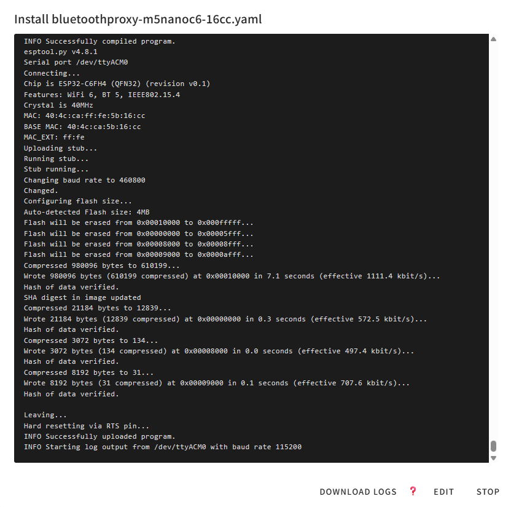

4. 確認
    - ESPHomeで外灯デバイスが「ONLINE」になっていることを確認  
    OFFLINEのままなら一度USBケーブルをさしなおしてマイコンをリスタートさせる  
    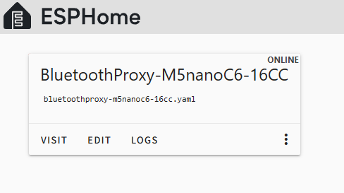

5. デバイスの追加  
    - 作成したBluetoothプロキシデバイスをHomeAssistantに追加します。

    - [設定] - [デバイスとサービス]  
    作成したBluetoothプロキシデバイスが発見されているので、「追加」  
    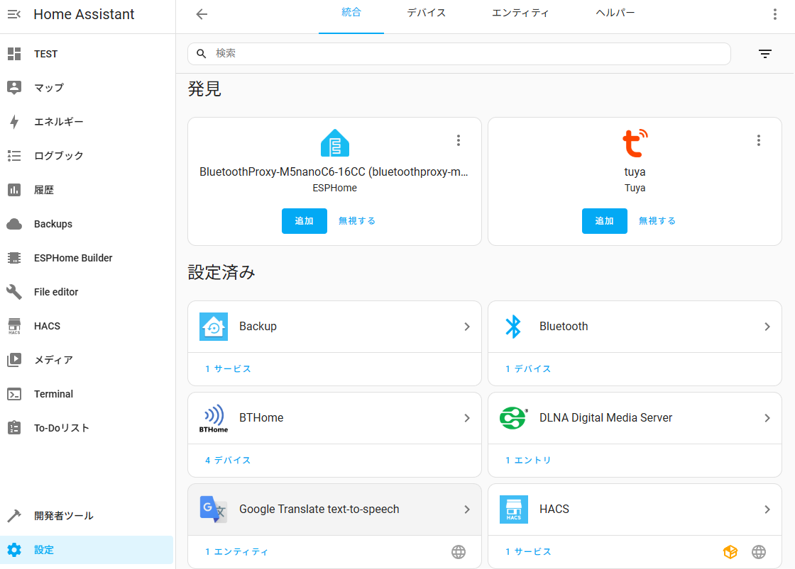

    - ESPHomeデバイスとして追加されます  
    特に設定などなく、Bluetoothプロキシとして動作します。

6. Bluetooth電波強度改善確認
    - Bluetoothの電波が弱いエリアに、Bluetoothプロキシを設置して確認。

    - 今まで電波が弱かったBluetoothデバイスの電波強度が改善されたか確認します。  


## XIAO ESP32C6でもセットアップしてみた

XIAO ESP32C6は、内蔵アンテナと外付けアンテナと切り替えて使えるようになっています。  
内蔵アンテナを使う場合も、ちゃんと設定しないとアンテナなしの状態で動作し、電波がとても弱いままになるので、起動時に内蔵アンテナの設定をするようにしました。

それ以外は、M5Stack nanoC6と変わりません。

### yamlファイル

```
esphome:
  name: bluetoothproxy-xiaoesp32c6
  friendly_name: BluetoothProxy-XiaoESP32C6
  # boot時にオンボードアンテナに切替
  on_boot:
    then:
      - output.turn_off: rf_switch_power # GPIO3をLOW (RFスイッチ有効)
      - output.turn_off: antenna_select # GPIO14をLOW (オンボードアンテナ選択)


esp32:
  board: esp32-c6-devkitc-1
  framework:
    type: esp-idf

# Enable logging
logger:

# Enable Home Assistant API
api:
  encryption:
    key: "XXXXXXXXXXXXXXXXXXXXXXXXXXXXXXXXXX"

ota:
  - platform: esphome
    password: "XXXXXXXXXXXXXXXXXXXXXXXXXXXXXX"

wifi:
  ssid: !secret wifi_ssid
  password: !secret wifi_password

  # Enable fallback hotspot (captive portal) in case wifi connection fails
  ap:
    ssid: "Bluetoothproxy-Xiaoesp32C6"
    password: "XXXXXXX"

captive_portal:

esp32_ble_tracker:
    scan_parameters:
      interval: 1100ms
      window: 1100ms
      active: true

bluetooth_proxy:
    active: true

# アンテナ切り替えのためのGPIO制御
output:
  # RFスイッチの電源制御 (GPIO3)
  - platform: gpio
    pin: GPIO3
    id: rf_switch_power
  
  # アンテナ選択制御 (GPIO14)
  - platform: gpio
    pin: GPIO14
    id: antenna_select

```
