# HACSとは？

Home Assistant Community Store (HACS)

Home Assistantの非公式な統合、プラグイン、UI要素などを管理するためのツールです。コミュニティ製の豊富なコンテンツを簡単に見つけ、インストール、そして更新できるため、Home Assistantの機能を大幅に拡張し、よりパーソナルなスマートホーム環境を構築するのに役立ちます。

<iframe title="HACS" src="https://hatenablog-parts.com/embed?url=https://www.hacs.xyz/" style="width:100%;height:150px; max-width:600px; margin-left:auto; margin-right:auto;" frameborder="0" scrolling="no" loading="lazy"></iframe>

# HACSのインストール

前回ミニPCにHomeAssistant OSをインストールしました。  
<iframe title="HomeAssistantをミニPCにインストール | ガンバラナイ" src="https://hatenablog-parts.com/embed?url=https://ganbaranai.tech/tech-blog/ha-install-minipc/" style="width:100%;height:150px; max-width:600px; margin-left:auto; margin-right:auto;" frameborder="0" scrolling="no" loading="lazy"></iframe>

そのHomeAssistantをさらに便利にするためのツールHACSをインストールしていきます。

<iframe title="ユーザードキュメント - HACS" src="https://hatenablog-parts.com/embed?url=https://www.hacs.xyz/docs/use/" style="width:100%;height:150px; max-width:600px; margin-left:auto; margin-right:auto;" frameborder="0" scrolling="no" loading="lazy"></iframe>

このページの手順に従ってインストールします。

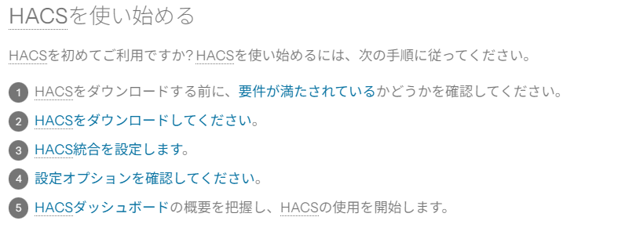

## 1. HACSをダウンロードする前に、要件が満たされているかどうかを確認

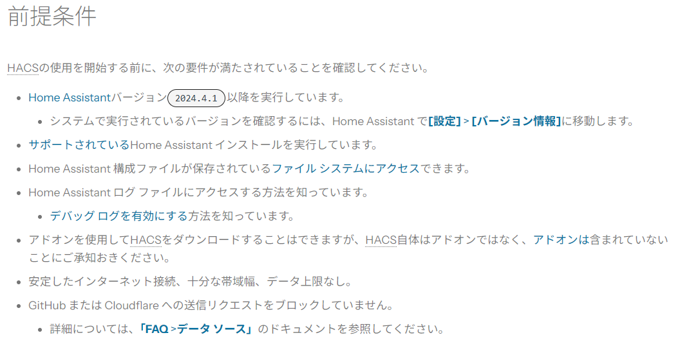

## 2. HACSをダウンロード

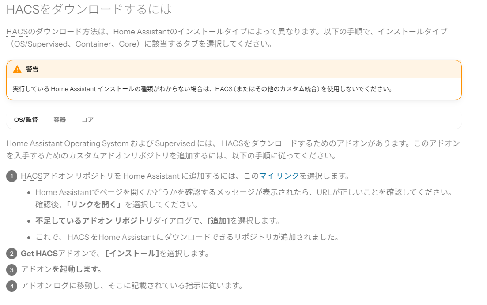

「マイリンク」をクリックします。

  
ローカルのHomeAssitantのURLが違っていないか確認して「Save」

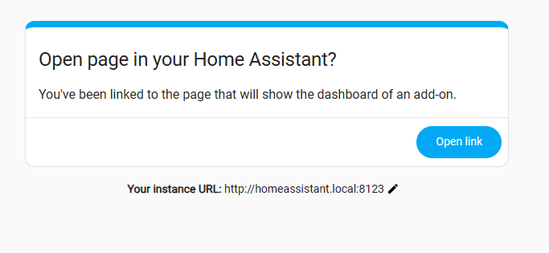  
「Open Link」

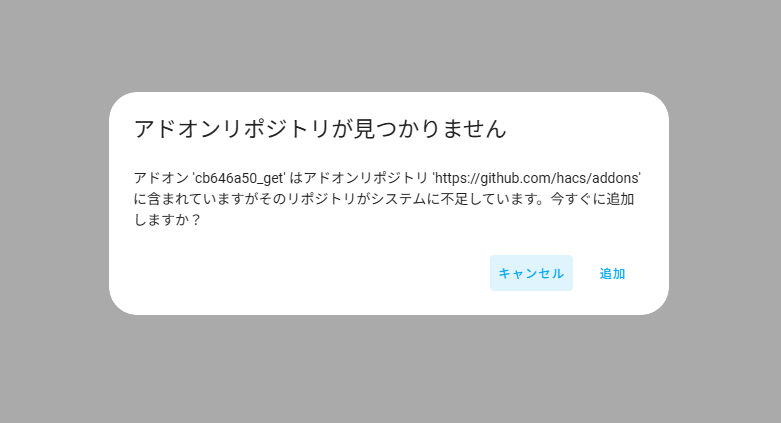  
「追加」

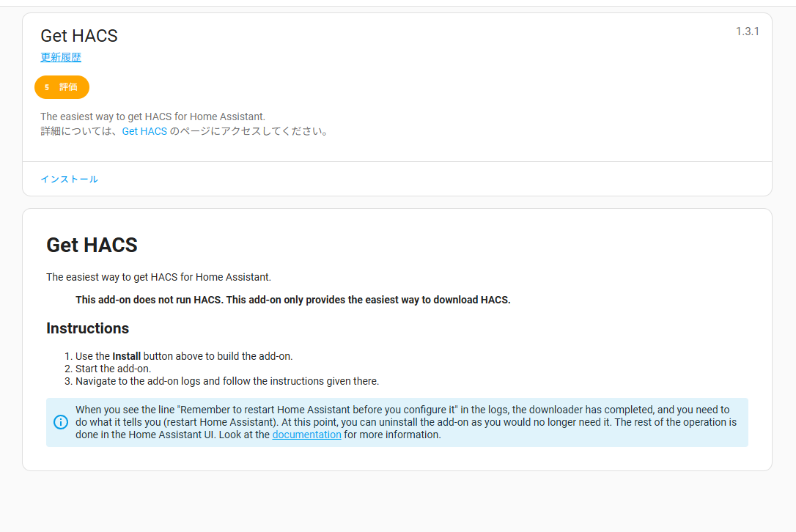  
「インストール」

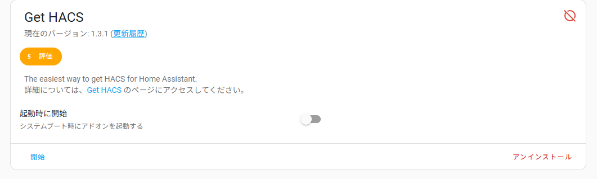  
「開始」

HomeAssistantの再起動  
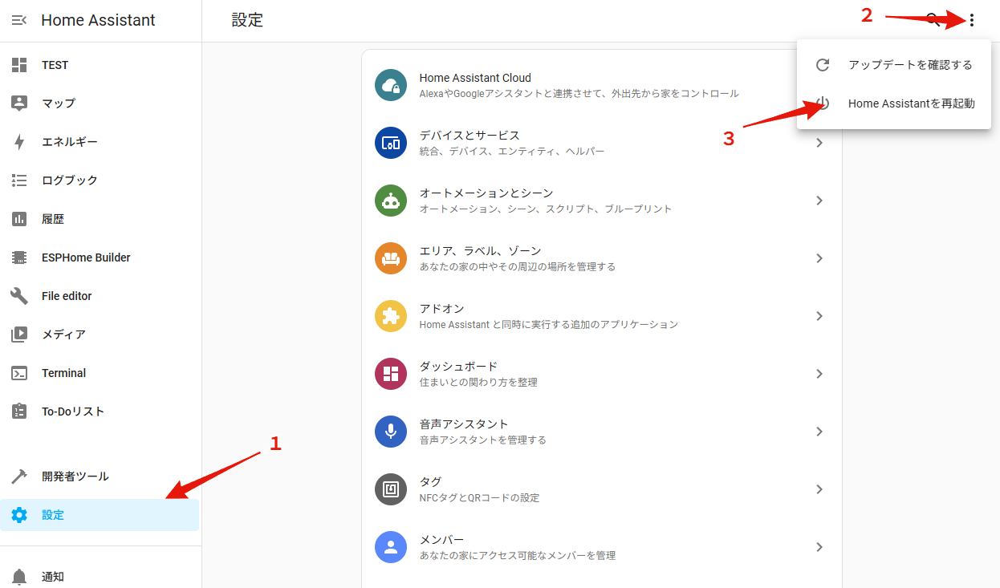

## 3. HACS統合を設定

[設定] > [デバイスとサービス]

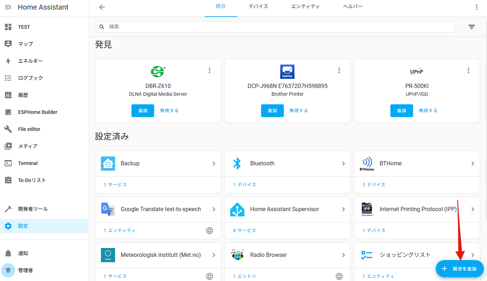  
「統合を追加」

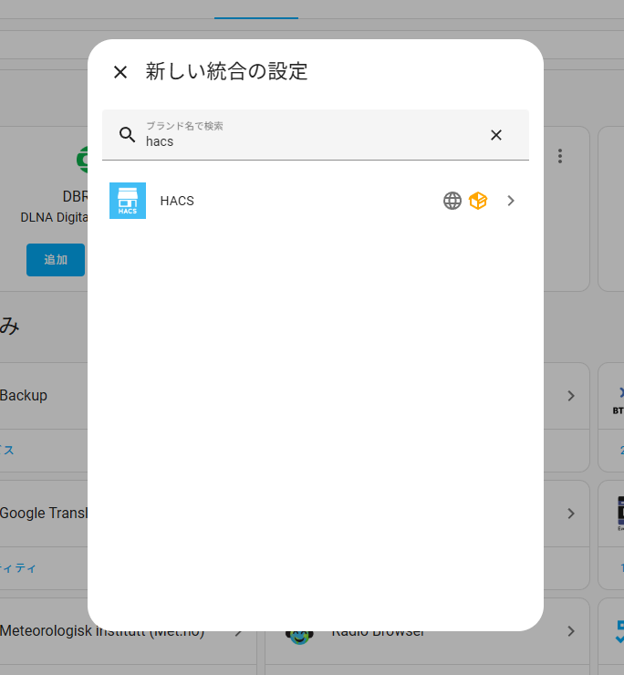  
「hacs」で検索して、「HACS」をクリック

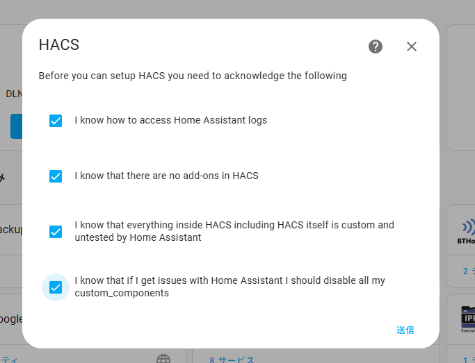  
チェックを入れて「送信」

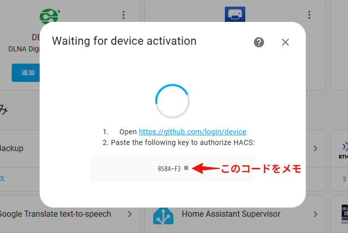  
認証コードをメモして、リンクをクリック

GitHubのページが表示されるので、メモしたコードを入力

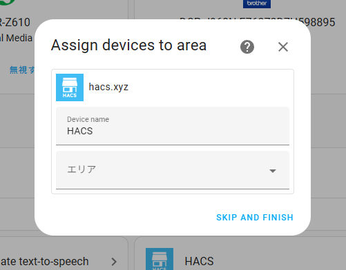  
「SKIP AND FINISH」

## 4. 設定オプションを確認

特に設定を変更する必要はないと思います。

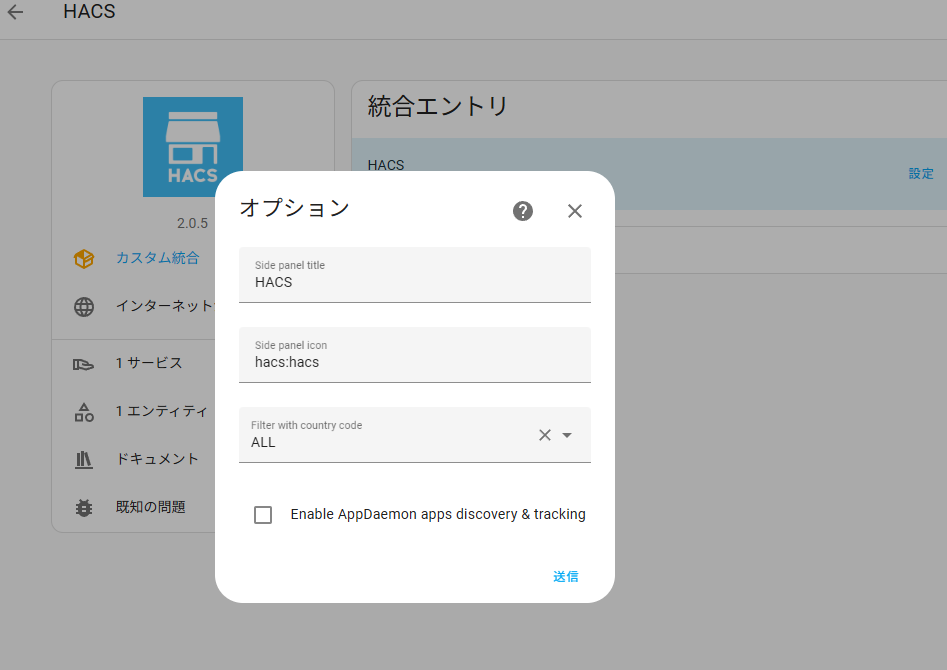

## 5. HACSダッシュボードの概要を把握し、HACSの使用を開始

HACSの画面が利用できるようになりました。

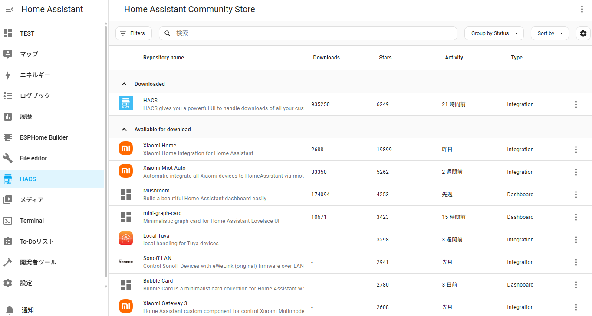

