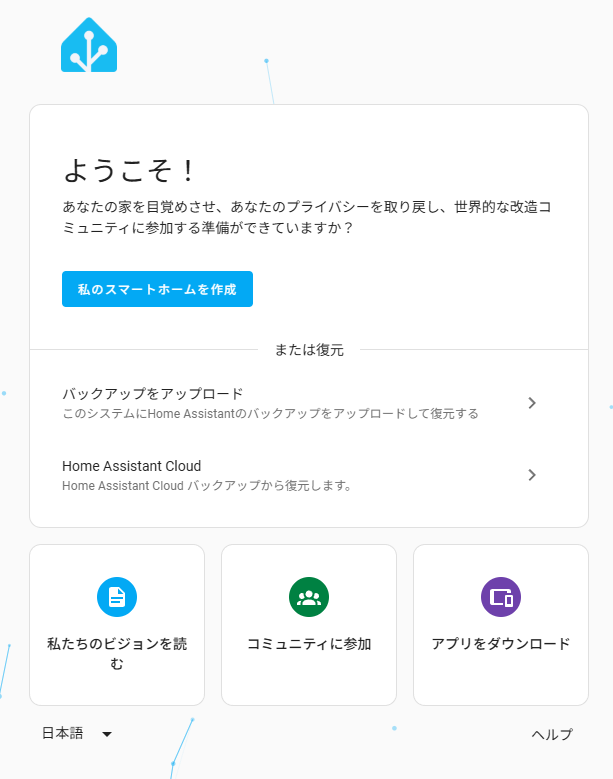
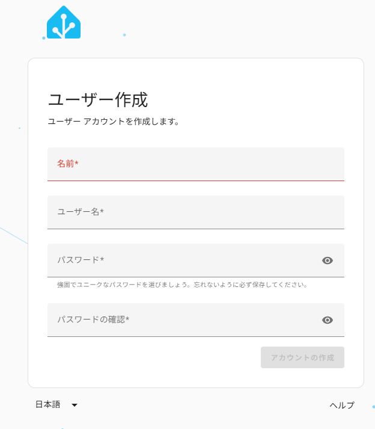
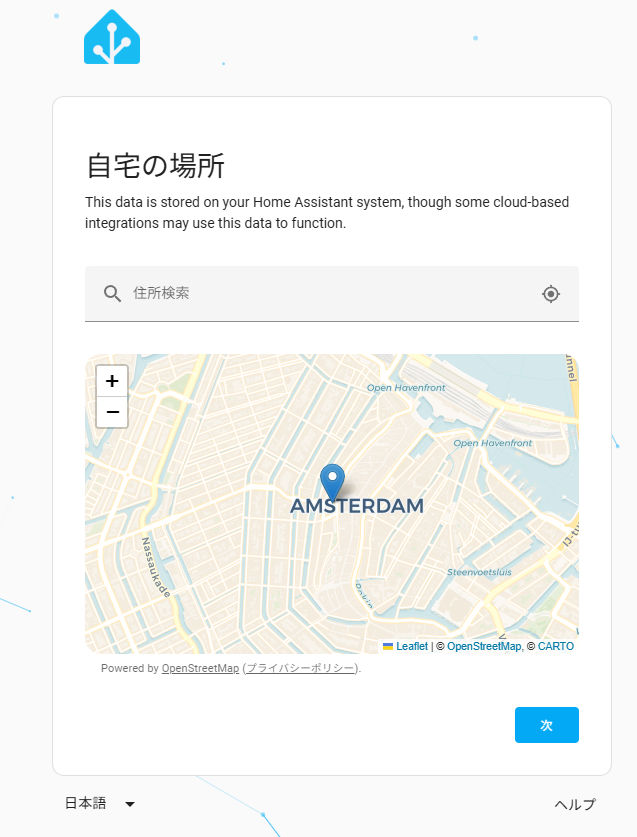
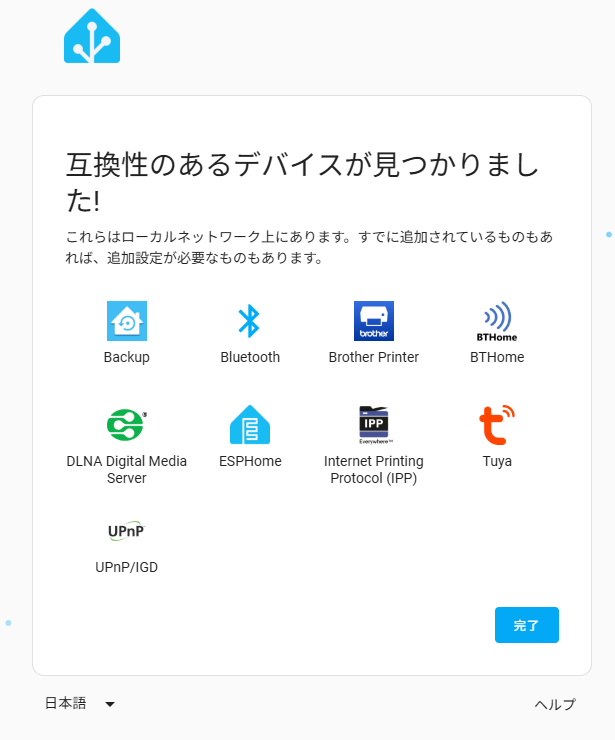
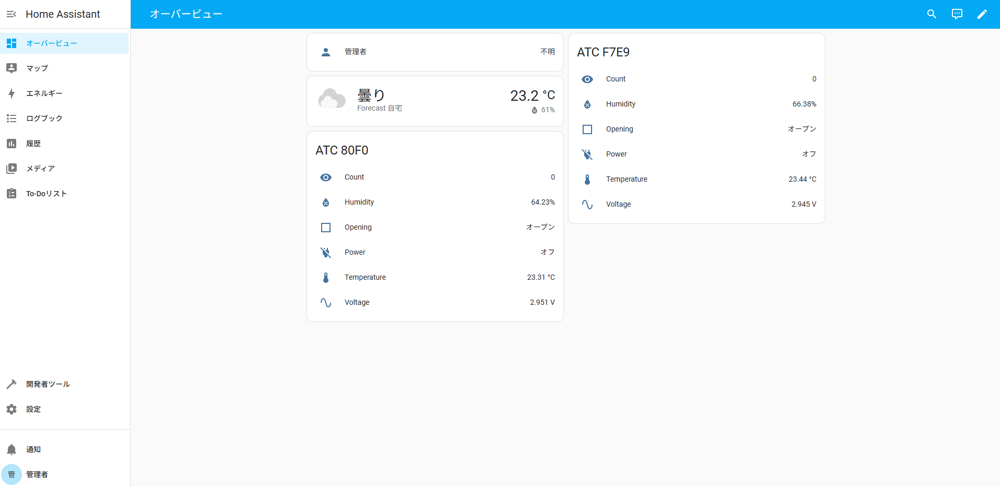

# HomeAssistantとは

ホーム アシスタントは、ホーム オートメーションに使用される無料のオープンソース ソフトウェアです。これは統合プラットフォームおよびスマート ホーム ハブとして機能し、ユーザーがスマート ホーム デバイスを制御できるようにします。

(Wikipediaより)

複数メーカーのいろいろなスマートホーム製品や、自作の機器などを一括管理できるようです。

自由にカスタムできるダッシュボードや、いろんな機器を組み合わせた自動化などもできるという優れものらしいです。

<iframe title="Home Assistant" src="https://hatenablog-parts.com/embed?url=https://www.home-assistant.io/" style="width:100%;height:150px; max-width:600px; margin-left:auto; margin-right:auto;" frameborder="0" scrolling="no" loading="lazy"></iframe>

# インストール方法

インストール方法はいろいろあって、一番簡単なのは、
- SDカードにHomeAssistantOSを書き込んでラズベリーパイで起動

なのですが、ラズベリーパイも今購入するとなんだかんだで１万円台後半必要。  

HomeAssistatOSは、IntelPCにも対応とのことなので、２万円出して安いミニPCのほうがスペックが格段に良いので試してみることにします。

Amazonで19,900円で購入したPCを使います。

<iframe title="２万円以下のミニPC「ACEMAGIC Vista Mini V1」を買ってみた | ガンバラナイ" src="https://hatenablog-parts.com/embed?url=https://ganbaranai.tech/blog/minipc-acemagic-vistaminiv1/" style="width:100%;height:150px; max-width:600px; margin-left:auto; margin-right:auto;" frameborder="0" scrolling="no" loading="lazy"></iframe>

# インストール

<iframe title="汎用 x86-64 - ホームアシスタント" src="https://hatenablog-parts.com/embed?url=https://www.home-assistant.io/installation/generic-x86-64" style="width:100%;height:150px; max-width:600px; margin-left:auto; margin-right:auto;" frameborder="0" scrolling="no" loading="lazy"></iframe>

↑の手順に従ってインストールします。

## BIOS設定
HomeAssistantをインストールPCでBIOS設定を変更します。

1. UEFI ブート モードが有効になっていることを確認
2. セキュアブートを無効

の設定をします。

セキュアブートを無効にしても、プリインストールされていたWindowsは普通に起動しました。

## USBメモリで起動するUbuntu作成
別のPCでの作業になります。

<iframe title="Ubuntu 24.04のLive USBを使ってArduino IDEの検証 | Lang-ship" src="https://hatenablog-parts.com/embed?url=https://lang-ship.com/blog/work/ubuntu-24-04-live-usb/" style="width:100%;height:150px; max-width:600px; margin-left:auto; margin-right:auto;" frameborder="0" scrolling="no" loading="lazy"></iframe>
↑を参考に、Raspberry Pi Imagerを使ってUSBメモリにUbuntuをインストールします。

1. Ubuntuのディスクイメージをダウンロード  
  https://jp.ubuntu.com/download  
  「Ubuntu Desktop 24.04.2 LTS」  
  を選択しました。  
2. Raspberry Pi ImagerでUSBメモリーに書き込み  
  OSの選択で、「Use custom」を選んで、ダウンロードしたファイルを選択します。

## USBメモリでUbuntu起動
ここからは、HomeAssistant OSをインストールするPCで作業します。

作成したUbuntu USBを、HomeAssistant OSをインストールするPCに接続して起動します。

F12などを押してBootするデバイスを選択します。  
(今回使ったミニPCはESCでBIOS画面でBootドライブを選択して起動できました）

メニューで  
「Try or Install Ubuntu」  
を選択します。

WiFi設定なしで「Ubuntuを試してみる」で起動します。

起動後、画面右上辺りをクリックしてWiFi接続します。

## HomeAssistant OSインストール

USBから起動したUbuntuで、Firefoxブラウザを立ち上げ、以下ページを参考に進めていきます。

https://www.home-assistant.io/installation/generic-x86-64

「homeassistant install」などで検索すると出てきます。

Firefoxブラウザでもページの翻訳ができるので日本語のほうが良ければ翻訳して進めます。  
ブラウザ画面の右上の三本線のメニューから「Translate Page」で翻訳できます。

Method 1(方法１)の５の手順からです。

「download the image」のリンクをクリックするとイメージのダウンロードが始まります。  
日本語翻訳だと「そこから、画像をダウンロードする」になっています。

手順6:
1. デスクトップ左下のUbuntuロゴのアイコンをクリックしてアプリ一覧を表示
2. Utilitiesうぃクリックし、その中のDisksを起動

手順7:
1. インストールする起動デバイス(SSD)を選択
2. ウィンドウ上部に出てきた、３点メニューから「Restore Disk Image」を選択
3. ダウンロードしたイメージファイルを選択し、「Start Restoring..」をクリック
4. 確認画面が出るので「Restore」
5. 「Authenticate」

## 初回起動

SSDへの書き込みが終了したら、Ubuntuを終了し、USBメモリを取り外し再起動。

HomeAssistantが起動したら、別のPCで以下URLを開く。

http://homeassistant.local:8123/

「私のスマートホームを作成」ボタンをクリック  

ユーザー作成  

自宅の住所  

互換性のあるデバイスが見つかりました  

オーバービュー  

※互換性のあるデバイスや、オーバービューは環境によって変わります。

