# Threadとは

Threadは、低消費電力で、2.4GHz帯を使う無線通信プロトコルです。  
スマートホームデバイス間の接続を、より信頼性が高く、効率的にするために設計されました。  
デバイス同士がメッシュネットワークを構築できるため、ひとつのデバイスが故障しても、ネットワーク内の別のデバイスが通信経路を確保するため、ネットワーク全体がダウンするリスクを減らせます。

# Home AssistantのThread対応について

Home Assitantは、Thread通信に対応しています。  
ボーダールーターを介して、Thread通信を行います。  
また、ESP-HomeもThread通信に対応しており、ESP32-C6などのThread対応デバイスを用いて、HomeAssistantと連携できるデバイスを作成することができます。

# ボーダールーターとは

通常のPCが対応する無線通信は、主にWiFiやBluetoothなので、そのままでは通信できません。  
そこでボーダールーターと呼ばれる、Threadネットワークと、WiFiなどのネットワークとの橋渡しをするデバイスが必要になります。  
ボーダールーターはネットワーク内に複数設置することが可能で、一つが故障してもネットワーク内の別のデバイスが通信経路を確保してくれます。

# Aqara Hub M100について

日本で普通に買える安価なボーダールーターを探したところ、この製品を見つけました。  

USB端子に刺してつかうような形になっていますが、電源をとっているだけなので、PCに接続しなくても、充電用ACアダプターなどに刺しても利用可能です。

公式サイト：
https://www.aqara.com/jp/product/hub-m100/

Amazonで購入しました。  
https://amzn.to/4mMakJT  
(アフィリエイトリンクです)  
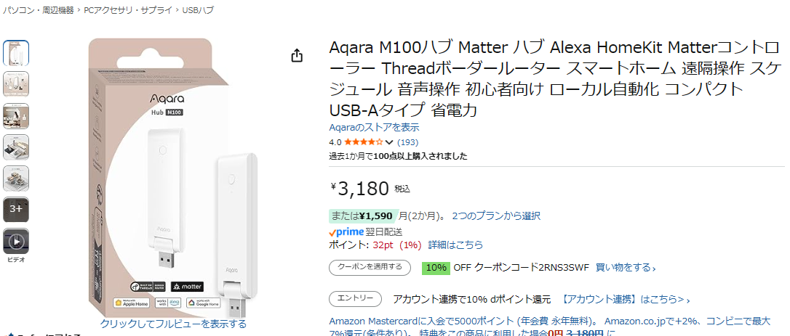

# 開封

箱  
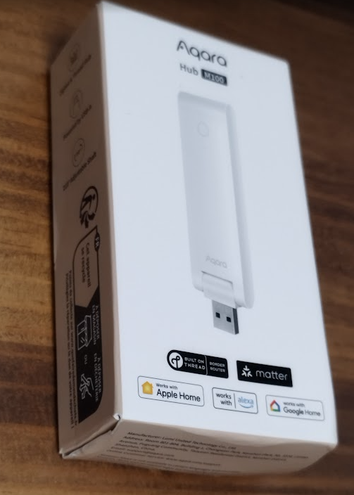

内容物  
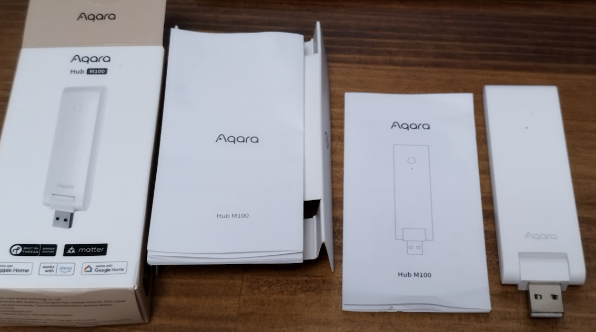

M100本体の裏面  
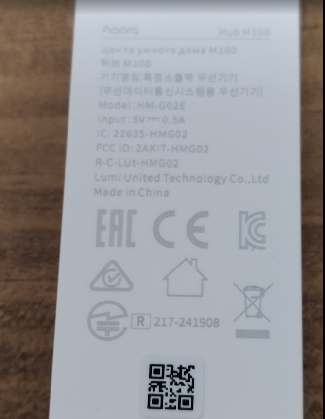  
ちゃんと技適マークもある！

# セットアップ

オンラインマニュアルに従ってセットアップをしていきます。  
https://store-support.aqara.com/ja-jp/products/hub-m100#user-manual

## アプリインストール

M100をWiFiに接続するためには、まず「Aqara Home」アプリをインストールする必要があります。

アプリストアや、GooglePlayで、「Aqara Home」を検索してインストールします。

### アカウント登録
アプリを起動すると、まずはログインを求められるので、アカウントを作成します。  
アプリに指示通りにアカウントを作成します。

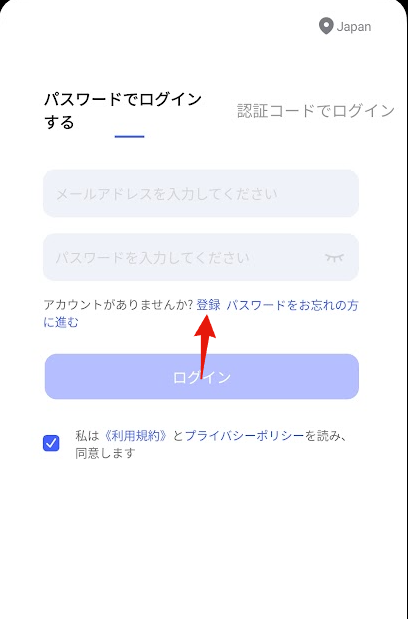

アカウント作成が終わるとホーム画面になります。  
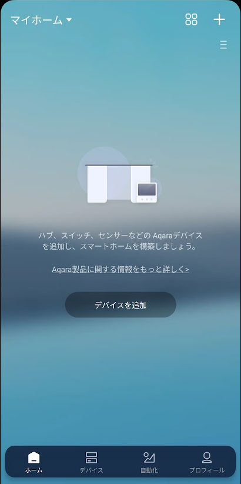

M100をUSBにつなぎます。  
USBからは電源をとるだけなので、ACアダプターでもPCのUSB端子でもどちらでも構いません。  
今回はひとまず、モバイルバッテリーにつなぎました。

USBにつないだら、アプリの「デバイスを追加」をタップします。

M100が見つかるので、M100をタップします。  
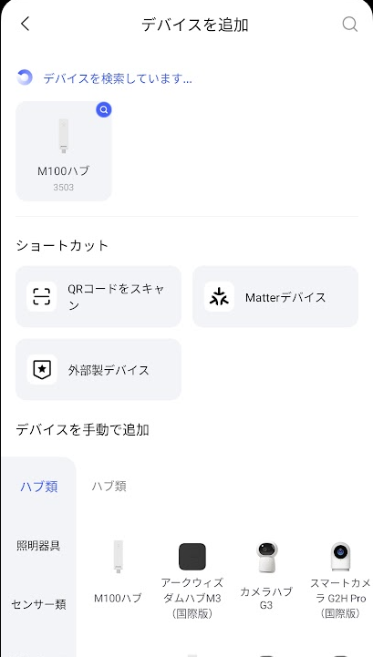  

アクセスポイントの情報を入力します。  
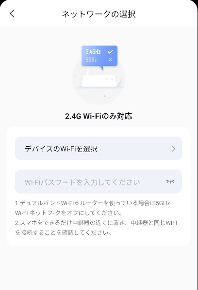

ネットワークの設定中です。画面の指示に従ってください。  
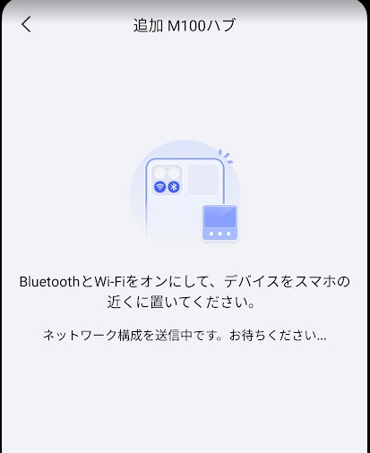

設定が終了するとこのような画面になります。
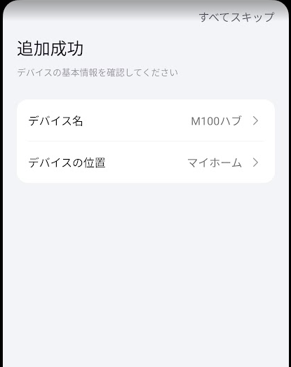

M100のLEDが青色に点灯していたらWiFi接続成功です。

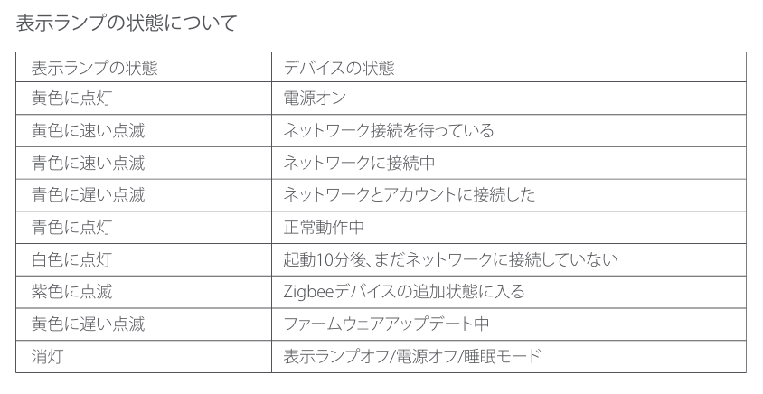

Aqara Home アプリを使うのはここまでで、ここから先はHome Assistantの設定になります。

## HomeAssistantの設定

「設定」-「デバイスとサービス」で、デバイスが発見されているのと「Thread統合」が追加されています。  
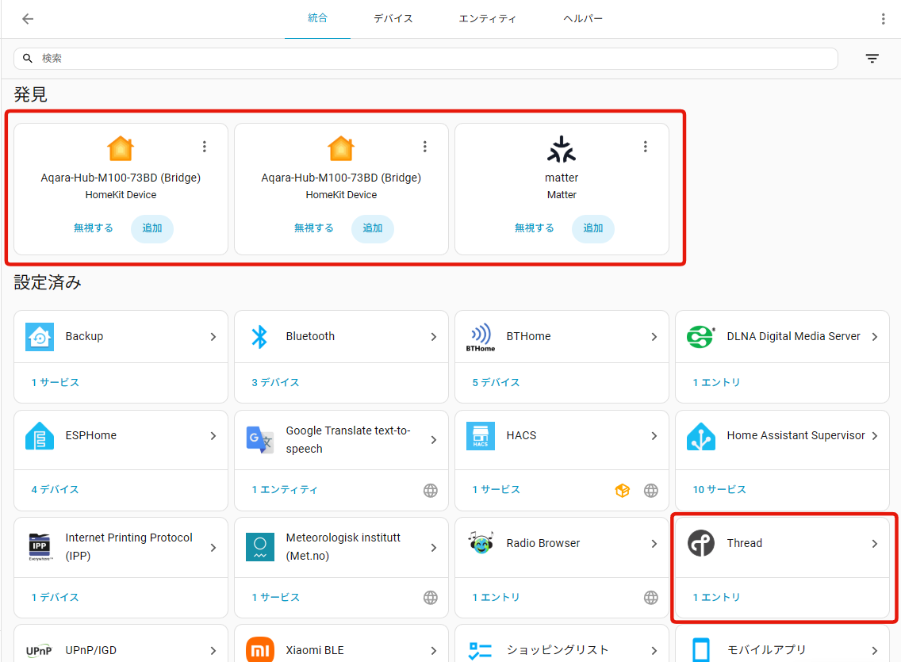

~~多分この状態ですでにM100を通してThread通信はできると思いますが、設定の確認です。~~

「Thread」-「歯車アイコン」を押した画面  
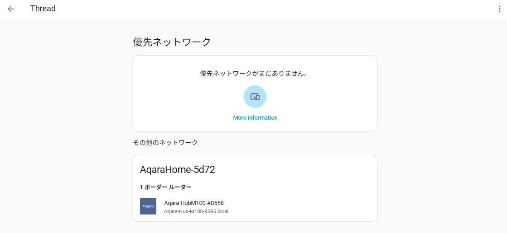

「Thread」-「３点メニュー」-「システムオプション」の画面  
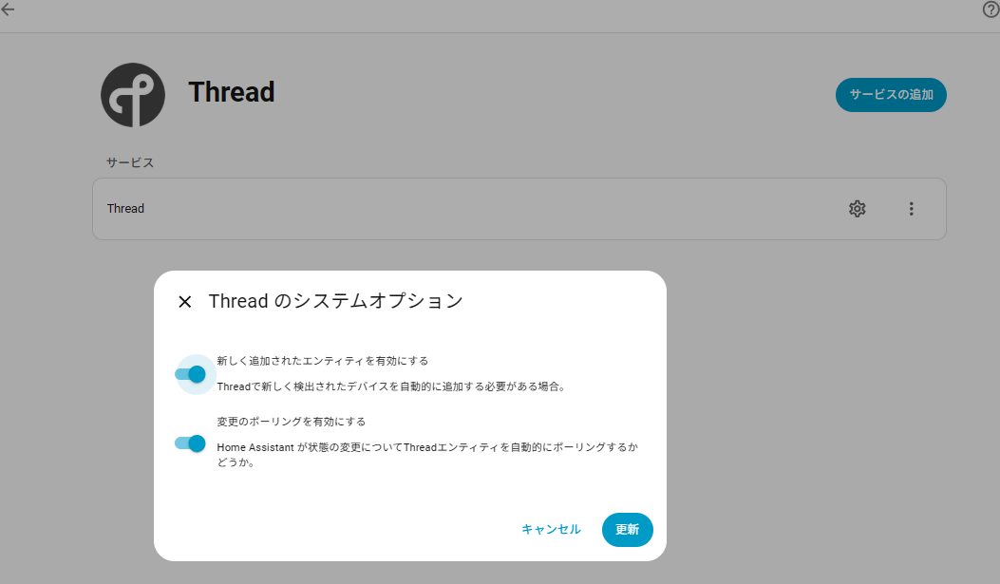

### 優先ネットワークに設定(2025.8.20追記)

この状態ではまだ、M100を通じてHomeAssistantとThread通信ができません。

M100が所属しているThread通信のグループに、HomeAssistantを入れる必要があります。

#### M100のネットワークに参加

M100の設定をしたスマートフォンに、HomeAssistantのコンパニオンアプリが入っている必要があります。  
M100のThread通信グループの情報が、設定をしたスマホにしかないので、そのスマホからHomeAssistantに各種情報を送信する必要があるようです。

1. M100を設定したスマホで、HomeAssitantのコンパニオンアプリを起動
2. [設定] > [デバイスとサービス]に移動し、Thread統合を選択
3. 画面下のほうにある「Send credentials Home Assistant」ボタンをタップ

これで、画面を更新すると、M100の属しているネットワークの右上に「i」が丸で囲まれたアイコンが表示されます。  
このアイコンを見るとそのネットワークの情報が確認できます。
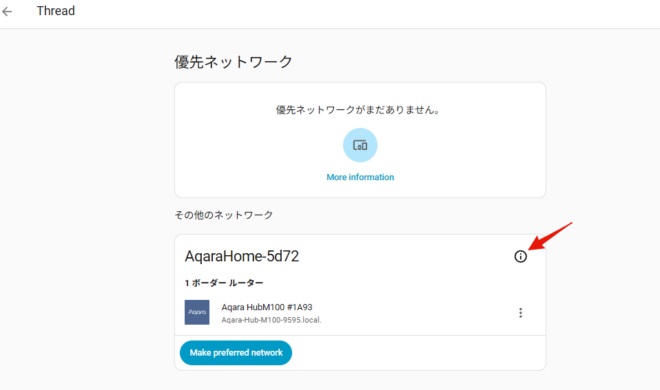

#### 優先ネットワークの設定

M100の属しているネットワークの下に表示されている「Make Preferred network」ボタンをクリックします。  
これで、優先ネットワークに設定されます。
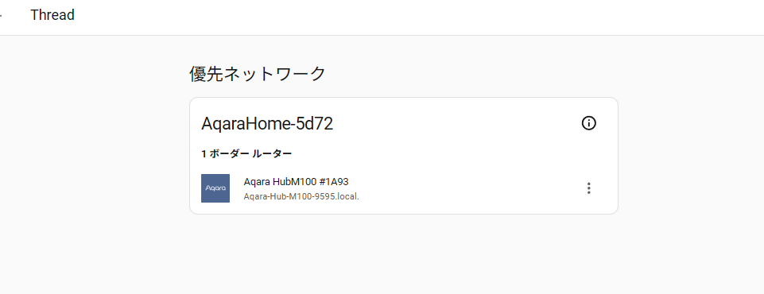

Matterデバイスを使う場合は、Matter統合を追加する必要があると思いますが、今回はThread通信の実験を行いたいだけなので今は追加しないでおきます。

次回はESP32-C6を使ったThreadデバイスの作成方法を紹介する予定です。
