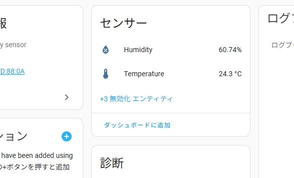

# 温湿度計 Xiaomi LYWSD03MMC

> Xiaomi LYWSD03MMCは、シンプルでコンパクトなデザインのスマート温湿度計です。スイス製Sensirionセンサーを搭載し、高精度な温度・湿度測定が可能。Mi HomeアプリとBluetooth連携することで、現在の状態や過去の履歴をグラフで確認できます。乳幼児向け快適環境表示モードもあり、CR2032ボタン電池で動作します。据え置き・壁掛け両対応で、手軽に室内の環境管理ができます。

Geminiがまとめてくれました。

# Xiaomi LYWSD03MMCをHomeAssistantに接続

いくつか方法があるようですが、今回はLYWSD03MMCのファームウェアをカスタムファームウェアに書き換えてBTHomeデバイスとして接続します。

## カスタムファームウェア

<iframe title="pvvx/ATC_MiThermometer: Xiaomi 温度計と Telink フラッシャー用のカスタムファームウェア" src="https://hatenablog-parts.com/embed?url=https://github.com/pvvx/ATC_MiThermometer" style="width:100%;height:150px; max-width:600px; margin-left:auto; margin-right:auto;" frameborder="0" scrolling="no" loading="lazy"></iframe>

いろいろ特徴があるようですが、今回特にメリットがありそうなのは、

- バッテリー寿命の延長（1年以上）
- Home Assistantの「BTHome 統合」、「パッシブ BLE モニター」などを完全サポートします。

## カスタムファームウェアの書き込み

Bluetoothが使えるPCと、WEBブラウザを使って、カスタムファームウェアの書きこみをします。

1. 書き込み用WEBページにアクセス

    https://pvvx.github.io/ATC_MiThermometer/TelinkMiFlasher.html

    

    「Connect」をクリック

2. LYWSD03MMCと接続

    

    書き換えたいLYWSD03MMCを選択し、「ペア設定」

3. アクティベート

    

    「Do Activate」をクリック

4. 書きこむファームウェアを選択

    

    「Custom Firmware: ATC_v51.bin」をクリック

5. 書き込み開始

    

    「Start Flashing」をクリック

    書き込みが終了すると切断されます。

## カスタムファームウェア設定

1. 書き込み用のWEBページから「Connect」で再接続します。

    

    直前に書き込みしたLYWSD03MMCは、名前が変わっていますが、「ペア設定済み」となっているのでそれを選択します。

    ATC_XXXXXXXのXXXXXX部分が、MACアドレスになるので自分はこの番号をテプラで張っています。

2. 設定変更

    

    設定をいろいろ変更できます。

    基本変更する必要はないですが、画面上の顔文字を消す場合、  
    Smiley - Comfort: のチェックを外します。

    顔文字がないとすっきりして湿度が目立つようになるのでおすすめです。

    設定を反映させるには、「Send Config」をクリックします。

## Home Assistantに追加

Home Assistantのページで、[設定] - [デバイスとサービス]  
http://homeassistant.local:8123/config/dashboard

「ATC XXXX」という、BTHomeデバイスが発見されているので「追加」します。

## デバイスの設定

BTHomeデバイスとして登録されたので、設定を変更します。

1. デバイスを選択

    BTHomeのデバイスから設定したいデバイスを選択します。

    

2. センサー情報の設定

      
    Openは使わないので非表示にします。  
    Openをクリックします。

      
    歯車アイコンをクリックします。

      
    「有効化」をOFFにして、「更新」をクリックします。

    同じように、PowerとVoltageも有効化をOFFにします。

3. 診断情報の設定

      
    無効化されている情報があるので、有効化していきます。

    「無効化エンティティ」をクリック

      
    「Signal Strength」をクリック

    歯車アイコンをクリックして「有効化」をON  
    アイコンも変更してみました。
    

## ダッシュボードに追加

  
「ダッシュボードに追加」をクリック。

  
追加するダッシュボードを選択。  
追加できるダッシュボードがない場合は、[設定]-[ダッシュボード]-[ダッシュボードを追加]でダッシュボードを作っておきます。

追加したダッシュボードを開いても、まだ追加したカードは出てきていないので、右上の鉛筆アイコンをクリック。  

  
画面下のほうに、外灯のカードがあるので、追加したい場所にドラッグアンドドロップ。

  
右上の「終了」をクリック。

こんな感じで必要なカードを追加していく。

カードの表示方法変更も、ダッシュボードの編集から行います。

