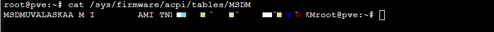

# Proxmoxとは

PC１台で、仮想的に複数のPCを作り、それぞれ別のOSをインストールして、同時に動かすことができる仮想化システムです。

物理的なPCを新たに購入しなくても、複数のOSを試すことができて便利です。

そして何より無料です。

Proxmoxのインストール方法などは、以下を参考にしてください。

<iframe title="ミニPC（Intel NUC）へのProxmox VEのインストールから初期設定まで #Linux - Qiita" src="https://hatenablog-parts.com/embed?url=https://qiita.com/yankee/items/1d576f7a25d6f33c6cb5" style="width:100%;height:150px; max-width:600px; margin-left:auto; margin-right:auto;" frameborder="0" scrolling="no" loading="lazy"></iframe>

インストール後は、以下のスクリプトでリポジトリの設定やら何やらを全部やってくれます。

<iframe title="Proxmox VE Helper-Scripts" src="https://hatenablog-parts.com/embed?url=https://community-scripts.github.io/ProxmoxVE/scripts?id=post-pve-install" style="width:100%;height:150px; max-width:600px; margin-left:auto; margin-right:auto;" frameborder="0" scrolling="no" loading="lazy"></iframe>


# Proxmox上にWindows11Proをインストール

Amazonで購入したミニPCにインストールされていたWindowsがボリュームライセンスでしたが、サポートに問い合わせたらOEMキー発行してくれたので以下を参考にインストールしてみました。

<iframe title="OEMのWindows11ライセンスをProxmoxVEに移行する #proxmox - Qiita" src="https://hatenablog-parts.com/embed?url=https://qiita.com/tachiki__/items/67be59e5d98a2dfe7097" style="width:100%;height:150px; max-width:600px; margin-left:auto; margin-right:auto;" frameborder="0" scrolling="no" loading="lazy"></iframe>

## VM作成
  
VM IDは、ホスト情報をゲストに反映させるときに使うので覚えておきます。


  
[完了]でVMを作成します。

## ホストの情報をゲストに反映
BIOSに保存されているライセンス情報などを、作成したVMに反映させる作業です。

```
cat /sys/firmware/acpi/tables/MSDM
```

  
後から教えてもらったOEMキーとは違うライセンスキーが表示されました。  
(最初に入っていたボリュームライセンスのキー？)

とりあえずこのまま反映させてみました。

```
mkdir /etc/pve/qemu-server/101
cat /sys/firmware/acpi/tables/MSDM > /etc/pve/qemu-server/101/slic_table
```

ホストの情報を表示
```
root@pve:~# dmidecode | grep -A8 'System Information'
System Information
        Manufacturer: Default string
        Product Name: Default string
        Version: Default string
        Serial Number: Default string
        UUID: f2f60480-2134-11ef-9287-b0a7e6263300
        Wake-up Type: Power Switch
        SKU Number: Default string
        Family: Default string
```  
ほとんどの情報が`Default string`になっていて怪しいです。  
(さすが格安ミニPC)


`/etc/pve/qemu-server/101.conf`を編集
```
bios: ovmf
boot: order=scsi0;ide2;ide0;net0
cores: 2
cpu: host
efidisk0: local-lvm:vm-101-disk-0,efitype=4m,pre-enrolled-keys=1,size=4M
ide0: local:iso/virtio-win.iso,media=cdrom,size=709474K
ide2: local:iso/Win11_24H2_Japanese_x64.iso,media=cdrom,size=5616576K
machine: pc-q35-9.2+pve1
memory: 4096
meta: creation-qemu=9.2.0,ctime=1749350058
name: Windows11Pro
net0: virtio=BC:24:11:73:46:E9,bridge=vmbr0,firewall=1
numa: 0
ostype: win11
scsi0: local-lvm:vm-101-disk-1,iothread=1,size=64G
scsihw: virtio-scsi-single
smbios1: uuid=f2f60480-2134-11ef-9287-b0a7e6263300
sockets: 1
tpmstate0: local-lvm:vm-101-disk-2,size=4M,version=v2.0
vmgenid: c2277e59-28e7-4874-9073-71c16ef895d1
args: -acpitable file=/etc/pve/qemu-server/101/slic_table
```
- `args:...`の行を追加
- `smbios1:`の行を修正(uuidを確認したものに変更)


## Windowsインストール
VMを起動してWindowsをインストール


ネットワーク接続時のドライバーインストールは、virtio-winのドライバディスク(D:)を選択すれば、その中から自動でドライバーを探して設定してくれました。  
(スクショは撮り忘れました)


# ライセンス確認


やはりボリュームライセンスのままでした。

## OEMライセンスに変更してみる

[設定] - [システム] - [ライセンス認証]  から、OEMキーに変更してみます。


認証も無事に通りました。


ライセンスもOEMに変更されました。

## ドライバや仮想化用のツールをインストール


